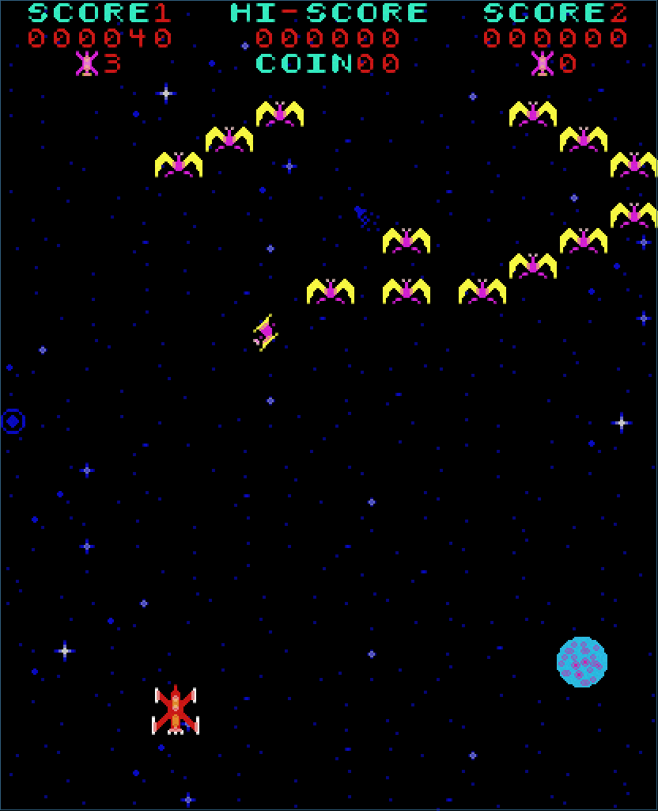
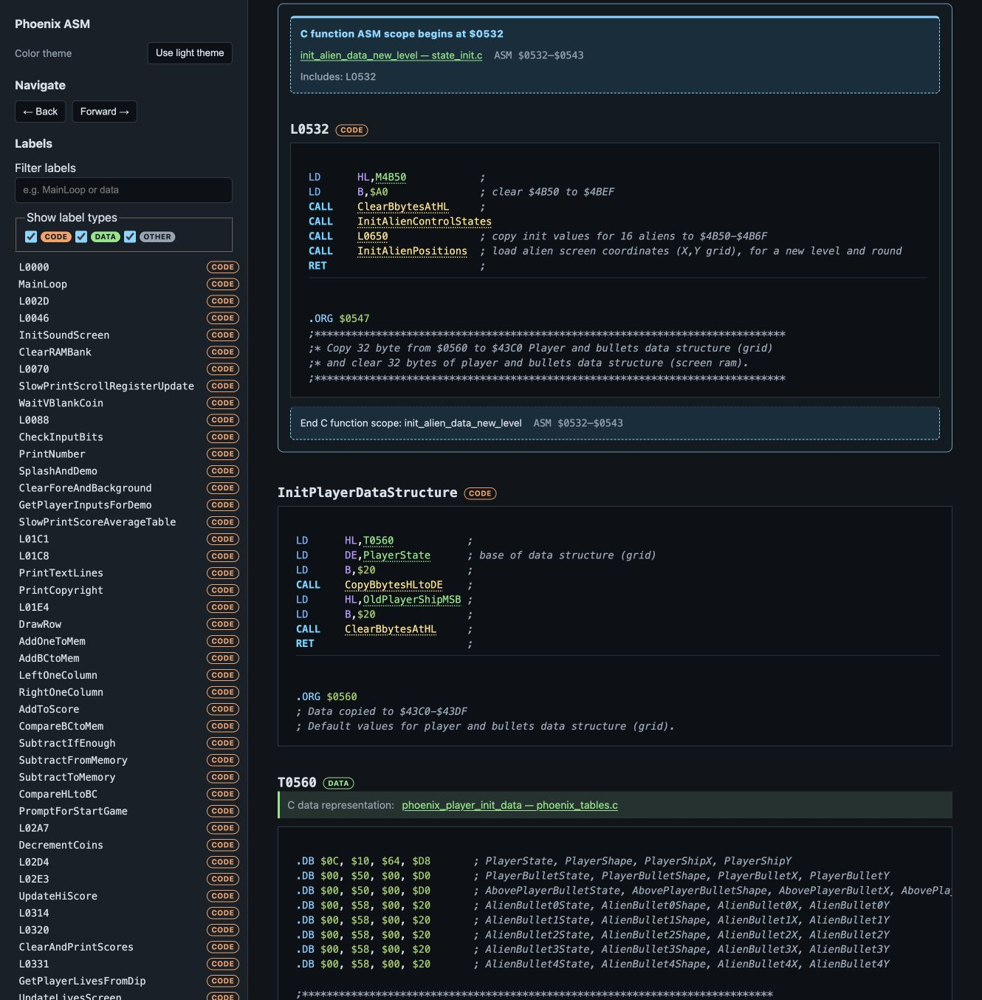

# Phoenix Arcade

🇬🇧 English · 🇳🇱 [Nederlands](README.nl.md)



*Phoenix* is the 1980 arcade shoot-'em-up where you fend off diving birds and
an armoured mothership. This repository lets you actually play it — in a
faithful pixel-perfect recreation or a redrawn high-resolution version — and,
if you get curious, look at exactly how the original game worked under the
hood.

## Play it

Pick a look and build it. Each command builds from source, so a compiler
step happens the first time; see [Requirements](#requirements) for what you
need installed.

| Version | What you get | Command | Full details |
| --- | --- | --- | --- |
| **Modern, high-resolution** | Redrawn glyphs, smooth colour and lighting, same rules | `make c2-run` | [`c2-phoenix/README.md`](c2-phoenix/README.md) |
| **Classic, pixel-perfect** | The original 8×8 look, rebuilt in C | `cd c-phoenix && make run` | [`c-phoenix/README.md`](c-phoenix/README.md) |
| **Original arcade board** | Runs the real 1980 program code on a Java-based hardware emulator | `cd jphoenix-emulator-port && make run` | [`jphoenix-emulator-port/README.md`](jphoenix-emulator-port/README.md) |

Each "full details" README has the controls, build options, and command-line
flags for that version (for example, the arrow keys / WASD to move and Space
to fire, the same across all three).

One thing every version needs first: your own legally obtained Phoenix
Amstar ROM set. The repository never ships ROM bytes. Preparing a set takes
a few minutes — see [`roms/README.md`](roms/README.md) for where to put the
files and the one command that validates and assembles them.

To build all three versions at once without starting any of them, use
`make build` (`make all` is an alias).

## Watch it first

Not ready to build yet? **[Read the demo guide](demo/README.md)** — it opens
with playable recordings of a real session, side by side with the
high-resolution look, before it shows any of the developer tooling.

## How the project is put together

Phoenix Arcade is one monorepo, organised in layers: playable games at the
top, and the material that explains them nested underneath.

```text
phoenix-arcade/
├─ demo/                     Recordings, screenshots and the guided showcase
├─ jphoenix-emulator-port/   Java emulator — runs the original 1980 ROM
├─ c-phoenix/                Modern, hand-translated C port of the game
│  ├─ c-annotated/           Knowledge base linking the C code to the original Z80 assembly
│  ├─ animations/            Gallery of enemy flight patterns and movement data
│  └─ tools/                 Visual tracer, lockstep checker, and other analysis tooling
├─ c2-phoenix/                High-resolution presentation, built on the c-phoenix engine
└─ roms/                     Guide for preparing your own ROM set
```

- [`jphoenix-emulator-port/`](jphoenix-emulator-port/README.md) is the
  accuracy baseline: a Java desktop emulator (built with modern Gradle/LibGDX
  tooling) that runs the original Intel 8080 program, graphics ROM and
  colour PROM exactly as the arcade board did. Its own README has the full
  build, controls, and command-line reference.
- [`c-phoenix/`](c-phoenix/README.md) is a from-scratch, hand-translated C
  port of that same ROM logic — organised as readable modules instead of
  assembly, and checked frame-by-frame against the Java emulator for
  equivalence. Its own README is the entry point for everything nested
  under it (build, controls, and the tooling covered below).
  - [`c-annotated/`](c-phoenix/c-annotated/README.md) — knowledge base
    linking the C code to the original Z80 assembly.
  - [`animations/`](c-phoenix/animations/README.md) — gallery of enemy
    flight patterns and movement data.
  - [`tools/`](c-phoenix/tools/README.md) — visual tracer, lockstep
    checker, and other analysis tooling.
- [`c2-phoenix/`](c2-phoenix/README.md) reuses the C port's game engine and
  swaps in a high-resolution renderer; it's the version pictured above. Its
  own [`tools/`](c2-phoenix/tools/README.md) generate the matching semantic
  traces.
- [`demo/`](demo/README.md) ties all three together with curated recordings,
  screenshots, and a walkthrough of the tooling below.

## Go deeper: study how Phoenix actually works

Everything above is playable software. Underneath it sits a full,
source-linked explanation of the original 1980 game, built for anyone
curious enough to ask "why does that bird move like that?" or "how do we
actually know the C port behaves like the original?" None of this is
required to play — it's there for when you want to look under the hood.
The [demo guide](demo/README.md) walks through the highlights below in a
guided order; the sections here are the reference version.

### See the ROM turn into readable code

The original game shipped as Z80 assembly, burned into ROM chips. Three
files, in a row, turn that into something you can actually read:

```text
Phoenix.asm  →  Phoenix.md  →  Phoenix.html
 hand-annotated    the same assembly    an interactive page: click a
 original           as linked,         label, jump straight to the C
 assembly           browsable Markdown  function that replaced it
```

- [`Phoenix.asm`](c-phoenix/context/Phoenix.asm) — the original Z80 assembly,
  annotated by hand with what each routine does and which RAM it touches.
  (Credits: [Sorbas2020](https://github.com/Sorbas2020/Phoenix))
- [`Phoenix.md`](c-phoenix/context/Phoenix.md) — the same material,
  auto-generated as cross-referenced Markdown; GitHub renders this one
  directly.
- [`Phoenix.html`](c-phoenix/context/Phoenix.html) — an interactive version
  of the same page, with code/data filters, address tooltips, and clickable
  links into the C source. GitHub only shows this file's raw source; to
  actually browse it, run `make c-asm-view` and open the
  `http://127.0.0.1:8765/…` address it prints.



### Watch a play session frame by frame

The **visual tracer** replays a recorded session as a physical grid: every
alien, bird, and bullet drawn as a moving dot with its own trail, next to
the exact frame number and RAM state behind it. `make c-tracer-view` builds
one and opens it for you (`make c2-tracer-view` and `make j-tracer-view` do
the same for the other two versions).

The table below is one frame — record 945 — from the same recorded session,
shown three ways: as the two playable versions render it, and as the tracer
sees the underlying state.

| C-Phoenix (playable) | C2-Phoenix (playable, hi-res) | What the tracer shows |
| --- | --- | --- |
|  |  |  |

There is also a friendlier, game-level **semantic viewer** — score, lives,
level transitions, and enemy events instead of raw positions — via
`make c2-demo-view`.

### What "lockstep" actually proves

The C port isn't just built to *look* like Phoenix — it's checked to
*behave* exactly like it, and that check is the strongest claim this
project makes. Here is what it does:



In words: a **lockstep** run feeds the identical sequence of button presses
into both the Java emulator (running the real 1980 ROM) and the C port,
frame by frame, then compares what each one has written to memory after
every single frame — player position, enemy slots, score, lives, timers,
all of it. If the two never disagree, the port is proven equivalent for
that recorded session, not merely similar-looking. The three screenshots
above are themselves one product of that comparison: the same underlying
record, rendered three ways.

The current batch runs 57 recorded scenarios this way and reports
byte-exact agreement for all of them; see the [12 July verification
record](c-phoenix/context/verification/2026-07-12/README.en.md) for the
concrete revisions and results. The repeatable method is documented in
[`tools/lockstep/README.md`](c-phoenix/tools/lockstep/README.md), with the
full step-by-step in
[`tools/lockstep/PROCEDURE.en.md`](c-phoenix/tools/lockstep/PROCEDURE.en.md).

### See how enemies actually move

Every alien formation and bird dive in Phoenix follows a fixed flight path,
stored in the ROM as a short list of movement vectors. The animation
gallery turns each one into an animated diagram, drawn directly from that
data — this is a live preview of three of them at once, running right now:



The [full animation and trajectory gallery](c-phoenix/animations/README.md)
has 78 of these, one per ROM-defined pattern, plus the six bird
growth-and-explosion animation phases, in Dutch or English.

### The reference material behind all of this

- [`c-phoenix/context/`](c-phoenix/context/README.md) is the filing
  cabinet: the annotated assembly, RAM/ROM maps, generated call graphs, and
  every recorded trace live here, indexed in one place.
- [`context/input-scripts/`](c-phoenix/context/input-scripts/README.md)
  holds the recorded button-press scripts (`bird-investigation.txt` and
  friends) behind every demo, tracer, and lockstep run above — replay one
  and you get exactly the same session again, byte for byte.
- [`context/traces/`](c-phoenix/context/traces/README.md) collects short,
  written case studies — "here's the RAM byte that tracks bird growth, and
  here's the evidence" — rather than raw dumps.
- [`c-annotated/`](c-phoenix/c-annotated/README.md) is the machine-readable
  knowledge base: a graph connecting C functions, ROM addresses, RAM
  fields, and tables, with its own validity checks. Available in Dutch or
  English.

### Tool references, for running your own investigation

Everything above is produced by small, documented scripts, not by hand.
These indexes are written for people who want to run their own trace,
comparison, or graph instead of using the `make` shortcuts — skip them
unless that's specifically what you're after:

- [`c-phoenix/tools/README.md`](c-phoenix/tools/README.md) — the tracing,
  mapping, comparison, and input-bot scripts behind the C port's analysis.
  Among them is the [input bot](c-phoenix/tools/input-bot-howto.md): you name a
  moment you want to see — level nine, a two-player handoff — and it searches
  for an input script that reaches it. It found 50 of the 59 replay scripts
  this project's coverage evidence rests on.
- [`c2-phoenix/tools/README.md`](c2-phoenix/tools/README.md) — the same
  idea for the high-resolution presentation's semantic traces.
- [`jphoenix-emulator-port/tools/README.md`](jphoenix-emulator-port/tools/README.md)
  — call-graph and ROM-coverage tools for the Java emulator.

## Choose your starting point

| If you want to… | Start here |
| --- | --- |
| Just play, high-resolution look | `make c2-run` |
| Just play, pixel-perfect classic | `cd c-phoenix && make run` |
| Just play, on the original ROM code | `cd jphoenix-emulator-port && make run` |
| Watch before building anything | **[Read the demo guide](demo/README.md)** |
| See how an enemy wave actually moves | [Open the animation gallery](c-phoenix/animations/README.md) |
| Trace a play session frame by frame | `make c-tracer-view` |
| Understand what a lockstep comparison proves | [Read "What lockstep actually proves"](#what-lockstep-actually-proves) |
| Browse the annotated assembly interactively | `make c-asm-view` |
| Read the annotated assembly as plain files | [`Phoenix.asm`](c-phoenix/context/Phoenix.asm) → [`Phoenix.md`](c-phoenix/context/Phoenix.md) |
| Study the source-linked knowledge base | [Open the C-annotated documentation](c-phoenix/c-annotated/README.md) |
| Run your own trace or comparison script | [Open the C-Phoenix tools index](c-phoenix/tools/README.md) |
| Build all three versions without running one | `make build` (or `make all`) |
| Remove local build output before a fresh build | `make clean` |
| Build and check the whole repository | `make verify` |

## Requirements

- **To play:** GCC or Clang, SDL2, and GNU Make for the C versions; JDK 11+
  (17+ for the optional LibGDX frontend) for the Java version. Python 3 is
  needed once, to prepare the ROM set.
- **To go deeper:** the same, plus Graphviz for the full comparison and
  graph pipeline.

The projects were developed mainly on **macOS** and also support Linux. On
Windows, use WSL2 for the full C, Java, tracing, and graph toolchain. The
Java core builds natively on Windows with JDK 11+.

## License

Original Phoenix Arcade contributions are available under the
[MIT License](LICENSE). Third-party provenance and exclusions are described
in [THIRD_PARTY_NOTICES.md](THIRD_PARTY_NOTICES.md). The original Phoenix
ROM itself is not included or licensed by this project — see
[`roms/README.md`](roms/README.md).

## For contributors and maintainers

<details>
<summary>Build variants, repository checks, and ROM maintenance tools</summary>

### C2 rendering variants

`c2-phoenix` ships five renderer experiments on the same engine. Build with
`make c2-run C2_VARIANT=classic` for the original, unblended look, or another
`C2_VARIANT` value (`hires2`, `hires2a`, `hires3`, `hires3a`, the default) to
compare an individual step in isolation. See
[`demo/c2-hires-variants-comparison.md`](demo/c2-hires-variants-comparison.md)
for a side-by-side gallery.

### ROM preparation commands

```sh
make romprepare ROM_DIR=/path/to/phoenix-amstar-chips
```

The ROM guide ([`roms/README.md`](roms/README.md)) explains the expected
individual chip files and what the build does with them; the target
directories themselves have their own short notes:
[`roms/local/README.md`](roms/local/README.md) (where you drop your own chip
dumps) and [`roms/assembled/README.md`](roms/assembled/README.md) (where the
build writes the assembled images).

### Design-time source graphs

`c-phoenix/context/graphs/` holds generated call-graphs of the C source
itself — which function calls which, not what a play session actually
executed (that's the runtime callgraph gallery in the
[demo guide](demo/README.md) instead). Regenerate them with `make -C
c-phoenix docs`; see [`context/graphs/README.md`](c-phoenix/context/graphs/README.md)
for what each graph answers.

### Repository checks

```sh
make links        # Verify local Markdown links.
make large-files  # Report files >= 1 MiB; reject unapproved files >= 20 MiB.
```

Large generated dumps and HTML traces are ignored. Curated compressed
fixtures and demo material are documented in
[LARGE-FILES.md](LARGE-FILES.md).

### Repository maintenance tools

Run these targets from the repository root. They are the supported entry
points for the root utility scripts; invoking the scripts directly is
normally unnecessary.

| Make target | Script | Purpose |
| --- | --- | --- |
| `make links` | `tools/check_markdown_links.py` | Checks local Markdown links. |
| `make large-files` | `tools/audit_large_files.py` | Reports large files and rejects unapproved files of 20 MiB or more. |
| `make public-audit` | `tools/audit_public_export.py` | Reports private-only files that must not enter the planned byte-free public export. Add `--strict` only when invoking the script directly in an enforcement workflow. |
| `make romcheck` | `tools/rom_tool.py` | Validates the supplied Phoenix chip set against the ROM manifest. |
| `make romnormalize` | `tools/rom_tool.py` | Normalizes supplied chip filenames and creates the local archive without assembling ROM images. |
| `make rombuild` | `tools/rom_tool.py` | Builds the assembled program, graphics, and PROM images from validated chips. |
| `make romprepare` | `tools/rom_tool.py` + `tools/generate_phoenix_tables.py` | Builds the ROM images and verifies the C tables derived from program ROM. |
| `make gen-phoenix-tables` | `tools/generate_phoenix_tables.py` | Regenerates the byte payloads in `c-phoenix/phoenix_tables.c` from `program.rom`, but aborts on an unexpected mismatch. |

`gen-phoenix-tables` is deliberately conservative: use `ALLOW_MISMATCH=1`
only after reviewing a genuine ROM-set change.

</details>
