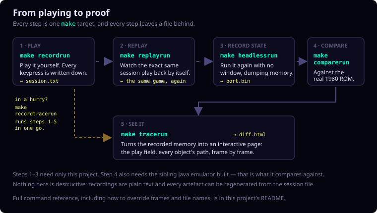

c-phoenix - Phoenix (1980) arcade port in C
=============================================

A hand-translated C port of the original Phoenix arcade ROM (Z80), verified
against [jphoenix-emulator-port](../jphoenix-emulator-port), a real Z80 emulator
that executes the original ROM bytes.

Dutch documentation: [README.nl.md](README.nl.md).

This root README is the entry point. Detailed documentation intentionally lives
next to the files it describes:

- [Interactive Knowledge Base Explorer](c-annotated/knowledge-base-explorer/index.html)
  - start here to browse a game system by topic, then open its C routine,
  original Z80 range, and explanatory documentation. It opens directly as a
  local static page.
- [STATUS.md](context/STATUS.md) - current status, open observations, and
  verification scope.
- [Central demo](../demo/README.md) - videos, screenshots, visual tracing, and
  the shared project showcase.
- [tools/README.md](tools/README.md) - mapping, trace, compare, and input-bot
  tools.
- [tools/lockstep/README.md](tools/lockstep/README.md) - scripted jphoenix vs
  c-phoenix batch verification.
- [context/README.md](context/README.md) - ASM, RAM, tile, mapping, graph,
  replay, and trace reference material.
- [context/input-scripts/README.md](context/input-scripts/README.md) - replay
  scripts, `make replayrun`, bot goals, and the "bug spotted during manual
  play" workflow.
- [context/traces/README.md](context/traces/README.md) - curated trace cases
  and policy for what should or should not be kept in Git.

The workflow
------------

Most of what follows is one loop: play a session, replay it, record what the
game did, compare that against the original ROM, and turn the result into
something you can look at.



Build
-----

Requirements: `gcc` and SDL2 (`brew install sdl2` on macOS).

```bash
make
```

This compiles all `.c` files in the project directory and produces the
`c-phoenix` binary.

```bash
make clean
```

Run
---

```bash
./build/c-phoenix
```

Opens a 3x scaled window (208x256 -> 624x768) and starts the game normally.

### Controls

| Action | Key(s) |
| --- | --- |
| Left | Left arrow, A, J |
| Right | Right arrow, D, L |
| Fire | Space, W, I |
| Shield | Down arrow, S, K |
| Start 1 player | 1 |
| Start 2 players | 2 |
| Insert coin | C, 3, 5 |
| Screenshot current frame | F12 |
| Pause / resume | Left mouse click in the window |

Screenshots made with F12 are written as `screenshot_<frame-number>.ppm` in the
working directory.

Command-Line Options
--------------------

| Option | Behavior |
| --- | --- |
| `--run-frames=<n>` | Headless mode: runs exactly `n` frames without window/pacing and exits. Used for tests and lockstep comparison against jphoenix. |
| `--input-script=<path>` | Replays a deterministic input script: one event per line, `<frame> <button> <press\|release>`. |
| `--ram-dump=<path>` | Writes the full 3KB game RAM (`$4000-$4BFF`) for every frame. |
| `--coverage-dump=<path>` | Writes coverage/state information as JSON on exit. |
| `--no-render` | Skips rendering during headless runs. |
| `--screenshot=<path>` | Writes a PPM screenshot of the last rendered frame on exit. |
| `--dump-vram=<path>` | Writes a binary VRAM/register dump on exit. |
| `--record-input=<path>` | Records interactive input as a replay script. |
| `--start-delay=<seconds>` | Waits before starting the game; interactive mode only. |
| `--wait-for-space` | Waits until Space is pressed; interactive mode only. |

Examples
--------

```bash
./build/c-phoenix --start-delay=3
./build/c-phoenix --run-frames=3600 --ram-dump=/tmp/port.bin
./build/c-phoenix --run-frames=1200 --input-script=context/input-scripts/basic_playthrough.txt

make replayrun
make replayrun REPLAY_SCRIPT=context/input-scripts/bird-investigation.txt
make headlessrun
make recordrun
make comparerun
make tracerun
make help

make headlessrun \
  REPLAY_SCRIPT=context/input-scripts/two_player_last_grown_bird.txt \
  REPLAY_FRAMES=9000 \
  REPLAY_RAM_DUMP=/tmp/c-last-grown-bird.bin \
  REPLAY_COVERAGE_DUMP=/tmp/c-last-grown-bird.coverage.json

./build/c-phoenix --input-script=context/input-scripts/generated/mutated_rank_01_score_5003729.txt
./build/c-phoenix --record-input=/tmp/session.txt
```

See [context/input-scripts/README.md](context/input-scripts/README.md) for the
"bug spotted during manual play" workflow: record with `--record-input`, pause
with a mouse click, write a short symptom note, then compare the replay between
C-Phoenix and jphoenix.

The make workflow for that loop is:

```bash
make recordrun
make replayrun REPLAY_SCRIPT=/tmp/c-phoenix-session.txt
make headlessrun REPLAY_SCRIPT=/tmp/c-phoenix-session.txt REPLAY_FRAMES=9000
make comparerun COMPARE_SCRIPT=/tmp/c-phoenix-session.txt COMPARE_FRAMES=9000 COMPARE_NAME=session
make tracerun COMPARE_SCRIPT=/tmp/c-phoenix-session.txt COMPARE_FRAMES=9000 COMPARE_NAME=session
```

For a new interactive session, the complete chain is one command:

```bash
make recordtracerun RECORD_NAME=bird-investigation
```

Play the scenario, then close the game window. The recording is written to
`/tmp/bird-investigation.txt`; Make then automatically runs both replays, the
RAM comparison, and the HTML tracer. It automatically replays until 400 frames
after the last recorded input event, then compares the full run. Override this with
`RECORD_TRACE_FRAMES`, `RECORD_TRACE_TAIL_FRAMES`, and
`RECORD_TRACE_STOP_AFTER`.

`make tracerun` first executes `comparerun`, then writes the standalone visual
tracer HTML. Its default path is `/tmp/<COMPARE_NAME>-diff.html`. For the full
bird trace:

```bash
make tracerun \
  COMPARE_SCRIPT=context/input-scripts/two_player_last_grown_bird.txt \
  COMPARE_FRAMES=9000 \
  COMPARE_NAME=last-grown-bird \
  COMPARE_STOP_AFTER=999999
```

Use the local viewer target to generate and serve it in one step:

```bash
make tracer-view \
  COMPARE_SCRIPT=context/input-scripts/two_player_last_grown_bird.txt \
  COMPARE_FRAMES=9000 \
  COMPARE_NAME=last-grown-bird \
  COMPARE_STOP_AFTER=999999
```

It prints the localhost URL (default port `8766`) and keeps the server running
until `Ctrl-C`. To serve an already generated tracer, use
`make tracer-view-only TRACE_VIEW_OUTPUT=/tmp/last-grown-bird-diff.html`.
Override the tracer with `VISUAL_TRACE_OUTPUT`, `VISUAL_TRACE_PLAYER`,
`VISUAL_TRACE_KIND`, and `VISUAL_TRACE_EXTRA_ARGS`.

Lockstep Verification
---------------------

The full recipe is in [tools/lockstep/PROCEDURE.md](tools/lockstep/PROCEDURE.md). Tool options are in
[tools/README.md](tools/README.md). In short:

```bash
cd ../jphoenix-emulator-port
java -Dphoenix.ramdump=/tmp/jphx.bin -Dphoenix.ramdump.frames=3600 \
     -cp build/classes PhoenixDesktop
cd ../c-phoenix
make
./build/c-phoenix --run-frames=3610 --ram-dump=/tmp/port.bin
python3 tools/compare_ram_dumps.py /tmp/jphx.bin /tmp/port.bin \
    --align-c98 --stop-after 999999
```

Trace, Replay, and Bot Tools
----------------------------

See [tools/README.md](tools/README.md) for the tool reference and
[context/input-scripts/README.md](context/input-scripts/README.md) for practical
replay and bot workflows.

```bash
python3 tools/trace_sprites.py /tmp/port.bin --kind all \
    --only-active --output=/tmp/objects.csv

python3 tools/view_sprite_trace.py /tmp/port.bin \
    --kind aliens --player 1 --output=/tmp/alien-paths.html

python3 tools/view_sprite_trace.py /tmp/jphx.bin \
    --compare /tmp/port.bin \
    --reference-label jphoenix --port-label c-phoenix \
    --kind birds --player 1 --output=/tmp/bird-diff.html

python3 tools/generate_mappings.py
```

Curated comparison artifacts and larger trace cases live under
[context/traces/](context/traces/). The
[two_player_last_grown_bird_compare](context/traces/two_player_last_grown_bird_compare/README.md)
case shows how a jphoenix-vs-C-Phoenix comparison is recorded, including RAM
dumps, coverage, and the visual tracer.

Comment Convention
------------------

Non-trivial C functions that translate ROM behavior should have a short block
above the function. Keep ASM traceability separate from functional explanation.

```c
/*
 * [ASM: XXXX-YYYY]
 * Functional role: what this routine does in game or hardware terms.
 * Reads/writes RAM: key state fields or RAM regions.
 * Important branch/invariant: only if useful.
 * Verification/trace note: only with concrete evidence.
 */
```

If a routine is still unclear, document the uncertainty explicitly instead of
inventing behavior.

Project Structure
-----------------

- `*.c`/`*.h` - translated game logic split by ASM area.
- `sound.c`, `sound_discrete.c`, `sound_dispatcher.c`, `tms36xx.c`,
  `mame_lofi_resampler.c` - sample buffering, discrete audio, and TMS3615
  music.
- `platform_sdl.c` - SDL2 platform layer for windowing, rendering, input,
  threading, and command-line options.
- `phoenix_hw.h` / `hw_video_audio.c` - hardware I/O emulation.
- `phoenix_render_assets.h` - generated decoded tile pixels and RGB palette.
- `context/` - ASM reference, mappings, callgraphs, and input scripts.
- `tools/compare_ram_dumps.py` - lockstep comparison.
- `tools/lockstep/` - scripted batch lockstep verification tools.
- `tools/trace_sprites.py` / `tools/view_sprite_trace.py` - object traces and
  HTML viewer.
- `tools/input_bot.py` - replay evaluation and mutation.
- `context/STATUS.md` - current status, open observations, and verification scope.
