# Phoenix Animations & Trajectories Guide (`c-phoenix/animations`)

Welcome to the central visual archive for the *Phoenix* Arcade Game (`c-phoenix`). This directory contains functional, memory, and visual analyses of both **bird animations** and **vectorial flight trajectories** for aliens, birds, and the mothership.

## Source Priority

The source of truth is, in this order: **Z80 ASM/ROM → C-port → annotated analysis → visual assets**. SVGs make ROM and C data accessible, but do not replace the underlying source code. Any conclusion without links to ASM, ROM, or C code is an interpretation requiring verification.

---

## 🗂️ Table of Contents

1. 🚀 [`animation-trajectory.md`](animation-trajectory.md) — **In-depth analysis of prescribed flight patterns, RAM data structures (`$4000-$4BFF`), Z80 ROM cluster layout, master overview flight animation, and 128 SVG animations.**
2. 📐 [`animation-trajectory-detailed.md`](animation-trajectory-detailed.md) — **Detailed step-by-step coordinate tables per individual flight pattern (step #, vector index, dX, dY, cumulative X/Y).**
3. 🦅 [`bird-animations.md`](bird-animations.md) — **Visual guide for all 6 bird animation phases (egg hatching to grown bird and bonus explosion).**

---

## 🏛️ Why Separate ROM Clusters & Chapter Organization?

- **Cluster A (ROM `$1000–$13FF` / EPROM Chip 1):** Contains **Patterns 01 through 18** for orderly formation waves in **Alien Wave 1 & 3**.
- **Cluster B (ROM `$2C00–$2FFF` / EPROM Chip 3):** Contains **Patterns 19 through 36** for **Breakout aliens** and **Mothership escorts** (Levels 9, 10, 11).
- **Chapter Organization:** Follows the exact 4 physical game entity subsystems of the Arcade Z80 engine (Wave 1/3 Aliens, Breakout/Escort Aliens, Wave 5/7 Bird AI & Dive spawns, Mothership & Attract Mode).

---

## 🎬 Master Overview Animation

Three of the game's movement types at once — an alien swoop, a bird dive-bomb, and the mothership's descent — all drawn from the vectors stored in the ROM:


Source file: [`../00_overview_flight_patterns.svg`](../00_overview_flight_patterns.svg).

---

## 🦅 The bird, phase by phase

Phoenix birds are not one sprite. They hatch, grow, attack, and explode — six distinct animation phases, each reconstructed from the graphics ROM:

| Egg hatching | Small bird flapping | Full-grown wing matrix |
| --- | --- | --- |
|  |  |  |
| **Dive-bombing attack** | **Explosion and bonus** | **Mothership descent** |
|  |  | 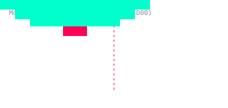 |

---

## 🔡 What everything is actually made of

The diagrams above are interpretations. The sheets below are not: they are rendered straight from the decoded graphics ROM and colour PROM, using the same palette arithmetic as the running game.

Phoenix has no sprite engine. Every object on screen is a handful of **8×8 characters** written into screen memory, and the character's own index decides its colour — bits 5-7 select one of eight colour groups in the PROM table. That is why each block of 32 characters looks like one family:

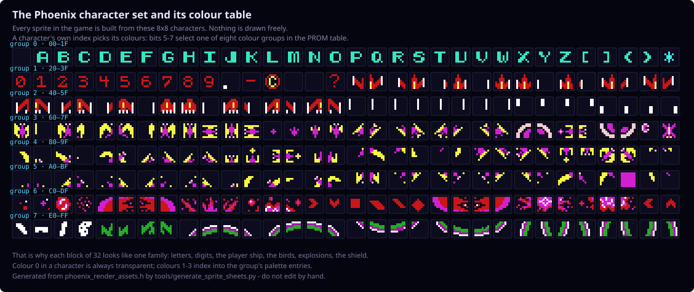

Stars, planets, the mothership and the aliens come from a second, independent set:

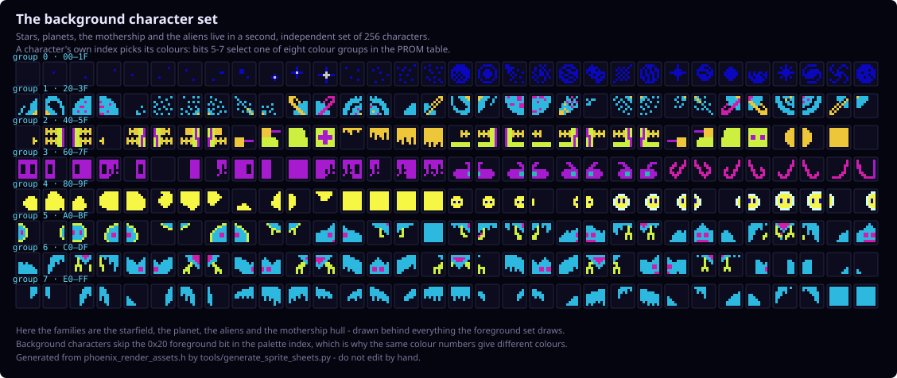

### The sequences, with their character composition

Phoenix has a small family of **drawNxN routines**, and which one draws an object decides its size and the order its characters are written. They all work the same way: two characters fill one column top to bottom, then the routine steps sideways to the next column. Each sheet below states the routine it used.

Underneath every frame are the **character codes** it is assembled from — cross-reference them with the sets above to see exactly which pixels the hardware fetched.

**The player ship** — eight poses, four characters each, drawn as a 2×2 block from `phoenix_sprite_character_block_shapes`:

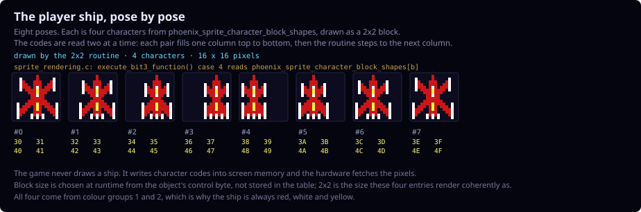


**The formation alien** — and it is not one sprite. As it drifts, climbs and dives, the game switches between *different block sizes*: `sprite_rendering.c` picks `1x1`, `2x1`, `1x2` or `2x2` at runtime from the object's control byte. No table holds that size, so these poses were read out of the foreground screen memory of the committed recording `c-last-grown-bird.bin.gz`.

Flying level, two characters side by side:

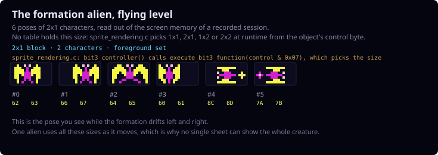


Climbing, one character wide and two tall — the same creature seen head-on:

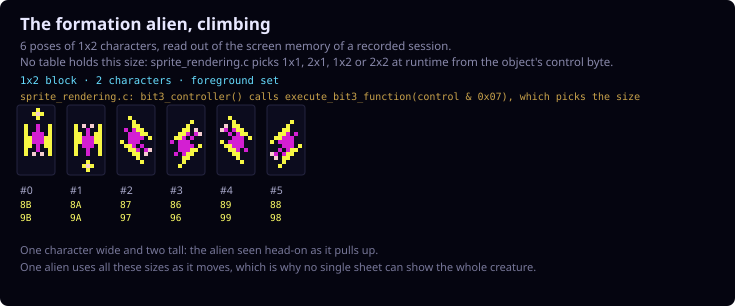


Diving and banking, its widest form:

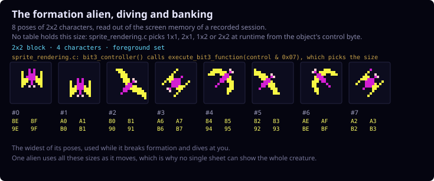


The same scan over the same recording also produced the 3×2 explosion blocks shown below, which is an independent check that this way of reading the dump is sound.

Grouping poses by size tells you which shapes exist, but not the order the game shows them in. Following *one* object frame by frame does — here is a single alien leaving the formation and dropping fourteen rows onto the player, with its block size changing as it goes:

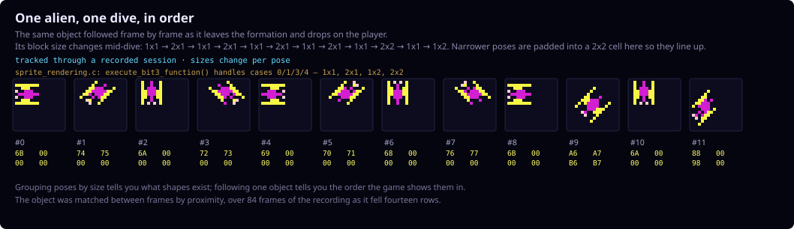


**The mothership's pilot** — the tallest block any of these routines draws, four rows by two columns:

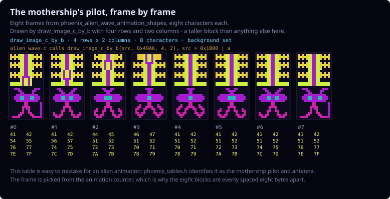


**An explosion** — eight frames from `phoenix_alien_explosion_frames`, and here the indirection matters. Those bytes are *not* character codes: `alien_logic.c` turns each one into an address with `0x1700 | byte`, then calls `drawNx2` with n=3, which reads six characters from `phoenix_shield_and_drawnx2_shapes`. So one frame is a 3×2 block, not one character:

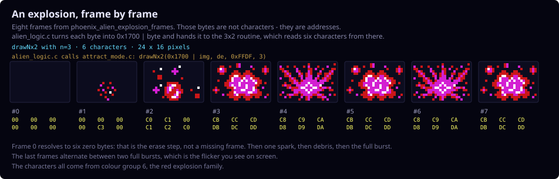


**The bonus explosion** — the same 3×2 routine, but called twice with fixed addresses, once for each half of a wider burst:

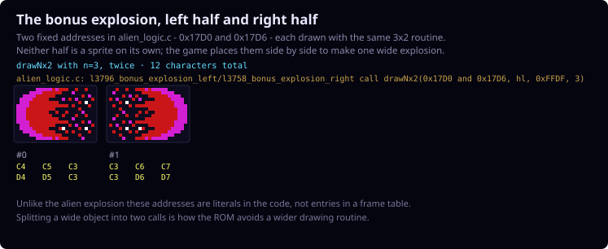


### The birds

Birds take a third route. `drawbirdobject` looks up a **width** for the bird's shape type in `phoenix_bird_draw_entries`, then a **pointer** to its character data in `phoenix_bird_shape_pointers`, and `draw_bird_shape_350c` walks that data two characters at a time. So a bird is between three and seven columns wide depending only on its type — the egg and the grown bird are the same routine with a different column count:

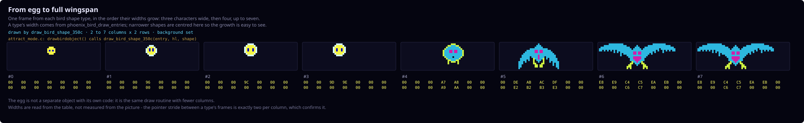


Each type has four frames of its own. **The small bird**, six characters wide:

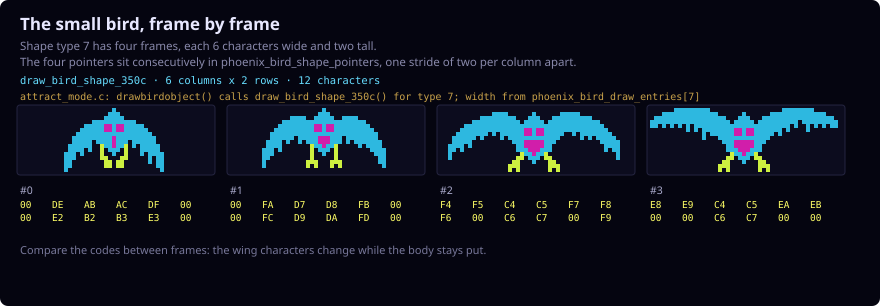


**The grown bird**, seven characters wide — the widest sprite the routine draws:

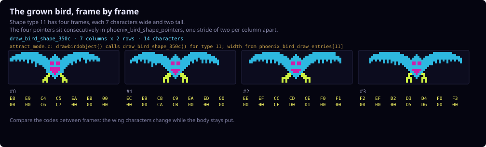


### Regenerating these sheets

All of them come out of one script, run from the repository root:

```sh
python3 c-phoenix/tools/generate_sprite_sheets.py
```

It reads `phoenix_render_assets.h` and `phoenix_tables.c` for everything that *is* in a table, and the committed recording `c-last-grown-bird.bin.gz` for the objects whose size is only decided at runtime. Each run prints which recording it used.

That default recording contains no mothership and no multi-character shield. To cover those, produce the richer bird-investigation session first and point the script at it — again from the repository root:

```sh
make -C c-phoenix tracerun \
  COMPARE_SCRIPT=context/input-scripts/bird-investigation.txt \
  COMPARE_FRAMES=13935 \
  COMPARE_NAME=bird-investigation \
  COMPARE_STOP_AFTER=999999

python3 c-phoenix/tools/generate_sprite_sheets.py \
  --dump /tmp/port_bird-investigation.bin
```

`tracerun` runs `comparerun` first, so the sibling JPhoenix project must be built (JDK 11+). It writes `/tmp/port_bird-investigation.bin` — note the underscore after `port` — plus `/tmp/ref_bird-investigation.bin` for the emulator side. Dumps deliberately stay in `/tmp`; see [`context/traces/README.md`](../../context/traces/README.md) for why they are not committed.

**The player shield** — sixteen characters in a 4×4 block, the largest single sprite in the game. Like the alien its size is a runtime decision, so this too was read out of a recording:

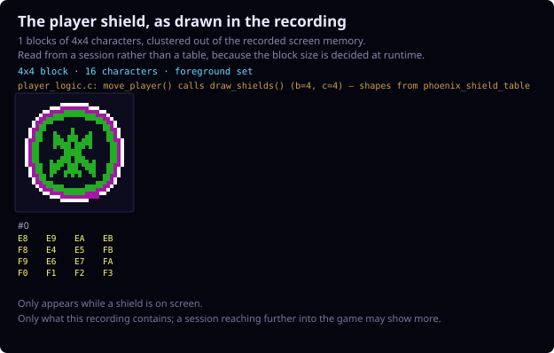

> **Still open: the mothership.** Scanning background RAM by colour group cannot tell a mothership hull from a grown bird — both live in the same upper groups, and that scan produced birds labelled as a hull, twice. Identifying the object needs its RAM slot rather than its colours, which is a job for the visual tracer.

The still sheets and the playing versions are all regenerated by [`tools/generate_sprite_sheets.py`](../../tools/generate_sprite_sheets.py) from `phoenix_render_assets.h` and `phoenix_tables.c`. Nothing in them is hand-drawn; if the ROM data changes, the sheets change with it.

> **Still to add:** the mothership explosion. It draws from `phoenix_shield_and_drawnx2_shapes` like the explosions do, but its call site has not been traced yet, so it is left out rather than guessed at.

---

## 🎨 Flight Patterns & Trajectories

This directory holds 128 SVG files: the 78 flight patterns below plus the sprite sheets from the previous section. They are listed rather than shown because there are so many; open any file to watch it.

### 👾 Alien Cluster A: Wave 1 & 3 Patterns (ROM `$1000–$13FF`)
- [`../07_alien_closed_loop_cluster_a.svg`](../07_alien_closed_loop_cluster_a.svg) — Cluster A overview animation
- [`../cluster_a/pattern_01.svg`](../cluster_a/pattern_01.svg) through [`../cluster_a/pattern_18.svg`](../cluster_a/pattern_18.svg) — 18 closed-loop flight patterns.

### 🛸 Alien Cluster B: Breakout & Escort Patterns (ROM `$2C00–$2FFF`)
- [`../08_alien_breakout_cluster_b.svg`](../08_alien_breakout_cluster_b.svg) — Cluster B overview animation
- [`../cluster_b/pattern_19.svg`](../cluster_b/pattern_19.svg) through [`../cluster_b/pattern_36.svg`](../cluster_b/pattern_36.svg) — 18 breakout & escort attack patterns.

### 🪶 Bird AI Behavior Scripts (ROM `$3F00–$3F7F`)
- [`../bird_scripts/bird_script_00.svg`](../bird_scripts/bird_script_00.svg) through [`../bird_scripts/bird_script_15.svg`](../bird_scripts/bird_script_15.svg) — 16 AI behavior scripts.

### 🎯 Bird Dive & Spawn Positions (ROM `$3DC0–$3DDF`)
- [`../bird_dive_spawns/dive_spawn_00.svg`](../bird_dive_spawns/dive_spawn_00.svg) through [`../bird_dive_spawns/dive_spawn_15.svg`](../bird_dive_spawns/dive_spawn_15.svg) — 16 start & dive coordinates.

### 🦅 Bird & Mothership Animations
- 🥚 [`../01_egg_hatching.svg`](../01_egg_hatching.svg) — Egg to bird hatching transformation
- 🪶 [`../02_small_bird_flapping.svg`](../02_small_bird_flapping.svg) — Wing flapping cycles (Frame A & B)
- 🦅 [`../03_grown_bird_matrix.svg`](../03_grown_bird_matrix.svg) — Full-grown bird 4x4 wing matrix
- 💣 [`../04_dive_bombing_attack.svg`](../04_dive_bombing_attack.svg) — Dive bombing attack flight
- 💥 [`../05_bird_explosion_bonus.svg`](../05_bird_explosion_bonus.svg) — Particle explosion & 500pt bonus score
- 🎬 [`../06_intro_splash_bird.svg`](../06_intro_splash_bird.svg) — Intro splash bird (Attract Mode)
- 🚀 [`../09_mothership_descent_trajectory.svg`](../09_mothership_descent_trajectory.svg) — Mothership steady descent trajectory

---

## 🔗 Knowledge Graph Links

All documents and animations in this directory are 1-to-1 linked with C source files and the Knowledge Graph in `../../c-annotated/en/`:
* [`phoenix_tables.c`](../../phoenix_tables.c) → [`phoenix-tables.md`](../../c-annotated/en/phoenix-tables.md)
* [`alien_logic.c`](../../alien_logic.c) → [`alien-logic.md`](../../c-annotated/en/alien-logic.md)
* [`bird_logic.c`](../../bird_logic.c) → [`bird-logic.md`](../../c-annotated/en/bird-logic.md)
* [`bird_wave_behavior.c`](../../bird_wave_behavior.c) → [`bird-wave-behavior.md`](../../c-annotated/en/bird-wave-behavior.md)
* [`attract_mode.c`](../../attract_mode.c) → [`attract-mode.md`](../../c-annotated/en/attract-mode.md)
