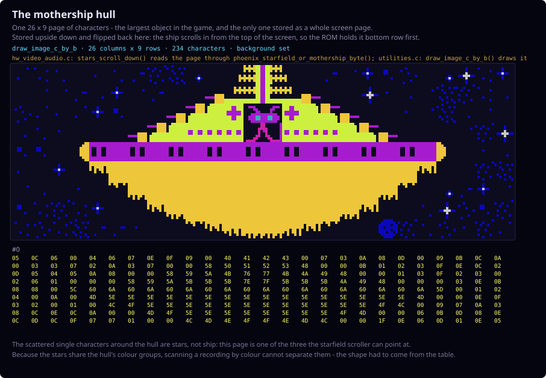

# Phoenix Sprite Sequences (`c-phoenix/animations`)

How every object on screen is assembled from 8x8 characters, and which C
routine draws it. The sheets here are rendered straight from the decoded
graphics ROM and colour PROM, using the same palette arithmetic as the running
game — nothing in them is hand-drawn.

Companion documents: [`animation-trajectory.md`](animation-trajectory.md) for
the *paths* objects follow, [`bird-animations.md`](bird-animations.md) for the
bird phases, and [`README.md`](README.md) for the directory index.

---

## 🗂️ On this page

- [The character set](#-the-character-set) — two sets of 256 characters, in eight colour groups
- [The sprites, object by object](#-the-sprites-object-by-object) — each sequence with its character codes and C routine
- [Regenerating these sheets](#-regenerating-these-sheets) — one script, and how to point it at another recording

---

## 🔤 The character set

The diagrams above are interpretations. The sheets below are not: they are rendered straight from the decoded graphics ROM and colour PROM, using the same palette arithmetic as the running game.

Phoenix has no sprite engine. Every object on screen is a handful of **8×8 characters** written into screen memory, and the character's own index decides its colour — bits 5-7 select one of eight colour groups in the PROM table. That is why each block of 32 characters looks like one family:


Stars, planets, the mothership and the aliens come from a second, independent set:


Phoenix has a small family of **drawNxN routines**, and which one draws an object decides its size and the order its characters are written. They all work the same way: two characters fill one column top to bottom, then the routine steps sideways to the next column. Each sheet below states the routine it used.

Underneath every frame are the **character codes** it is assembled from — cross-reference them with the sets above to see exactly which pixels the hardware fetched.

---

## 🖼️ The sprites, object by object

### The player ship

The player ship is eight poses, four characters each, drawn as a 2×2 block from `phoenix_sprite_character_block_shapes`:


### The formation alien

The formation alien is not one sprite. As it drifts, climbs and dives, the game switches between *different block sizes*: `sprite_rendering.c` picks `1x1`, `2x1`, `1x2` or `2x2` at runtime from the object's control byte. No table holds that size, so these poses were read out of the foreground screen memory of the committed recording `c-last-grown-bird.bin.gz`.

Flying level, two characters side by side:


Climbing, one character wide and two tall — the same creature seen head-on:


Diving and banking, its widest form:


The same scan over the same recording also produced the 3×2 explosion blocks shown below, which is an independent check that this way of reading the dump is sound.

Grouping poses by size tells you which shapes exist, but not the order the game shows them in. Following *one* object frame by frame does — here is a single alien leaving the formation and dropping fourteen rows onto the player, with its block size changing as it goes:


### The player shield

The shield is sixteen characters in a 4×4 block, the largest single sprite in the game. Like the alien its size is a runtime decision, so this too was read out of a recording:


---

### The mothership's pilot

The pilot is the tallest block any of these routines draws, four rows by two columns:


### The mothership's hull

The hull is the largest object in the game, and the only one the ROM stores as a whole 26 x 9 page rather than as a sprite. It sits upside down in the ROM, because the ship scrolls in from the top of the screen; it is flipped back here. The pilot above is drawn separately, on top of it.



The scattered single characters around the ship are **stars**, not hull: `phoenix_mothership_tile_page` is one of the three pages the starfield scroller can point at, so the ship and the sky it flies through share one page. That is also why this sheet could not be found the way the shield and the alien were: the stars sit in the same colour groups as the hull, so scanning a recording by colour cannot separate them. The shape had to come from the table.

### An explosion

An explosion is eight frames from `phoenix_alien_explosion_frames`, and here the indirection matters. Those bytes are *not* character codes: `alien_logic.c` turns each one into an address with `0x1700 | byte`, then calls `drawNx2` with n=3, which reads six characters from `phoenix_shield_and_drawnx2_shapes`. So one frame is a 3×2 block, not one character:


### The bonus explosion

The bonus explosion uses the same 3×2 routine, but called twice with fixed addresses, once for each half of a wider burst:


### The birds

Birds take a third route. `drawbirdobject` looks up a **width** for the bird's shape type in `phoenix_bird_draw_entries`, then a **pointer** to its character data in `phoenix_bird_shape_pointers`, and `draw_bird_shape_350c` walks that data two characters at a time. So a bird is between three and seven columns wide depending only on its type — the egg and the grown bird are the same routine with a different column count:


Each type has four frames of its own. **The small bird**, six characters wide:


**The grown bird**, seven characters wide — the widest sprite the routine draws:


---

## 🔁 Regenerating these sheets

All of them come out of one script, run from the repository root:

```sh
python3 c-phoenix/tools/generate_sprite_sheets.py
```

It reads `phoenix_render_assets.h` and `phoenix_tables.c` for everything that *is* in a table, and the committed recording `c-last-grown-bird.bin.gz` for the objects whose size is only decided at runtime. Each run prints which recording it used.

That default recording contains no mothership and no multi-character shield. To cover those, produce the richer bird-investigation session first and point the script at it — again from the repository root:

```sh
make -C c-phoenix tracerun \
  COMPARE_SCRIPT=context/input-scripts/bird-investigation.txt \
  COMPARE_FRAMES=13935 \
  COMPARE_NAME=bird-investigation \
  COMPARE_STOP_AFTER=999999

python3 c-phoenix/tools/generate_sprite_sheets.py \
  --dump /tmp/port_bird-investigation.bin
```

`tracerun` runs `comparerun` first, so the sibling JPhoenix project must be built (JDK 11+). It writes `/tmp/port_bird-investigation.bin` — note the underscore after `port` — plus `/tmp/ref_bird-investigation.bin` for the emulator side. Dumps deliberately stay in `/tmp`; see [`context/traces/README.md`](../../context/traces/README.md) for why they are not committed.

The still sheets and the playing versions are all regenerated by [`tools/generate_sprite_sheets.py`](../../tools/generate_sprite_sheets.py) from `phoenix_render_assets.h` and `phoenix_tables.c`. Nothing in them is hand-drawn; if the ROM data changes, the sheets change with it.

---
