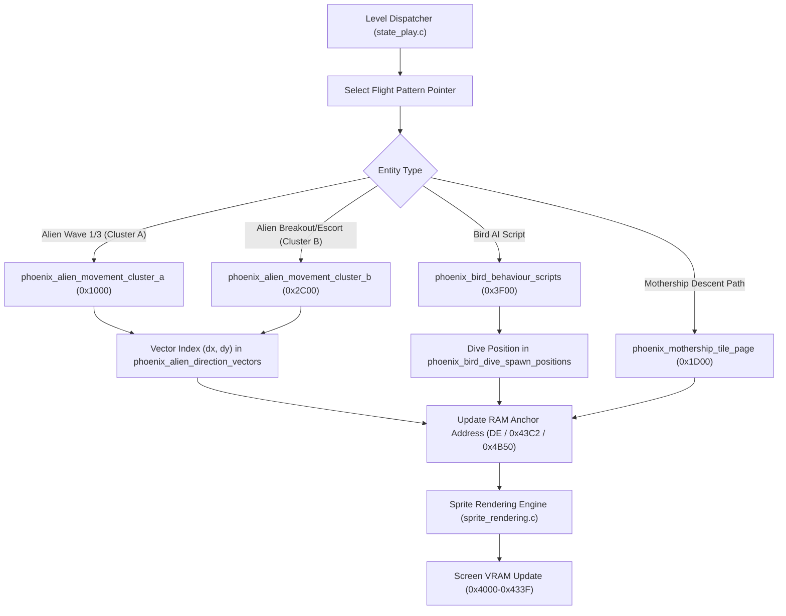

# Phoenix Animation Trajectories & Prescribed Movement Patterns (`animation-trajectory.md`)

This document provides an in-depth Knowledge Graph analysis of **prescribed movement patterns, vector tables, Z80 ROM clusters, ROM addresses, RAM data structures, and AI flight scripts** in the *Phoenix* Arcade codebase. The classification as **closed loop** or **open trajectory** is derived from ROM vectors; the directory contains 78 SVG files, including pattern representations and master overview animations.

---

## Table of Contents
1. [Overview of Flight Pattern Architecture & Z80 Memory Loop](#1-overview-of-flight-pattern-architecture--z80-memory-loop)
2. [Difference Between Closed Loop and Open Trajectory Patterns](#2-difference-between-closed-loop-and-open-trajectory-patterns)
3. [Why Different Clusters & Chapter Structuring?](#3-why-different-clusters--chapter-structuring)
4. [Alien Cluster A Patterns — Wave 1 & 3 Formations (Patterns 01 through 18)](#4-alien-cluster-a-patterns--wave-1--3-formations-patterns-01-through-18)
5. [Alien Cluster B Patterns — Breakout & Escorts (Patterns 19 through 36)](#5-alien-cluster-b-patterns--breakout--escorts-patterns-19-through-36)
6. [Bird Flight Trajectories & AI Behavior Scripts](#6-bird-flight-trajectories--ai-behavior-scripts)
7. [Mothership & Attract Mode Movement Paths](#7-mothership--attract-mode-movement-paths)
8. [Execution Loop & Mermaid Diagram](#8-execution-loop--mermaid-diagram)

---

## 1. Overview of Flight Pattern Architecture & Z80 Memory Loop

In the *Phoenix* arcade hardware, enemy movements (aliens, birds, and mothership) are not calculated dynamically via physical forces, but controlled via **static vectorial lookup tables** stored in Z80 ROM in [`phoenix_tables.c`](../../phoenix_tables.c) / [`phoenix_tables.h`](../../phoenix_tables.h).

### **Memory Map & RAM Data Structures**
Each active entity on screen utilizes a specific memory layout in Arcade RAM (`$4000–$4BFF`):

| RAM Address / Offset | Variable / Register | Functional Description |
|---|---|---|
| `$43C0–$43DF` | `PlayerShipX` / Bullet Grid | Player ship coordinates and active player bullets |
| `$4360–$437F` | `M436D`, `M436E`, `M436F` | Bird AI phase registers, descent targets, and random dive thresholds |
| `$4B50–$4B6F` | `AlienPointerTable` | 16-bit RAM pointers indicating the active step in a flight pattern |
| `$4800–$4B3F` | `BackgroundScreen` / VRAM | 90° rotated 32x32 tile matrix video buffer (832 bytes per page) |

### **Vector Transformation & Indexing**
A RAM pointer (e.g. at offset `$4B50`) reads a step byte from ROM per frame. This byte acts as an index into the direction table [`phoenix_alien_direction_vectors`](../../phoenix_tables.h#L162) (ROM `$1700–$173F`):

```math
\mathrm{VectorAddress} = \mathtt{0x1700} + (\mathtt{StepByte}\ \mathrm{AND}\ \mathtt{0x1F}) \times 2
```

Reading these two bytes yields the pairwise directional delta $(\Delta X, \Delta Y)$:
```math
X_{\mathrm{new}} = X_{\mathrm{old}} + \Delta X
```

```math
Y_{\mathrm{new}} = Y_{\mathrm{old}} + \Delta Y
```

---

### **Master Overview Animation of All Flight Trajectories**
The animated SVG below demonstrates the simultaneous operation of the entire Arcade vector system: the alien dive loop (cyan), the bird sine dive with bomb dropping (magenta/yellow), and the steady mothership descent trajectory (green):


#### **Knowledge Graph Links**
* **Relevant C Source Files:**
  - [`phoenix_tables.c`](../../phoenix_tables.c) $\rightarrow$ [`phoenix-tables.md`](../../c-annotated/en/phoenix-tables.md)
  - [`alien_logic.c`](../../alien_logic.c) $\rightarrow$ [`alien-logic.md`](../../c-annotated/en/alien-logic.md)
  - [`bird_logic.c`](../../bird_logic.c) $\rightarrow$ [`bird-logic.md`](../../c-annotated/en/bird-logic.md)
  - [`bird_wave_behavior.c`](../../bird_wave_behavior.c) $\rightarrow$ [`bird-wave-behavior.md`](../../c-annotated/en/bird-wave-behavior.md)
  - [`attract_mode.c`](../../attract_mode.c) $\rightarrow$ [`attract-mode.md`](../../c-annotated/en/attract-mode.md)

---

## 2. Difference Between Closed Loop and Open Trajectory Patterns

Vector integration of the ROM patterns described below distinguishes **two movement pattern types** in the *Phoenix* engine:

| Property | 🔄 Closed Loop Patterns | ↗️ Open Trajectory Patterns |
|---|---|---|
| **Net Displacement** | $\sum \Delta X = 0 \quad \text{and} \quad \sum \Delta Y = 0$ | $\sum \Delta X \neq 0 \quad \text{or} \quad \sum \Delta Y \neq 0$ |
| **Shape & Path** | The entity leaves its formation origin $(X_0, Y_0)$, completes a circular, oval, or figure-8 loop, and **returns exactly to $(X_0, Y_0)$**. | The entity executes a screen-wide displacement or breakout sprint across the screen (e.g. downward or diagonally). |
| **Typical Patterns** | Cluster A Patterns `01`, `02`, `07`, `10`, `11`, `12` & Cluster B Pattern `23`. | Cluster A Patterns `03`, `04`, `05`, `06`, `08`, `09`, `13–18` & Cluster B Patterns `19–22`, `24–36`. |
| **End-of-Loop Logic** | At the `0x00` terminator, the pattern restarts seamlessly from the beginning at the same anchor address. | At the `0x00` terminator or screen boundary, the game engine triggers a breakout repositioning ([`l3028`](../../c-annotated/en/alien-logic.md#l3028)) or re-orientation ([`l3672_aim`](../../c-annotated/en/bird-wave-behavior.md#l3672_aim)). |

---

## 3. Why Different Clusters & Chapter Structuring?

### **1. Why Separate ROM "Clusters"?**
The C-port models movement data as two distinct ROM ranges ("clusters"), derived from table mappings and ASM address ranges:

1. **Cluster A (ROM `$1000–$13FF` / 1024 bytes):**
   - **Location:** ROM chip 1 at `$1000`.
   - **Function:** Contains **Patterns 01 through 18** (`phoenix_alien_movement_cluster_a`). These are primarily closed formation loops used during **Alien Wave 1 and Wave 3** (orderly swarm formations with small and medium aliens).
   - **Initialization:** The table [`phoenix_alien_layout_pointers`](../../phoenix_tables.h#L139) initializes alien pointers to the start of this ROM page at `$1000` by default.

2. **Cluster B (ROM `$2C00–$2FFF` / 1024 bytes):**
   - **Location:** ROM chip 3 at `$2C00`.
   - **Function:** Contains **Patterns 19 through 36** (`phoenix_alien_movement_cluster_b`). These are primarily open breakout patterns used by **Breakout aliens** (aliens breaking out of formation) and **Mothership escort waves** (Levels 9, 10, and 11).
   - **Breakout Mechanism:** The breakout scheduler [`l3028`](../../c-annotated/en/alien-logic.md#l3028) in `alien_logic.c` jumps directly to entry addresses `$2E00` and `$2E40` in Cluster B upon attack.

---

### **2. Why This Chapter Organization? (Game Engine Subsystems)**
The structure in this document aligns with the 4 physical game entity subsystems of the Arcade Z80 engine:

- **Chapter 4 (Alien Cluster A):** Formation aliens in Waves 1 & 3.
- **Chapter 5 (Alien Cluster B):** Breakout attack aliens & mothership escorts.
- **Chapter 6 (Bird AI Scripts & Dive Spawns):** Bird swarms in Waves 5 & 7, including egg hatching, climbing, wing flapping, and sine dive-bombers.
- **Chapter 7 (Mothership & Attract Mode):** The 26x9 mothership tile matrix, Attract Mode intro bird, and background decorations.

---

## 4. Alien Cluster A Patterns — Wave 1 & 3 Formations (Patterns 01 through 18)

### **Detailed Cluster A Analysis**
- **ROM Address Range:** `$1000–$13FF` (1024 bytes) in [`phoenix_tables.c`](../../phoenix_tables.c#L73).
- **Structure:** 18 closed-loop & open-trajectory patterns (`T1020` through `T13D0`), each consisting of vector indices terminated by `0x00` and padded with `0xFF`.
- **Closed vs Open:** Patterns `01`, `02`, `07`, `10`, `11`, `12` are **Closed Loops** ($\sum \Delta = (0,0)$). Patterns `03`, `04`, `05`, `06`, `08`, `09`, `13–18` are **Open Trajectories**.

### **Cluster A Overview Animation**


---

### **Detailed Pattern Breakdown (01 through 18)**

#### Patterns 01 through 06
| Pattern 01 (ROM $1020, 64b — Closed) | Pattern 02 (ROM $1064, 64b — Closed) |
|---|---|
|  |  |

| Pattern 03 (ROM $10A8, 40b — Open) | Pattern 04 (ROM $10D4, 40b — Open) |
|---|---|
|  |  |

| Pattern 05 (ROM $1100, 43b — Open) | Pattern 06 (ROM $1130, 43b — Open) |
|---|---|
|  |  |

---

#### Patterns 07 through 12
| Pattern 07 (ROM $1160, 64b — Closed) | Pattern 08 (ROM $11A4, 40b — Open) |
|---|---|
|  |  |

| Pattern 09 (ROM $11D0, 45b — Open) | Pattern 10 (ROM $1200, 64b — Closed) |
|---|---|
|  |  |

| Pattern 11 (ROM $1244, 64b — Closed) | Pattern 12 (ROM $1288, 64b — Closed) |
|---|---|
|  |  |

---

#### Patterns 13 through 18
| Pattern 13 (ROM $12CA, 53b — Open) | Pattern 14 (ROM $1300, 36b — Open) |
|---|---|
|  |  |

| Pattern 15 (ROM $1328, 38b — Open) | Pattern 16 (ROM $1354, 69b — Open) |
|---|---|
|  |  |

| Pattern 17 (ROM $139C, 49b — Open) | Pattern 18 (ROM $13D0, 43b — Open) |
|---|---|
|  |  |

---

## 5. Alien Cluster B Patterns — Breakout & Escorts (Patterns 19 through 36)

### **Detailed Cluster B Analysis**
- **ROM Address Range:** `$2C00–$2FFF` (1024 bytes) in [`phoenix_tables.c`](../../phoenix_tables.c#L423).
- **Structure:** 18 patterns (patterns 19 through 36) primarily consisting of open breakout trajectories for diving aliens and mothership escort waves.
- **Closed vs Open:** Pattern `23` is a **Closed Loop** ($\sum \Delta = (0,0)$). Patterns `19–22`, `24–36` are **Open Trajectories** with net displacement across the screen.

### **Cluster B Overview Animation**


---

### **Detailed Pattern Breakdown (19 through 36)**

#### Patterns 19 through 24
| Pattern 19 (ROM $2C00, 48b — Open) | Pattern 20 (ROM $2C34, 86b — Open) |
|---|---|
|  |  |

| Pattern 21 (ROM $2C90, 53b — Open) | Pattern 22 (ROM $2CC8, 54b — Open) |
|---|---|
|  |  |

| Pattern 23 (ROM $2D00, 64b — Closed) | Pattern 24 (ROM $2D44, 64b — Open) |
|---|---|
|  |  |

---

#### Patterns 25 through 30
| Pattern 25 (ROM $2D88, 52b — Open) | Pattern 26 (ROM $2DC0, 50b — Open) |
|---|---|
|  |  |

| Pattern 27 (ROM $2E00, 28b — Breakout) | Pattern 28 (ROM $2E20, 28b — Breakout) |
|---|---|
|  |  |

| Pattern 29 (ROM $2E40, 40b — Open) | Pattern 30 (ROM $2E6C, 32b — Open) |
|---|---|
|  |  |

---

#### Patterns 31 through 36
| Pattern 31 (ROM $2E90, 49b — Open) | Pattern 32 (ROM $2EC4, 48b — Open) |
|---|---|
|  |  |

| Pattern 33 (ROM $2F00, 48b — Open) | Pattern 34 (ROM $2F34, 46b — Open) |
|---|---|
|  |  |

| Pattern 35 (ROM $2F64, 50b — Escort) | Pattern 36 (ROM $2FA0, 94b — Escort) |
|---|---|
|  |  |

---

## 6. Bird Flight Trajectories & AI Behavior Scripts

### **Detailed Analysis of Bird AI Subsystem**
The bird AI subsystem in [`bird_wave_behavior.c`](../../bird_wave_behavior.c) and [`bird_logic.c`](../../bird_logic.c) is driven by 4 linked ROM lookup tables:

1. **`phoenix_bird_behaviour_scripts` (ROM `$3F00–$3F7F` / 128 bytes):**
   - 16 AI pattern scripts of 8 bytes each (two data words + two continuation routine addresses).
   - Called by [`update_bird_behavior`](../../c-annotated/en/bird-wave-behavior.md#update_bird_behavior).
   - **Functions in C:**
     - `l35e0_descend()`: Descent phase where the bird accelerates downward and aims at the player.
     - `l3628_climb()`: Climb phase where the bird climbs upward in steps.
     - `l36c0_animate()`: Wing flapping animation timer.
     - `l36d2_grow()` / `l36ea_grow()` / `l370a_grow_or_dive()`: Egg hatching, transformation into 4x4 matrix bird, and dive-bomber activation.

2. **`phoenix_bird_dive_spawn_positions` (ROM `$3DC0–$3DDF` / 32 bytes):**
   - 32 prescribed start and attack positions (`(sp_x, sp_y)` stored pairwise).
   - Called by [`try_spawn_bird_dive_bomb`](../../c-annotated/en/bird-wave-behavior.md#try_spawn_bird_dive_bomb).

---

### **1. Bird AI Behavior Scripts (ROM `$3F00–$3F7F`) — 16 Detailed AI Scripts**

#### Scripts 00 through 07
| Script 00 (ROM $3F00 — Formation Idle) | Script 01 (ROM $3F08 — Hatch/Flap) |
|---|---|
|  |  |

| Script 02 (ROM $3F10 — Steep Dive) | Script 03 (ROM $3F18 — Swoop Flight) |
|---|---|
|  |  |

| Script 04 (ROM $3F20 — Growth Script Init) | Script 05 (ROM $3F28 — Flap/Climb) |
|---|---|
|  |  |

| Script 06 (ROM $3F30 — Dive Bomber) | Script 07 (ROM $3F38 — Deep Attack Loop) |
|---|---|
|  |  |

---

#### Scripts 08 through 15
| Script 08 (ROM $3F40 — Grown Bird Matrix) | Script 09 (ROM $3F48 — Heavy Descent) |
|---|---|
|  |  |

| Script 10 (ROM $3F50 — Attack Sine) | Script 11 (ROM $3F58 — Escort Bombs) |
|---|---|
|  |  |

| Script 12 (ROM $3F60 — Mothership Escort 1) | Script 13 (ROM $3F68 — Mothership Escort 2) |
|---|---|
|  |  |

| Script 14 (ROM $3F70 — Swoop Escort) | Script 15 (ROM $3F78 — Terminal Dive) |
|---|---|
|  |  |

---

### **2. Bird Dive & Launch Positions (ROM `$3DC0–$3DDF`) — 16 Screen Coordinates**

| Launch 00 & 01 (ROM $3DC0 & $3DC2) | Launch 02 & 03 (ROM $3DC4 & $3DC6) |
|---|---|
|  |  |

| Launch 04 & 05 (ROM $3DC8 & $3DCA) | Launch 06 & 07 (ROM $3DCC & $3DCE) |
|---|---|
|  |  |

| Launch 08 & 09 (ROM $3DD0 & $3DD2) | Launch 10 & 11 (ROM $3DD4 & $3DD6) |
|---|---|
|  |  |

| Launch 12 & 13 (ROM $3DD8 & $3DDA) | Launch 14 & 15 (ROM $3DDC & $3DDE) |
|---|---|
|  |  |

---

## 7. Mothership & Attract Mode Movement Paths

### **1. `phoenix_mothership_tile_page` (ROM `$1D00–$1DFF`)**
- **Description:** Prescribed 26x9 tile matrix and descent speed table for the steady downward movement of the mothership in [`mothership_impl.c`](../../mothership_impl.c) and [`mothership_logic.c`](../../mothership_logic.c).


---

### **2. `phoenix_intro_bird_anim_frames` (ROM `$233A–$2359`)**
- **Description:** Prescribed 32-step frame and movement sequence for the bird gliding across the title screen in Attract Mode ([`attract-mode.md`](../../c-annotated/en/attract-mode.md)).
- **Invocation:** [`draw_intro_bird_animation_frame`](../../c-annotated/en/attract-mode.md#draw_intro_bird_animation_frame) in `attract_mode.c`.


---

## 8. Execution Loop & Mermaid Diagram


