# Phoenix-spritesequenties (`c-phoenix/animations`)

Hoe elk object op het scherm uit 8x8-karakters wordt samengesteld, en welke
C-routine het tekent. De sheets hier zijn rechtstreeks gerenderd uit de
gedecodeerde graphics-ROM en kleur-PROM, met dezelfde paletrekensom als het
draaiende spel — niets erin is met de hand getekend.

Verwante documenten: [`animation-trajectory.md`](animation-trajectory.md) voor
de *banen* die objecten volgen, [`bird-animations.md`](bird-animations.md) voor
de vogelfases, en [`README.md`](README.md) voor de mapindex.

---

## 🗂️ Op deze pagina

- [De karakterset](#-de-karakterset) — twee sets van 256 karakters, in acht kleurgroepen
- [De sprites, object voor object](#-de-sprites-object-voor-object) — elke sequentie met zijn karaktercodes en C-routine
- [Deze sheets opnieuw genereren](#-deze-sheets-opnieuw-genereren) — één script, en hoe je het op een andere opname richt

---

## 🔤 De karakterset

De diagrammen hierboven zijn interpretaties. De sheets hieronder niet: die zijn rechtstreeks gerenderd uit de gedecodeerde graphics-ROM en kleur-PROM, met exact dezelfde paletrekensom als het draaiende spel.

Phoenix heeft geen sprite-engine. Elk object op het scherm is een handvol **8×8-karakters** die naar het schermgeheugen worden geschreven, en het karakternummer bepaalt zélf de kleur — bit 5-7 kiezen een van de acht kleurgroepen in de PROM-tabel. Daarom lijkt elk blok van 32 karakters op één familie:

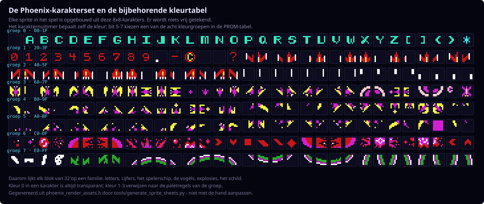

Sterren, planeten, het moederschip en de aliens komen uit een tweede, onafhankelijke set:

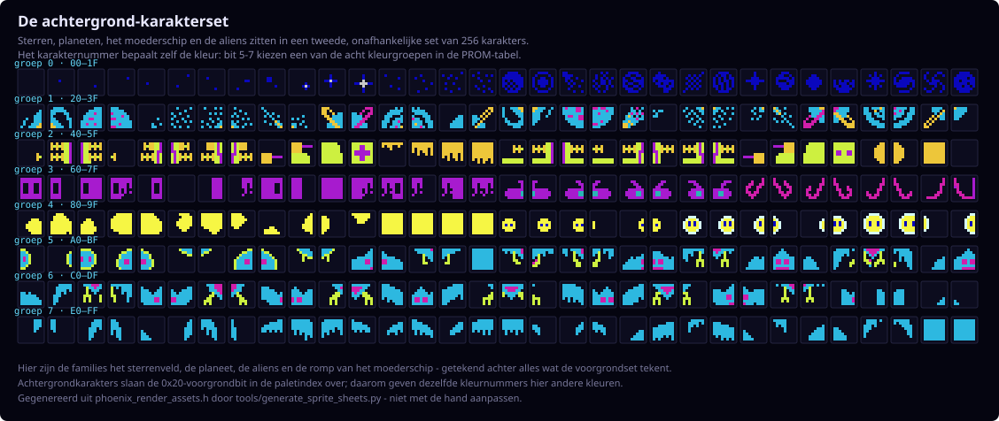

Phoenix heeft een kleine familie **drawNxN-routines**, en welke routine een object tekent bepaalt zijn afmeting én de volgorde waarin de karakters worden weggeschreven. Ze werken allemaal hetzelfde: twee karakters vullen een kolom van boven naar beneden, daarna stapt de routine zijwaarts naar de volgende kolom. Bij elke sheet hieronder staat welke routine is gebruikt.

Onder elk frame staan de **karaktercodes** waaruit het is opgebouwd — zoek die op in de sets hierboven en je ziet precies welke pixels de hardware ophaalde.

---

## 🖼️ De sprites, object voor object

### Het spelerschip

Het spelerschip is acht poses, elk vier karakters, getekend als 2×2-blok uit `phoenix_sprite_character_block_shapes`:

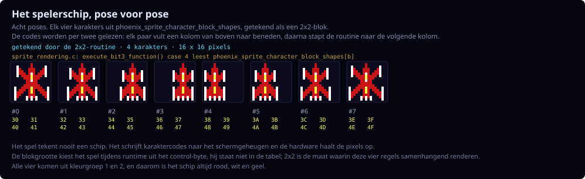


### De formatie-alien

De formatie-alien is niet één sprite. Terwijl hij schuift, klimt en duikt wisselt het spel van *blokgrootte*: `sprite_rendering.c` kiest tijdens runtime `1x1`, `2x1`, `1x2` of `2x2` uit het control-byte van het object. Geen tabel bevat die maat, dus deze poses zijn afgelezen uit het voorgrond-schermgeheugen van de gecommitte opname `c-last-grown-bird.bin.gz`.

In horizontale vlucht, twee karakters naast elkaar:

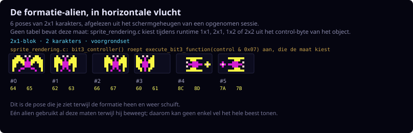


Klimmend, één karakter breed en twee hoog — hetzelfde beest recht van voren:

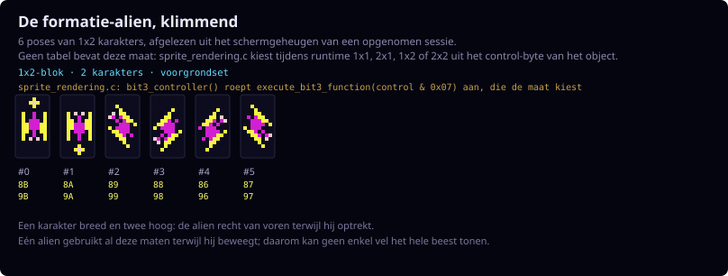


Duikend en zwenkend, zijn breedste vorm:

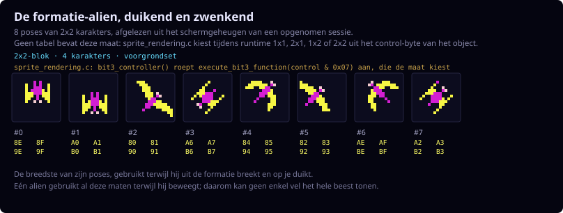


Dezelfde scan over dezelfde opname leverde ook de 3×2-explosieblokken hieronder op, wat een onafhankelijke controle is dat deze manier van aflezen deugt.

Poses groeperen op maat zegt welke vormen bestaan, maar niet in welke volgorde het spel ze toont. Eén object frame voor frame volgen wel — hier verlaat één alien de formatie en zakt veertien rijen op de speler af, terwijl zijn blokgrootte meewisselt:

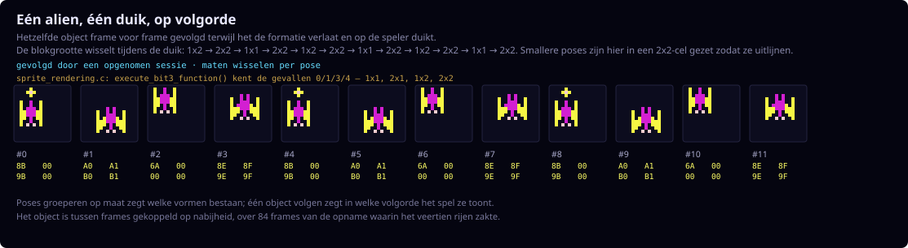


### Het spelerschild

Het schild is zestien karakters in een 4×4-blok, de grootste enkele sprite in het spel. Net als bij de alien is die maat een runtime-beslissing, dus ook dit is uit een opname afgelezen:

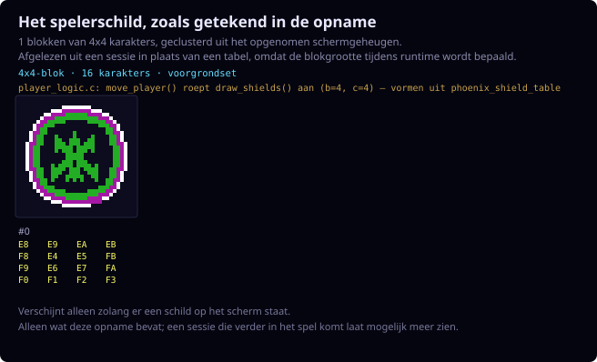

---

### De piloot van het moederschip

De piloot is het hoogste blok dat een van deze routines tekent, vier rijen bij twee kolommen:

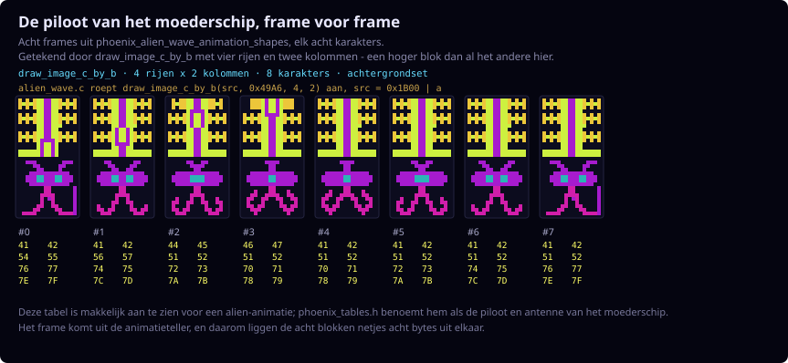


### De romp van het moederschip

De romp is het grootste object in het spel, en het enige dat de ROM als hele pagina van 26 x 9 bewaart in plaats van als sprite. Hij staat ondersteboven in de ROM, omdat het schip van bovenaf binnenscrollt; hier is hij teruggedraaid. De piloot hierboven wordt er los overheen getekend.

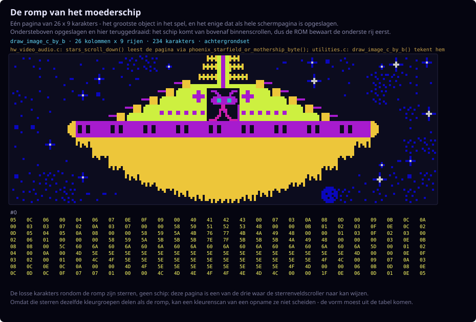

De losse karakters rondom het schip zijn **sterren**, geen romp: `phoenix_mothership_tile_page` is een van de drie pagina's waar de sterrenveldscroller naar kan wijzen, dus het schip en de lucht waar het doorheen vliegt delen één pagina. Daarom was deze sheet ook niet te vinden zoals het schild en de alien: de sterren zitten in dezelfde kleurgroepen als de romp, dus een kleurenscan van een opname kan ze niet scheiden. De vorm moest uit de tabel komen.

### Een explosie

Een explosie is acht frames uit `phoenix_alien_explosion_frames`, en hier zit een omweg in. Die bytes zijn *geen* karaktercodes: `alien_logic.c` maakt er met `0x1700 | byte` een adres van en roept dan `drawNx2` met n=3 aan, die daar zes karakters ophaalt uit `phoenix_shield_and_drawnx2_shapes`. Eén frame is dus een 3×2-blok, geen enkel karakter:

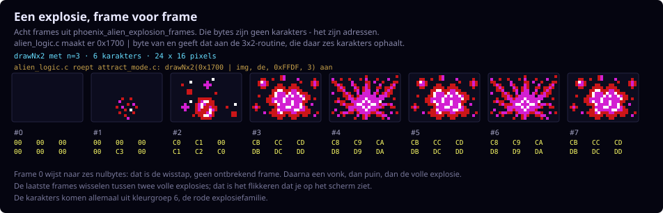


### De bonusexplosie

De bonusexplosie gebruikt dezelfde 3×2-routine, maar twee keer aangeroepen met vaste adressen, één per helft van een bredere explosie:

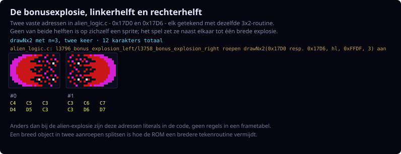


### De vogels

Vogels volgen een derde route. `drawbirdobject` zoekt eerst een **breedte** voor het vormtype op in `phoenix_bird_draw_entries`, dan een **pointer** naar de karakterdata in `phoenix_bird_shape_pointers`, waarna `draw_bird_shape_350c` die data per twee karakters afloopt. Een vogel is dus drie tot zeven kolommen breed, puur afhankelijk van zijn type — het ei en de volgroeide vogel zijn dezelfde routine met een ander aantal kolommen:

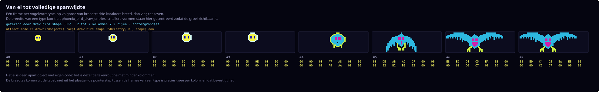


Elk type heeft vier eigen frames. **De kleine vogel**, zes karakters breed:

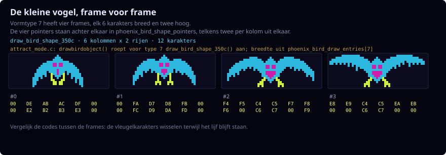


**De volgroeide vogel**, zeven karakters breed — de breedste sprite die de routine tekent:

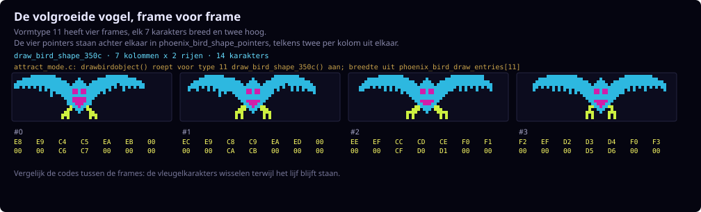


---

## 🔁 Deze sheets opnieuw genereren

Ze komen allemaal uit één script, te draaien vanuit de repository-root:

```sh
python3 c-phoenix/tools/generate_sprite_sheets.py
```

Het leest `phoenix_render_assets.h` en `phoenix_tables.c` voor alles wat wél in een tabel staat, en de gecommitte opname `c-last-grown-bird.bin.gz` voor de objecten waarvan de maat pas tijdens runtime wordt bepaald. Elke run meldt welke opname is gebruikt.

Die standaardopname bevat geen moederschip en geen schild van meerdere karakters. Wil je die erbij, maak dan eerst de rijkere bird-investigation-sessie en wijs het script daarnaar — opnieuw vanuit de repository-root:

```sh
make -C c-phoenix tracerun \
  COMPARE_SCRIPT=context/input-scripts/bird-investigation.txt \
  COMPARE_FRAMES=13935 \
  COMPARE_NAME=bird-investigation \
  COMPARE_STOP_AFTER=999999

python3 c-phoenix/tools/generate_sprite_sheets.py \
  --dump /tmp/port_bird-investigation.bin
```

`tracerun` draait eerst `comparerun`, dus het zusterproject JPhoenix moet gebouwd zijn (JDK 11+). Het schrijft `/tmp/port_bird-investigation.bin` — let op het underscore na `port` — plus `/tmp/ref_bird-investigation.bin` voor de emulatorkant. Dumps blijven bewust in `/tmp`; zie [`context/traces/README.nl.md`](../../context/traces/README.nl.md) voor waarom ze niet worden gecommit.

Zowel de stilstaande sheets als de bewegende versies worden gegenereerd door [`tools/generate_sprite_sheets.py`](../../tools/generate_sprite_sheets.py) uit `phoenix_render_assets.h` en `phoenix_tables.c`. Niets erin is met de hand getekend; verandert de ROM-data, dan veranderen de sheets mee.

---
