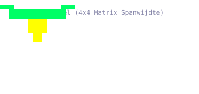
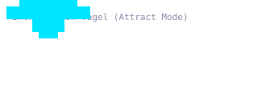

# Vogel Animaties & Visuele Analyse (`bird-animations.md`)

Dit document biedt een functionele en visuele analyse van alle vogel-gerelateerde animaties in *Phoenix* (levels 5 & 7), inclusief de exacte C-routines, Z80 ROM-adresbereiken, RAM-datastructuren en **losse geanimeerde SVG-bestanden**.

---

## Inhoudsopgave
1. [Overzicht Vogel-fases](#1-overzicht-vogel-fases)
2. [1. Ei & Broed-transformatie](#1-ei--broed-transformatie)
3. [2. Kleine Vogel Wieken & Flappen](#2-kleine-vogel-wieken--zweven)
4. [3. Grote / Volgroeide Vogel](#3-grote--volgroeide-vogel)
5. [4. Duikvlucht & Aanvalstraject](#4-duikvlucht--aanvalstraject)
6. [5. Vogel-Explosie & Bonus Score](#5-vogel-explosie--bonus-score)
7. [6. Attract Mode Intro-Vogel](#6-attract-mode-intro-vogel)

---

## 1. Overzicht Vogel-fases

In levels 5 en 7 van *Phoenix* worden de vogels aangestuurd via een dynamische toestandsmachine. De vogel-animatielus doorloopt verschillende fases: van ei tot kleine vogel, volgroeide vogel en duikvlucht.

#### **Knowledge Graph Koppelingen**
* **Relevante C-bestanden:**
  - [`bird_logic.c`](../../bird_logic.c) $\rightarrow$ [`bird-logic.md`](../../c-annotated/nl/bird-logic.md)
  - [`bird_wave_behavior.c`](../../bird_wave_behavior.c) $\rightarrow$ [`bird-wave-behavior.md`](../../c-annotated/nl/bird-wave-behavior.md)
  - [`birds_vertical_movement.c`](../../birds_vertical_movement.c) $\rightarrow$ [`birds-vertical-movement.md`](../../c-annotated/nl/birds-vertical-movement.md)
  - [`collision_detection.c`](../../collision_detection.c) $\rightarrow$ [`collision-detection.md`](../../c-annotated/nl/collision-detection.md)
  - [`attract_mode.c`](../../attract_mode.c) $\rightarrow$ [`attract-mode.md`](../../c-annotated/nl/attract-mode.md)

---

## 1. Ei & Broed-transformatie

### **Beschrijving & Code**
* **Routines:** [`l38bc_large_hit`](../../c-annotated/nl/collision-detection.md#l38bc_large_hit) (Z80 ROM: `$38BC–$38F1`) & [`l3250_egg_hatching`](../../c-annotated/nl/bird-wave-behavior.md#l3250_egg_hatching)
* **RAM-slots:** `bird_struct + 0` (type `0x0B` of `0x0C`), `bird_struct + 5` (broed-drempel).
* **Werking:** Eieren zweven in de formatie. Bij een schot (of zodra de broed-timer de drempelwaarde bereikt) transformeert het ei direct in een vogel via de tabel `phoenix_egg_transformation_types`.

---

## 2. Kleine Vogel (Wieken & Zweven)

### **Beschrijving & Code**
* **Routines:** [`drawbirdobject`](../../c-annotated/nl/attract-mode.md#drawbirdobject) (Z80 ROM: `$34C0–$355D`)
* **Tegelpointers:** `phoenix_bird_draw_entries` & `phoenix_bird_shape_pointers`
* **Werking:** Na het uitkomen wiekt de kleine vogel met 2 afwisselende vleugelframes (vleugels omhoog in frame A, vleugels omlaag in frame B) tijdens het vliegen in formatie.

---

## 3. Grote / Volgroeide Vogel

### **Beschrijving & Code**
* **Routines:** [`l327c_grown_bird_behavior`](../../c-annotated/nl/bird-wave-behavior.md#l327c_grown_bird_behavior) (Z80 ROM: `$327C–$32A0`)
* **Werking:** Als een kleine vogel voldoende tijd overleeft in het speelveld, groeit deze via `bird_struct + 4` uit tot een grote vogel met een brede 4x4 tegelmatrix spanwijdte.

---

## 4. Duikvlucht & Aanvalstraject

### **Beschrijving & Code**
* **Routines:** [`bird_flight_path`](../../c-annotated/nl/bird-logic.md#bird_flight_path) (Z80 ROM: `$3160`) & [`l3210_bird_dive_bomb`](../../c-annotated/nl/bird-wave-behavior.md#l3210_bird_dive_bomb)
* **Werking:** Bepaalde vogels verbreken de formatie en maken een versnelde duikvlucht in een sinus-traject naar het spelerschip, terwijl ze bommen laten vallen.

---

## 5. Vogel-Explosie & Bonus Score

### **Beschrijving & Code**
* **Routines:** [`bird_explosion_slot`](../../c-annotated/nl/collision-detection.md#bird_explosion_slot) & [`l3758_bonus_explosion_animation`](../../c-annotated/nl/alien-logic.md#l3758_bonus_explosion_animation)
* **RAM-slot:** `0x4378` / `0x437C` (bonus-explosie array).
* **Werking:** Bij een voltreffer spat de vogel uiteen in een 4x4 deeltjesraster (`phoenix_explosion_particle_page`). Vervolgens verschijnt een bonusscore (bijv. **100**, **200** of **500** punten) op de plek van de treffer.

---

## 6. Attract Mode Intro-Vogel

### **Beschrijving & Code**
* **Routines:** [`draw_intro_bird_animation_frame`](../../c-annotated/nl/attract-mode.md#draw_intro_bird_animation_frame) (Z80 ROM: `$21DC`)
* **Werking:** Tijdens het attract-scherm (titel-demo) zweeft een speciale geanimeerde vogel bovenaan het scherm ter demonstratie.

