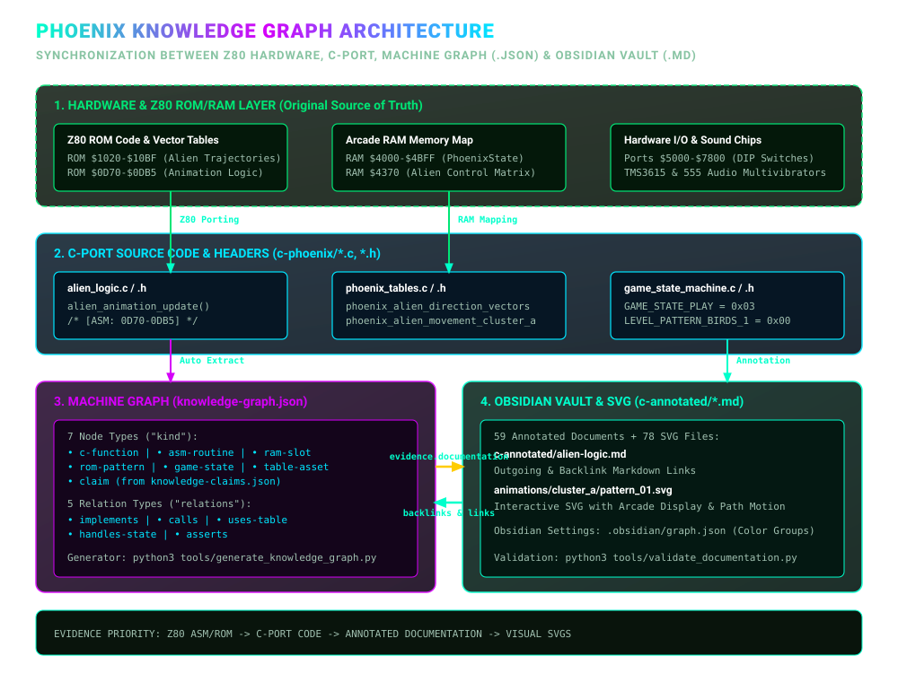
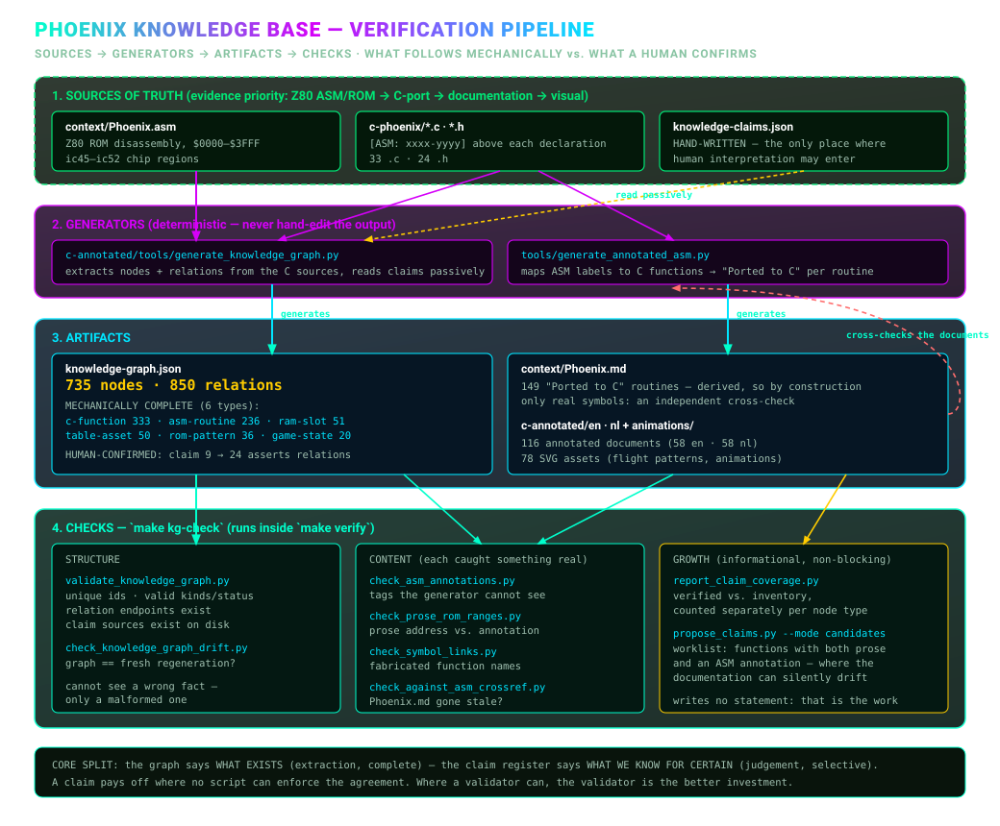

# Phoenix C & Header Annotated Knowledge Graph Documentation

Welcome to the **C & Header-Annotated Knowledge Graph Documentation** for the C port of the *Phoenix* Arcade Game (`c-phoenix`).

This directory contains a complete collection of **56 in-depth annotated documents** (32 `.c` source files + 24 `.h` header files), analyzing every component of the project down to function, memory map, and hardware port levels with interconnected links.

---

## 🎯 Goal & Concept

The goal of this documentation suite is to provide a navigable, **interactive Knowledge Graph** covering the ported C codebase of *Phoenix*.

Each function, structure, and header in every document is equipped with:
1. **Functionality & Arcade Background:** Narrative explanations of game behavior, RAM map ($4000–$4BFF), I/O ports, and Z80 ROM address ranges.
2. **Memory & Structure Context:** Utilized RAM slots (such as `$4370`, `$4B50`), registers, flags, and bitwise masks.
3. **Knowledge Graph Links:**
   - **Calls (Outgoing Calls):** Direct links to functions called by this function.
   - **Called By (Incoming Calls / Backlinks):** Direct links to functions that call this function.
4. **Relative Links:** All source code and documentation links use relative paths (e.g. `[phoenix_state.h](../../phoenix_state.h#L8)`).

### Source Priority

The source of truth is, in this order: **Z80 ASM/ROM → C-port → annotated analysis → visual explanations**. Technical conclusions should reference relevant ASM ranges, ROM tables, or C routines; conclusions without links are interpretations requiring verification.

The machine-readable core and regeneration instructions are in [`knowledge-graph.md`](../knowledge-graph.md); generated data is stored in [`knowledge-graph.json`](../knowledge-graph.json).

### How the layers fit together

From the 1980 Z80 hardware at the bottom to the browsable notes you are reading now:

### How a claim gets checked

Nothing in here is asserted by hand alone. Sources feed generators, generators produce artifacts, and a set of checks keeps the whole chain honest:

---

## 🗂️ Table of Contents for C & Header Annotated Files

### 🕸️ Dependency Graphs — which pages belong together

Every `.c` file below has an annotated page here, but they are not independent:
reading one usually means reading two or three others first. The design-time
graphs in [`../../context/graphs/`](../../context/graphs/README.md) show that
structure, generated from the same sources these pages annotate.

- [File call graph](../../context/graphs/file_callgraph.md) 🕸️ — **the
  dependency graph between source files.** One node per `.c` file, grouped into
  architectural clusters. Use it to see which annotated pages you need alongside
  the one you are reading, and which cluster a file belongs to.
- [ROM-bank call graph](../../context/graphs/rom_bank_callgraph.md) 🧭 —
  functions bucketed by the `[ASM: nnnn-nnnn]` tag in their doc comment, the
  same tag the annotations use. The bridge between these pages,
  [`context/mapping/`](../../context/mapping/README.md) and `Phoenix.asm`.
- [Cross-domain call graph](../../context/graphs/cross_domain_callgraph.md) 🔀 —
  only the calls that leave their own domain, which is where most surprises in
  the port live.

Those graphs are a map, not proof: they come from a textual scan, so read
[their README](../../context/graphs/README.md) for what the scan cannot see.

---

### 🎨 Visual Animations & Flight Patterns
- [`../../animations/en/README.md`](../../animations/en/README.md) 🎬 — **Visual animation guide & SVG analysis of all bird animations and flight trajectories in `c-phoenix/animations/`.**
- [`../../animations/en/animation-trajectory.md`](../../animations/en/animation-trajectory.md) 🚀 — **Analysis of all prescribed flight patterns, ROM clusters, vectors, and AI scripts.**
- [`../../animations/en/animation-trajectory-detailed.md`](../../animations/en/animation-trajectory-detailed.md) 📐 — **Detailed step-by-step coordinate tables on screen grid per individual pattern.**
- [`../../animations/en/bird-animations.md`](../../animations/en/bird-animations.md) 🦅 — **Analysis of bird animation phases.**

---

### 1. Memory Map, Hardware & Core Headers (5 header documents)
- [`phoenix-state-h.md`](phoenix-state-h.md) — Arcade RAM Memory Map (`PhoenixState` struct, $4000–$4BFF) ([`phoenix_state.h`](../../phoenix_state.h)).
- [`phoenix-hw-h.md`](phoenix-hw-h.md) — Hardware I/O ports (`$5000`, `$5800`, `$6000`, `$6800`, `$7000`, `$7800`) and DIP switches ([`phoenix_hw.h`](../../phoenix_hw.h)).
- [`game-constants-h.md`](game-constants-h.md) — `PhoenixGameState` and `LEVEL_PATTERN_*` enums and button masks ([`game_constants.h`](../../game_constants.h)).
- [`phoenix-tables-h.md`](phoenix-tables-h.md) — Declarations of ROM lookup tables ([`phoenix_tables.h`](../../phoenix_tables.h)).
- [`z80-core-h.md`](z80-core-h.md) — Z80 CPU bit rotation and helper macros ([`z80_core.h`](../../z80_core.h)).

### 2. Gameplay & Entities (8 C files + 5 H files)
- [`alien-logic.md`](alien-logic.md) / [`alien-logic-h.md`](alien-logic-h.md) — Swarm aliens, flight patterns, and explosion slots (`alien_logic.c` / `alien_logic.h`).
- [`alien-wave.md`](alien-wave.md) — Main loop for alien waves (levels 1, 3 & B), 4-frame interleaving, and star scrolling (`alien_wave.c`).
- [`bird-logic.md`](bird-logic.md) / [`bird-logic-h.md`](bird-logic-h.md) — Main loop for bird waves (levels 5 & 7) (`bird_logic.c` / `bird_logic.h`).
- [`bird-wave-behavior.md`](bird-wave-behavior.md) — Bird state machine, egg hatching, and dive bombing (`bird_wave_behavior.c`).
- [`birds-vertical-movement.md`](birds-vertical-movement.md) — Vertical scroll registers (`B4BD2`) and descent speeds (`birds_vertical_movement.c`).
- [`mothership-impl.md`](mothership-impl.md) — Mothership tile hit detection, shield piercing, and core explosions (`mothership_impl.c`).
- [`mothership-logic.md`](mothership-logic.md) / [`mothership-logic-h.md`](mothership-logic-h.md) — Erasing the mothership and bonus score calculation (`mothership_logic.c` / `mothership_logic.h`).
- [`player-logic.md`](player-logic.md) / [`player-logic-h.md`](player-logic-h.md) — Player ship control, shield activation (5s force field), and bullet spawning (`player_logic.c` / `player_logic.h`).
- [`player-explosion.md`](player-explosion.md) — Fragment rendering and particle splash grids (`player_explosion.c`).

### 3. Collision, Weapon & Scoring (3 C files + 1 H file)
- [`collision-detection.md`](collision-detection.md) — VRAM tile & pixel mask collisions with birds/eggs (`collision_detection.c`).
- [`weapon-collision.md`](weapon-collision.md) / [`weapon-collision-h.md`](weapon-collision-h.md) — Player bullets vs aliens, enemy bombs, and player collisions (`weapon_collision.c` / `weapon_collision.h`).
- [`scoring.md`](scoring.md) — BCD score addition, High Score comparisons, and bonus life thresholds (`scoring.c`).

### 4. Game State Machine & Modes (7 C files + 6 H files)
- [`game-state-machine.md`](game-state-machine.md) / [`game-state-machine-h.md`](game-state-machine-h.md) — Central state machine (States 0 through 7) (`game_state_machine.c` / `game_state_machine.h`).
- [`attract-mode.md`](attract-mode.md) / [`attract-mode-h.md`](attract-mode-h.md) — Splash screen sequencer, coins/credits, and demo (`attract_mode.c` / `attract_mode.h`).
- [`state-init.md`](state-init.md) / [`state-init-h.md`](state-init-h.md) — Level & game initialization (State 2) (`state_init.c` / `state_init.h`).
- [`state-play.md`](state-play.md) / [`state-play-h.md`](state-play-h.md) — Level dispatcher for 12 level phases (`state_play.c` / `state_play.h`).
- [`state-endings.md`](state-endings.md) / [`state-endings-h.md`](state-endings-h.md) — Player explosion (State 4), Game Over (State 5), Mothership explosion (State 6) (`state_endings.c` / `state_endings.h`).
- [`init-global-level-data.md`](init-global-level-data.md) — Copies 12 configuration bytes per level pattern to RAM (`init_global_level_data.c`).
- [`misc-logic.md`](misc-logic.md) — Background galaxies and random bombs (`misc_logic.c`).

### 5. Hardware, Rendering & Audio (7 C files + 7 H files)
- [`hw-video-audio.md`](hw-video-audio.md) / [`hw-video-audio-h.md`](hw-video-audio-h.md) — Main loop entry point (`RESET`), 60Hz VBlank (`hw_video_audio.c` / `hw_video_audio.h`).
- [`sprite-rendering.md`](sprite-rendering.md) / [`sprite-rendering-h.md`](sprite-rendering-h.md) — 1x1, 2x1, 1x2, and 2x2 sprite rendering (`sprite_rendering.c` / `sprite_rendering.h`).
- [`sound.md`](sound.md) / [`sound-h.md`](sound-h.md) — Audio mixer & 44.1kHz frame renderer (`sound.c` / `sound.h`).
- [`sound-discrete.md`](sound-discrete.md) / [`sound-discrete-h.md`](sound-discrete-h.md) — 555 multivibrators, RC circuits, and Poly18 noise (`sound_discrete.c` / `sound_discrete.h`).
- [`sound-dispatcher.md`](sound-dispatcher.md) — Z80 per-frame sound dispatcher (`$3A10`), sirens, intro tune (`sound_dispatcher.c`).
- [`tms36xx.md`](tms36xx.md) / [`tms36xx-h.md`](tms36xx-h.md) — Texas Instruments TMS3615 / MM6221AA synthesizers (`tms36xx.c` / `tms36xx.h`).
- [`mame-lofi-resampler.md`](mame-lofi-resampler.md) / [`mame-lofi-resampler-h.md`](mame-lofi-resampler-h.md) — 4-point cubic resampler (`mame_lofi_resampler.c` / `mame_lofi_resampler.h`).

### 6. Tables, Utilities, Platform & Support (5 C files + 5 H files)
- [`phoenix-tables.md`](phoenix-tables.md) — Z80 ROM tables for vectors, hit windows, and bird scripts (`phoenix_tables.c`).
- [`utilities.md`](utilities.md) / [`utilities-h.md`](utilities-h.md) — Memory read/write wrappers and BCD arithmetic (`utilities.c` / `utilities.h`).
- [`platform-sdl.md`](platform-sdl.md) — SDL2 window, keyboard input, and audio device management (`platform_sdl.c`).
- [`rom-compat-stubs.md`](rom-compat-stubs.md) — Stubs for Z80 ROM hardware compatibility (`rom_compat_stubs.c`).
- [`runtime-call-trace.md`](runtime-call-trace.md) — Diagnostics and call tracing (`runtime_call_trace.c`).
- [`coverage.md`](coverage.md) / [`coverage-h.md`](coverage-h.md) — Execution coverage tracking (`coverage.c` / `coverage.h`).
- [`knowledge-graph.md`](../knowledge-graph.md) — Structural definition and schema of the Knowledge Graph.
- [`walkthrough.md`](walkthrough.md) — Architectural walkthrough of the C port.
