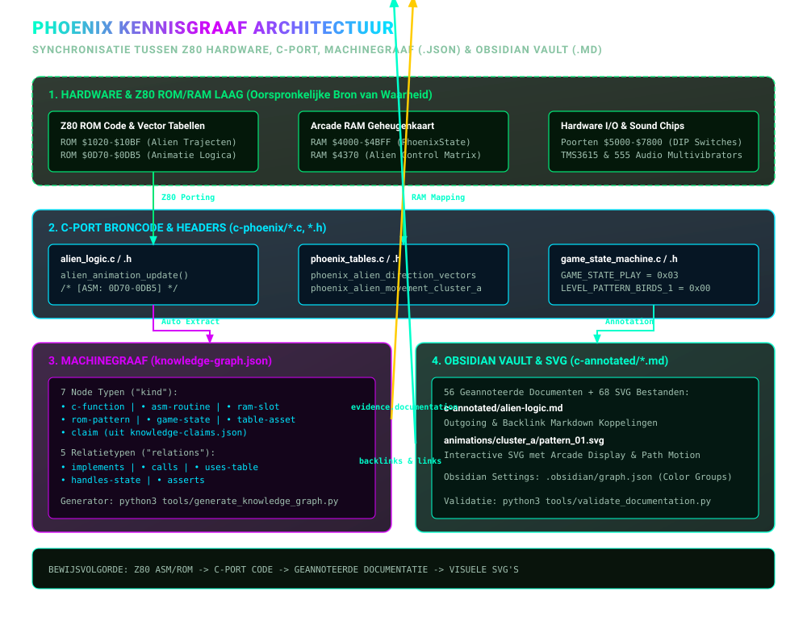
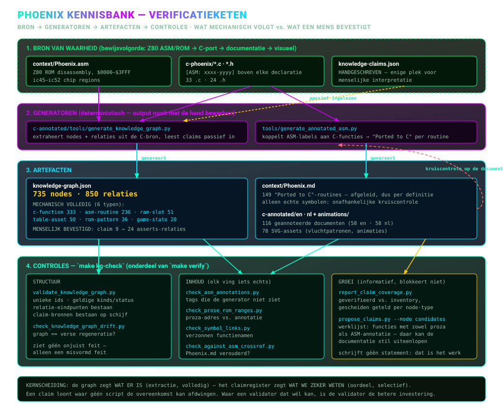

# Phoenix C & Header Annotated Knowledge Graph Documentatie

Welkom bij de **C & Header-Annotated Knowledge Graph Documentatie** voor de C-port van de *Phoenix* Arcade Game (`c-phoenix`).

Deze directory bevat een volledige verzameling van **56 diepgaande geannoteerde documenten** (32 `.c` bronbestanden + 24 `.h` headerbestanden), waarin elk onderdeel uit het project tot op functie-, geheugenkaart- en hardwarepoort-niveau wordt ontleed en onderling met elkaar is verbonden.

---

## 🎯 Doel & Concept

Het doel van deze documentatieset is het bieden van een navigeerbare, **interactieve Knowledge Graph** over de geporteerde C-codebase van *Phoenix*.

Elke functie, structuur en header in elk document is voorzien van:
1. **Functionaliteit & Arcade-achtergrond:** Verhalende uitleg van het spelgedrag, RAM-kaart ($4000–$4BFF), I/O poorten en Z80 ROM-adresbereiken.
2. **Geheugen- & Structuur-context:** Gebruikte RAM-slots (zoals `$4370`, `$4B50`), registers, vlaggen en bitwise maskers.
3. **Knowledge Graph Koppelingen:**
   - **Aanroepen (Outgoing Calls):** Directe links naar de functies die door deze functie worden aangeroepen.
   - **Aangeroepen door (Incoming Calls / Backlinks):** Directe links naar de functies die deze functie aanroepen.
4. **Relatieve Verwijzingen:** Alle broncode- en documentatielinks gebruiken relatieve paden (bijv. `[phoenix_state.h](../../phoenix_state.h#L8)`).

### Bronstatus

De bron van waarheid is, in deze volgorde: **Z80 ASM/ROM → C-port → deze geannoteerde analyse → visuele toelichting**. Technische conclusies in de analyse horen daarom naar de relevante ASM-range, ROM-tabel of C-routine te verwijzen; conclusies zonder zo'n koppeling zijn interpretaties die nog gecontroleerd moeten worden.

De machineleesbare kern en de instructies voor regeneratie staan in [`knowledge-graph.md`](../knowledge-graph.md); de gegenereerde data staat in [`knowledge-graph.json`](../knowledge-graph.json).

### Hoe de lagen op elkaar aansluiten

Van de Z80-hardware uit 1980 onderaan tot de doorbladerbare notities die je nu leest:

### Hoe een claim wordt gecontroleerd

Niets hierin berust alleen op handwerk. Bronnen voeden generatoren, generatoren maken artefacten, en een reeks controles bewaakt de hele keten:

---

## 🗂️ Inhoudsopgave van de C & Header Annotated Bestanden

### 🕸️ Afhankelijkheidsgrafen — welke pagina's bij elkaar horen

Elk `.c`-bestand hieronder heeft hier een geannoteerde pagina, maar die staan
niet los van elkaar: één lezen betekent meestal eerst twee of drie andere lezen.
De ontwerptijd-grafen in
[`../../context/graphs/`](../../context/graphs/README.nl.md) tonen die
structuur, gegenereerd uit dezelfde broncode die deze pagina's annoteren.

- [`file_callgraph`](../../context/graphs/file_callgraph.md) 🕸️ — **de
  afhankelijkheidsgraaf tussen bronbestanden.** Eén knoop per `.c`-bestand,
  gegroepeerd in architectuurclusters. Gebruik hem om te zien welke geannoteerde
  pagina's je erbij nodig hebt, en tot welk cluster een bestand behoort.
- [`rom_bank_callgraph`](../../context/graphs/rom_bank_callgraph.md) 🧭 —
  functies gesorteerd op de `[ASM: nnnn-nnnn]`-tag uit hun doc-commentaar,
  dezelfde tag die de annotaties gebruiken. De brug tussen deze pagina's,
  [`context/mapping/`](../../context/mapping/README.nl.md) en `Phoenix.asm`.
- [`cross_domain_callgraph`](../../context/graphs/cross_domain_callgraph.md) 🔀 —
  alleen de aanroepen die hun eigen domein verlaten, en daar zitten de meeste
  verrassingen in de port.

Die grafen zijn een kaart, geen bewijs: ze komen uit een tekstuele scan, dus
lees [hun README](../../context/graphs/README.nl.md) voor wat die scan niet
ziet.

---

### 🎨 Visuele Animaties & Vliegpatronen
- [`../../animations/nl/README.md`](../../animations/nl/README.md) 🎬 — **Visuele animatiegids & SVG-analyse van alle vogel-animaties en vliegtrajecten in `c-phoenix/animations/`.**
- [`../../animations/nl/animation-trajectory.md`](../../animations/nl/animation-trajectory.md) 🚀 — **Analyse van alle voorgeschreven vliegpatronen, ROM-clusters, vectoren en AI-scripts.**
- [`../../animations/nl/animation-trajectory-detailed.md`](../../animations/nl/animation-trajectory-detailed.md) 📐 — **Gedetailleerde stap-voor-stap coördinatentabellen op het scherm-grid per individueel patroon.**
- [`../../animations/nl/bird-animations.md`](../../animations/nl/bird-animations.md) 🦅 — **Analyse van de vogel-animatiefases.**

---

### 1. Geheugenkaart, Hardware & Core Headers (5 header-documenten)
- [`phoenix-state-h.md`](phoenix-state-h.md) — Arcade RAM Geheugenkaart (`PhoenixState` struct, $4000–$4BFF) ([`phoenix_state.h`](../../phoenix_state.h)).
- [`phoenix-hw-h.md`](phoenix-hw-h.md) — Hardware I/O poorten (`$5000`, `$5800`, `$6000`, `$6800`, `$7000`, `$7800`) en DIP-switches ([`phoenix_hw.h`](../../phoenix_hw.h)).
- [`game-constants-h.md`](game-constants-h.md) — `PhoenixGameState` en `LEVEL_PATTERN_*` enums en knoppen-maskers ([`game_constants.h`](../../game_constants.h)).
- [`phoenix-tables-h.md`](phoenix-tables-h.md) — Declaraties van ROM-opzoektabellen ([`phoenix_tables.h`](../../phoenix_tables.h)).
- [`z80-core-h.md`](z80-core-h.md) — Z80 CPU bitrotatie en hulp-macros ([`z80_core.h`](../../z80_core.h)).

### 2. Gameplay & Entiteiten (8 C-bestanden + 5 H-bestanden)
- [`alien-logic.md`](alien-logic.md) / [`alien-logic-h.md`](alien-logic-h.md) — Zwerm-aliens, vliegpatronen en explosieslots (`alien_logic.c` / `alien_logic.h`).
- [`alien-wave.md`](alien-wave.md) — Hoofdlus voor alien-waves (level 1, 3 & B), 4-frame interleaving en sterren-scrolling (`alien_wave.c`).
- [`bird-logic.md`](bird-logic.md) / [`bird-logic-h.md`](bird-logic-h.md) — Hoofdlus voor vogel-waves (levels 5 & 7) (`bird_logic.c` / `bird_logic.h`).
- [`bird-wave-behavior.md`](bird-wave-behavior.md) — Vogel-toestandsmachine, ei-uitbroeden en duikvluchten (`bird_wave_behavior.c`).
- [`birds-vertical-movement.md`](birds-vertical-movement.md) — Verticale scroll-registers (`B4BD2`) en afdaalsnelheden (`birds_vertical_movement.c`).
- [`mothership-impl.md`](mothership-impl.md) — Moederschip tegel-inslag detectie, schild-doorboring en kern-explosies (`mothership_impl.c`).
- [`mothership-logic.md`](mothership-logic.md) / [`mothership-logic-h.md`](mothership-logic-h.md) — Wissen van het moederschip en bonusscore-berekening (`mothership_logic.c` / `mothership_logic.h`).
- [`player-logic.md`](player-logic.md) / [`player-logic-h.md`](player-logic-h.md) — Spelerschip besturing, schild-activatie (5s krachtveld) en kogelspawning (`player_logic.c` / `player_logic.h`).
- [`player-explosion.md`](player-explosion.md) — Fragment-rendering en deeltjes-spatrasters (`player_explosion.c`).

### 3. Botsing, Wapen & Scoring (3 C-bestanden + 1 H-bestand)
- [`collision-detection.md`](collision-detection.md) — VRAM tegel- & pixelmasker botsingen met vogels/eieren (`collision_detection.c`).
- [`weapon-collision.md`](weapon-collision.md) / [`weapon-collision-h.md`](weapon-collision-h.md) — Spelerkogels vs aliens, vijandelijke bommen en speler botsingen (`weapon_collision.c` / `weapon_collision.h`).
- [`scoring.md`](scoring.md) — BCD-score optelling, High Score vergelijkingen en bonusleven-drempels (`scoring.c`).

### 4. Game State Machine & Modes (7 C-bestanden + 6 H-bestanden)
- [`game-state-machine.md`](game-state-machine.md) / [`game-state-machine-h.md`](game-state-machine-h.md) — Centrale toestandsmachine (States 0 t/m 7) (`game_state_machine.c` / `game_state_machine.h`).
- [`attract-mode.md`](attract-mode.md) / [`attract-mode-h.md`](attract-mode-h.md) — Splash-scherm sequencer, munten/credits en demo (`attract_mode.c` / `attract_mode.h`).
- [`state-init.md`](state-init.md) / [`state-init-h.md`](state-init-h.md) — Level- & game-initialisatie (State 2) (`state_init.c` / `state_init.h`).
- [`state-play.md`](state-play.md) / [`state-play-h.md`](state-play-h.md) — Level dispatcher voor 12 levelfases (`state_play.c` / `state_play.h`).
- [`state-endings.md`](state-endings.md) / [`state-endings-h.md`](state-endings-h.md) — Spelersexplosie (State 4), Game Over (State 5), Moederschipexplosie (State 6) (`state_endings.c` / `state_endings.h`).
- [`init-global-level-data.md`](init-global-level-data.md) — Kopieert 12 configuratiebytes per levelpatroon naar RAM (`init_global_level_data.c`).
- [`misc-logic.md`](misc-logic.md) — Achtergrond-sterrenstelsels en willekeurige bommen (`misc_logic.c`).

### 5. Hardware, Rendering & Audio (7 C-bestanden + 7 H-bestanden)
- [`hw-video-audio.md`](hw-video-audio.md) / [`hw-video-audio-h.md`](hw-video-audio-h.md) — Main loop entry point (`RESET`), 60Hz VBlank (`hw_video_audio.c` / `hw_video_audio.h`).
- [`sprite-rendering.md`](sprite-rendering.md) / [`sprite-rendering-h.md`](sprite-rendering-h.md) — 1x1, 2x1, 1x2 en 2x2 sprite rendering (`sprite_rendering.c` / `sprite_rendering.h`).
- [`sound.md`](sound.md) / [`sound-h.md`](sound-h.md) — Audio mixer & 44.1kHz frame renderer (`sound.c` / `sound.h`).
- [`sound-discrete.md`](sound-discrete.md) / [`sound-discrete-h.md`](sound-discrete-h.md) — 555-multivibratoren, RC-circuits en Poly18 ruis (`sound_discrete.c` / `sound_discrete.h`).
- [`sound-dispatcher.md`](sound-dispatcher.md) — Z80 per-frame sound dispatcher (`$3A10`), sirenes, intro-melodie (`sound_dispatcher.c`).
- [`tms36xx.md`](tms36xx.md) / [`tms36xx-h.md`](tms36xx-h.md) — Texas Instruments TMS3615 / MM6221AA synthesizers (`tms36xx.c` / `tms36xx.h`).
- [`mame-lofi-resampler.md`](mame-lofi-resampler.md) / [`mame-lofi-resampler-h.md`](mame-lofi-resampler-h.md) — 4-punts kubische resampler (`mame_lofi_resampler.c` / `mame_lofi_resampler.h`).

### 6. Tabellen, Utilities, Platform & Support (5 C-bestanden + 5 H-bestanden)
- [`phoenix-tables.md`](phoenix-tables.md) — Geëxtraheerde Arcade ROM opzoektabellen (`phoenix_tables.c`).
- [`utilities.md`](utilities.md) / [`utilities-h.md`](utilities-h.md) — RAM/VRAM abstracties (`mem_read`/`mem_write`), BCD-print (`utilities.c` / `utilities.h`).
- [`platform-sdl.md`](platform-sdl.md) — SDL2 vensterbeheer en VRAM-bankswapping (`platform_sdl.c`).
- [`coverage.md`](coverage.md) / [`coverage-h.md`](coverage-h.md) — Runtime-instrumentatie voor lockstep-testen (`coverage.c` / `coverage.h`).
- [`rom-compat-stubs.md`](rom-compat-stubs.md) — ROM-compatibiliteit stubs en "AMSTAR" copyright-check (`rom_compat_stubs.c`).
- [`runtime-call-trace.md`](runtime-call-trace.md) — Binaire profiling hooks (`runtime_call_trace.c`).
- [`phoenix-render-assets-h.md`](phoenix-render-assets-h.md) — Tegel-assets en kleurenpaletten (`phoenix_render_assets.h`).
- [`walkthrough.md`](walkthrough.md) — Samenvatting en opleveringsdocument.
