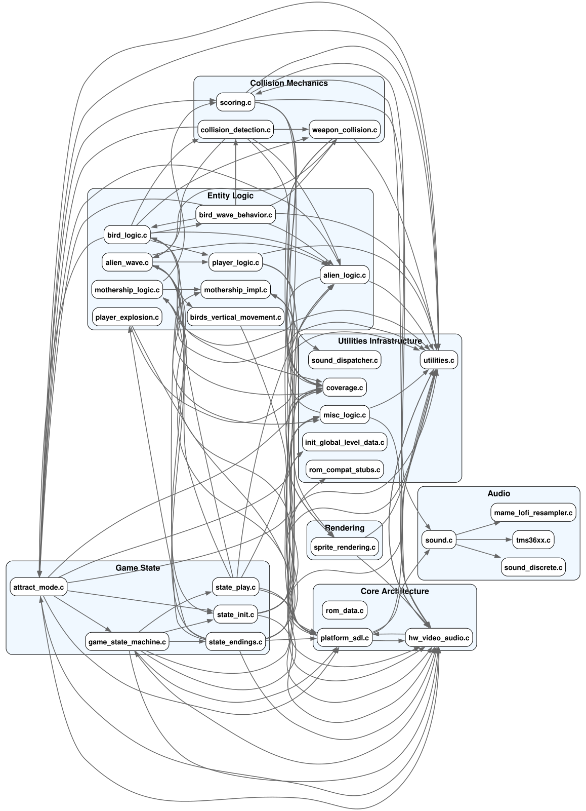

# C-Phoenix Graphs

🇬🇧 English · 🇳🇱 [Nederlands](README.nl.md)

Nine call-graphs of the C port, each answering one question about how the code
hangs together. Every one is generated from the sources by a script in
[`c-phoenix/tools/`](../../tools/); nothing here is drawn by hand, so a graph
that disagrees with the code means the code changed and the graph did not.

Each graph comes as three files: the Graphviz source (`.dot`), the rendered
picture (`.svg`), and a short guide (`.md`).

## Which graph do I want?

Start from the question you actually have:

| If you want to know… | Open | Why that one |
| --- | --- | --- |
| Where do I even start reading this port? | [file_callgraph](file_callgraph.md) | One node per source file, grouped into clusters. The only graph small enough to take in at a glance. |
| Who calls this function, and what does it call? | [callgraph](callgraph.md) | Every function and every edge. Large — open the SVG and zoom rather than reading it whole. |
| Does this change cross an architectural boundary? | [cross_domain_callgraph](cross_domain_callgraph.md) | Shows only edges that leave their own domain, so an unexpected one stands out. |
| Is this domain a coherent unit or a grab bag? | [internal_domain_callgraph](internal_domain_callgraph.md) | The mirror image: only the edges *inside* one domain. |
| Which parts of the game talk to each other? | [func_prefix_callgraph](func_prefix_callgraph.md) | Groups functions by naming family (`bird_*`, `mothership_*`, …) instead of by file. |
| What runs from the top down? | [execution_tree_callgraph](execution_tree_callgraph.md) | The call hierarchy as a tree, rooted at the entry points. |
| Which original ROM bank did this code come from? | [rom_bank_callgraph](rom_bank_callgraph.md) | Buckets functions by the `[ASM: nnnn-nnnn]` address in their doc comment. Useful when comparing against `Phoenix.asm`. |
| Are we still leaning on compatibility stubs? | [stub_hunter_callgraph](stub_hunter_callgraph.md) | Only the callers that still reach a ROM-compat stub. |
| Which functions did the test scripts actually execute? | [coverage_callgraph](coverage_callgraph.md) | The one graph built from a *run* rather than from the source text. |

**The first eight are design-time**: they read the `.c` files and describe what
the source says, regardless of whether that code ever runs. **`coverage_callgraph`
is different** — it needs `.gcov` output from an instrumented build, so it shows
what a particular set of replays reached.

## Start here: how the C port is laid out

`file_callgraph` is the readable overview — which source file depends on which,
grouped into the port's architectural clusters:



That picture is the fastest way to get oriented: entity logic in the middle,
collision and scoring above it, platform and audio at the bottom right, and
`utilities.c` pulled on by nearly everything.

Only `file_callgraph` is shown inline, deliberately. The function-level graphs
are very large — `func_prefix_callgraph` is roughly 2300 × 8100 points and
`execution_tree_callgraph` over 10 000 points wide — so a thumbnail would be an
unreadable smudge. Open those SVGs directly and zoom.

`stub_hunter_callgraph.svg` currently renders empty. That is the result, not a
failure: no active C caller still reaches a ROM-compatibility stub.

## The generators

| Graph | Script | Reads |
| --- | --- | --- |
| [callgraph](callgraph.md) | [`generate_callgraph.py`](../../tools/generate_callgraph.py) | the `.c` sources |
| [file_callgraph](file_callgraph.md) | [`generate_file_callgraph.py`](../../tools/generate_file_callgraph.py) | the `.c` sources |
| [func_prefix_callgraph](func_prefix_callgraph.md) | [`generate_func_prefix_callgraph.py`](../../tools/generate_func_prefix_callgraph.py) | the `.c` sources |
| [cross_domain_callgraph](cross_domain_callgraph.md) | [`generate_cross_domain_callgraph.py`](../../tools/generate_cross_domain_callgraph.py) | the `.c` sources |
| [internal_domain_callgraph](internal_domain_callgraph.md) | [`generate_internal_domain_callgraph.py`](../../tools/generate_internal_domain_callgraph.py) | the `.c` sources |
| [execution_tree_callgraph](execution_tree_callgraph.md) | [`generate_execution_tree_callgraph.py`](../../tools/generate_execution_tree_callgraph.py) | the `.c` sources |
| [rom_bank_callgraph](rom_bank_callgraph.md) | [`generate_rom_bank_callgraph.py`](../../tools/generate_rom_bank_callgraph.py) | the `.c` sources plus their `[ASM: …]` comments |
| [stub_hunter_callgraph](stub_hunter_callgraph.md) | [`generate_stub_hunter_callgraph.py`](../../tools/generate_stub_hunter_callgraph.py) | the `.c` sources plus `rom_compat_stubs.c` |
| [coverage_callgraph](coverage_callgraph.md) | [`generate_coverage_callgraph.py`](../../tools/generate_coverage_callgraph.py) | `.gcov` files from a coverage build |

## How the scripts work

All nine follow the same three steps, and none of them compiles anything:

1. **Scan the sources as text.** Every `.c` file in `c-phoenix/` is read line by
   line. A line matching a function-definition pattern registers a function and
   the file it lives in; after that, any name followed by `(` on a later line
   counts as a call — but only if that name is already known to be a defined
   function, so `if (`, casts and library calls are ignored.
2. **Classify into domains.** Each script carries a hard-coded `categories` map
   that assigns source files to clusters (Core Architecture, Game State, Entity
   Logic, Collision Mechanics, Rendering, Audio, Utilities). That map is what
   turns a flat edge list into a grouped picture, and it is also why adding a
   new source file needs a one-line edit in each generator to place it.
3. **Write `.dot`, then render.** The script writes Graphviz source and shells
   out to `dot -Tsvg` for the picture. **Graphviz must be installed**; without
   it the `.dot` file is still written and the `.svg` is skipped with a message.

Two scripts deviate. `generate_rom_bank_callgraph.py` also reads the
`[ASM: nnnn-nnnn]` tag in each function's doc comment and buckets the function
by its start address, which is how a modern C function is traced back to an
original ROM bank. `generate_coverage_callgraph.py` ignores call structure
altogether and parses `.gcov` files instead, marking each function executed or
not — so it needs a coverage build to have run first, and it reflects whichever
replays were used.

## What these graphs do not see

The scan is textual, not a compiler pass, and that has consequences worth
knowing before you treat a graph as complete:

- **Function definitions are matched on their return type.** The pattern covers
  `void`, `uint8_t`, `uint16_t`, `int` and `bool`. In the current sources that
  recognises 296 functions and misses 29 — those returning something else
  (`float`, `double`, `const char*`) or carrying an attribute macro such as
  `NO_INSTRUMENT`. A missed function is not a node, and calls to it are not
  edges.
- **Comments are not stripped.** A function name mentioned in a comment inside a
  function body counts as a call. There are around 399 comment lines in the
  sources that look like a call, so a small number of edges may be documentation
  rather than code.
- **Calls through function pointers are invisible**, as they are to any textual
  scan.

None of this makes the graphs wrong as an overview — it makes them a map, not a
proof. When an edge matters to an argument you are making, check it against the
source. For a call list that is recorded rather than inferred, use the runtime
graphs below.

## Using these alongside the knowledge base

Every `.c` file in this port has an annotated counterpart in
[`c-annotated/`](../../c-annotated/README.md), and `file_callgraph` doubles as
an index into it: the file a node names is the page you want, and the arrows
tell you which pages to read alongside it. `rom_bank_callgraph` reads the same
`[ASM: nnnn-nnnn]` tags the annotations and
[`context/mapping/`](../mapping/README.md) are built on, so the three views —
table, annotation and graph — are describing one and the same correspondence.

## Regenerating

From `c-phoenix/`, the whole set plus the other generated documentation:

```bash
make docs
```

Or one at a time, when you only changed one thing:

```bash
python3 tools/generate_file_callgraph.py
python3 tools/generate_rom_bank_callgraph.py
```

`coverage_callgraph` is the exception: it needs `.gcov` files, so run the
coverage build first.

## Not the same as runtime graphs

These graphs should not be confused with the per-scenario **runtime** graphs in
`context/runtimegraphs/<scenario>/`, generated by `make runtimegraph`. Those use
actual calls recorded while an input script plays, so they show what happened
rather than what the source allows. The comparison there also distinguishes
designed call edges from edges observed in that run — which is the honest way to
find both dead code and undocumented paths.
