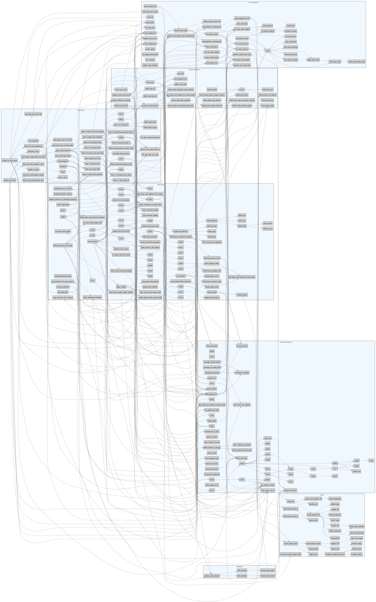

# Phoenix C-Port - Function Dependency Callgraph

This generated graph visualizes the C-level function calls (`A()` calls `B()`).
- **Nodes** represent the individual C functions (`phoenix_main_loop`, `collision_detection_for_birds`, etc.).
- **Subgraphs (Blue boxes)** represent the logical architectural domains we defined earlier (Game State, Entity Logic, Rendering, etc.).
- **Arrows** show the explicit calling dependencies extracted from the `.c` files.

Because there are 300+ functions, this is a very dense graph! Zoom in and pan around to trace exactly how the Game State Machine drops down into Entity Logic, and how Entity Logic drops down into Collision Mechanics and Hardware Abstraction.

