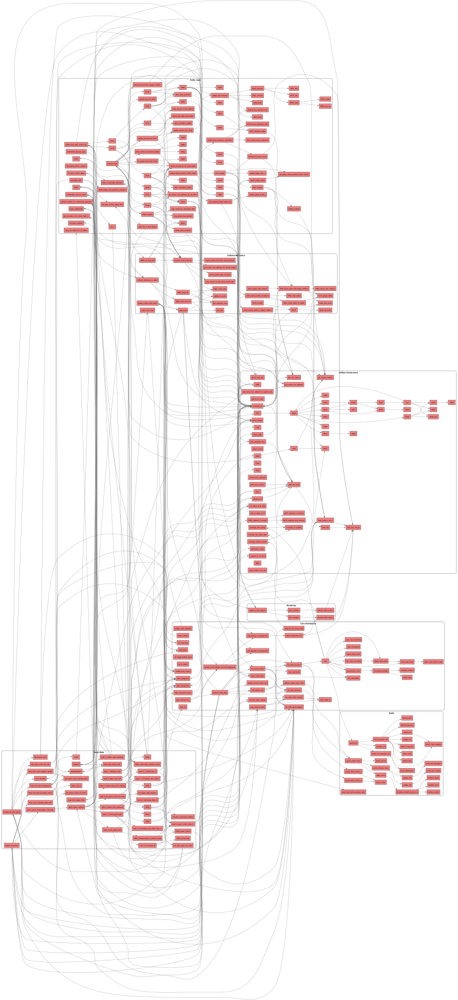

# Phoenix C-Port - Code Coverage Graph

Dit is misschien wel de krachtigste test-tool voor een C-port! 
Omdat je via GCC met `-fprofile-arcs -ftest-coverage` de executie van de emulator bijhoudt (en de `.gcda`/`.gcov` bestanden genereert), heb ik deze data ingeladen op de callgraph:

- **Groene Functies**: Zijn tijdens je test/gameplay-sessies minstens één keer met succes door de C-code uitgevoerd.
- **Rode Functies**: Zijn nog **nooit** aangeroepen in je tests. Dit zijn dode paden, ongeteste boss-fases of game-over states!

Zo zie je direct (bijvoorbeeld in `mothership_impl.c` of specifieke afhandelingen in `state_endings.c`) welke code absoluut nog extra aandacht en een gerichte speelsessie of unit-test nodig heeft.

