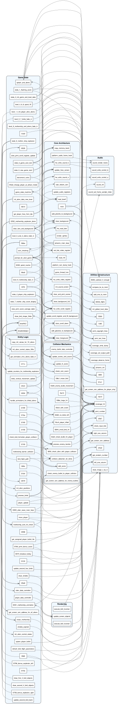

# Phoenix C-Port - Cross-Domain API Graph

This is arguably the most powerful view of the codebase we've generated yet!

Based on your suggestion, I took the original logical grouping (7 domains) but applied a massive filter: **I completely removed all internal calls**. 
If a function in `Entity Logic` calls another function in `Entity Logic`, it is ignored. We ONLY draw lines when a function crosses the boundary into another domain.

Furthermore, I **pruned all isolated nodes**. Any function that only talks to its own domain and doesn't participate in cross-domain communication is hidden.

What remains is a crystal-clear map of the **API boundaries**:
- You can exactly see which functions act as the "public interface" for a block.
- You can see how `Game State` coordinates high-level actions across `Audio` and `Entity Logic`.
- You can see how `Collision Mechanics` specifically calls into `Rendering` and `Audio` when hits occur.

