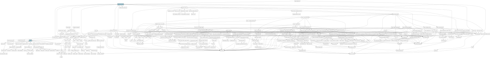

# Phoenix C-Port - Execution Tree Graph

In plaats van de logische blokken, focust deze graaf puur op de **Hiërarchie van de Executie**. 
- Het toont een strikte *Top-Down* (TB) structuur.
- De blauwe blokjes bovenaan zijn de absolute startpunten (zoals `phoenix_main_loop` of SDL event handlers).
- Om het een overzichtelijke 'boom' te houden, zijn de gigantische utility-knopen (zoals `mem_read` of `add_to_score`) verborgen. 

Dit geeft je een prachtig inzicht in de levenscyclus van één frame of cyclus, en laat perfect zien hoe de calls als een waterval naar beneden stromen in je systeem.

