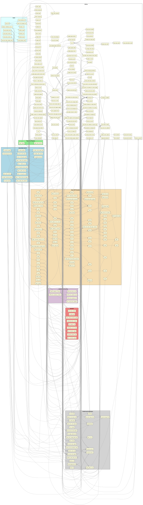

# Phoenix C-Port - Functional Grouping Callgraph

Instead of looking at the `.c` files, this graph looks **purely at the functions themselves** and clusters them based on their semantic naming prefix.

This gives a beautiful logical grouping where:
- All `sound_...` and `tms36xx_...` functions form the **Audio** cluster.
- All `bird_...`, `alien_...`, and `mothership_...` functions form the **Enemies** cluster.
- All `collision_...` and `scoring_...` functions form the **Collision & Scoring** cluster.
- All `lXXXX_...` functions form the **Direct Z80 Translations** cluster.

This layout perfectly separates *what* the code is doing from *where* it is currently saved on disk, revealing the true functional architecture of your port.

