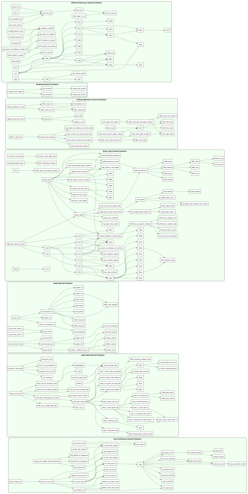

# Phoenix C-Port - Internal Domain Cohesion Graph

Dit is exact het omgekeerde van de vorige view!

In deze visualisatie hebben we **alle externe lijntjes (API calls) doorgeknipt**. We tekenen uitsluitend de pijlen wanneer een functie een ándere functie binnen **hetzelfde blok** aanroept. 
Opnieuw heb ik de geïsoleerde functies (die puur door de buitenwereld worden aangeroepen en zélf geen interne calls doen) weggefilterd.

Wat dit ons laat zien is de **Interne Cohesie**:
- Hoe ingewikkeld is een specifiek blok onder de motorkap?
- Je ziet prachtig de enorme interne complexiteit en recursie binnen de `Entity Logic` en de `Collision Mechanics`.
- Je ziet heel duidelijk de interne utility-ketens (de private helper-functies) die een domein gebruikt om zijn werk te doen zonder dat de rest van de codebase daar iets van af weet.

