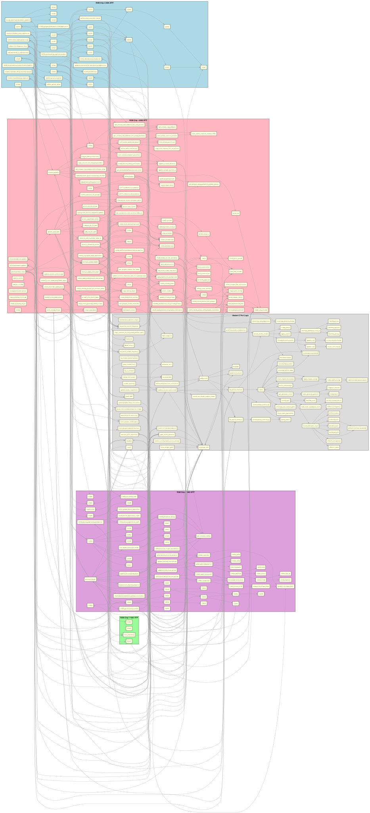

# Phoenix C-Port - Physical ROM Bank Graph

What if we organize the architecture based on how the original 1980 arcade machine was wired? 

The original Phoenix ROM was 16KB, usually split across four 4KB EPROM chips. Because our C port meticulously documents the original Z80 addresses (via `[ASM: XXXX-YYYY]`), we can group our modern C functions based on the physical silicon chip they originally lived on!

- **ROM Chip 1 (0000-0FFF)**: Mostly Core Logic, Boot sequence, Game State, and basic drawing.
- **ROM Chip 2 (1000-1FFF)**: Often specific level data, early logic.
- **ROM Chip 3 (2000-2FFF)**: More advanced logic.
- **ROM Chip 4 (3000-3FFF)**: Complex enemy logic (Birds and Alien swooping).
- **Modern C Port Logic**: Functions like SDL wrappers, C abstractions (`mem_read`), and custom audio generators that didn't exist in the Z80 ROM.

This gives a fascinating retro-hardware view of your C codebase!

