# Inputscripts

Deze map bevat deterministische knop-tijdlijnen waarmee `c-phoenix` echte
gameplay kan afspelen zonder menselijke input tijdens de run.

Engelse documentatie: [README.md](README.md).

## Waarom

Handmatig spelen bewijst hooguit dat iets in een enkele sessie werkte. Een
inputscript maakt dezelfde actievolgorde reproduceerbaar. Daardoor kun je:

- dezelfde run voor en na een wijziging vergelijken;
- RAM-dumps frame-voor-frame diffen;
- dezelfde replay tegen jphoenix draaien;
- objecttraces of visuele diff-viewers maken.

## Formaat



Een event per regel:

```text
<frame> <button> <press|release>
```

Knoppen: `coin`, `start1`, `start2`, `fire`, `left`, `right`, `shield`.

Er is geen auto-release. Houd knoppen dus expliciet meerdere frames vast.

## Script Draaien

```bash
make
./build/c-phoenix --run-frames=4000 \
    --input-script=context/input-scripts/extended_playthrough.txt \
    --ram-dump=/tmp/trace.bin
```

Of via make:

```bash
make headlessrun \
    REPLAY_SCRIPT=context/input-scripts/my_session.txt \
    REPLAY_FRAMES=15000 \
    REPLAY_RAM_DUMP=/tmp/trace.bin
```

Gebruik `make replayrun REPLAY_SCRIPT=context/input-scripts/my_session.txt`
om een script zichtbaar terug te kijken.

## Coverage Evalueren

```bash
python3 tools/input_bot.py evaluate \
    --script context/input-scripts/basic_playthrough.txt \
    --frames 4000 \
    --target player_bullet_fired \
    --target enemy_bullets_active \
    --sdl-video-driver dummy \
    --no-render
```

De evaluator verandert gameplay niet; hij leest alleen de coverage JSON terug
en rapporteert welke states, levels en doelen zijn bereikt.

## Input-Bot Instrueren Voor Een Doel

> Nog niet bekend met de bot?
> [`tools/input-bot-howto.nl.md`](../../tools/input-bot-howto.nl.md) legt uit
> wat het is en loopt een volledige zoektocht door, inclusief `--generations`
> voor targets die één ronde niet haalt. De afbeelding in
> [`demo/README.nl.md`](../../../demo/README.nl.md) toont de lus in één oogopslag.

1. Kies een target:

```bash
python3 tools/input_bot.py list-targets
```

2. Evalueer eerst de seed:

```bash
python3 tools/input_bot.py evaluate \
  --script context/input-scripts/basic_playthrough.txt \
  --frames 4000 \
  --target level_transition \
  --sdl-video-driver dummy \
  --no-render
```

3. Kies mutatiemodus:

- `regenerate`: vroege verkenning;
- `jitter`: timing variëren rond een seed die de juiste fase al haalt;
- `sweep`: links/rechts schieten over een targetgebied.

Voorbeeld:

```bash
python3 tools/input_bot.py mutate \
  --seed context/input-scripts/generated/mutated_rank_01_score_3092917.txt \
  --frames 26000 \
  --iterations 80 \
  --target mothership_core_gate_70 \
  --target mothership_explosion \
  --mutate-after 10000 \
  --mutation-mode sweep
```

4. Promoveer alleen een bruikbare winnaar naar `context/input-scripts/`, met
een headercomment waarin staat wat het script test en waarom het bewaard wordt.

## Valkuil: Lange Holds, Geen Korte Pulsen

Een knopdruk van een frame kan precies tussen twee input-samples vallen. Houd
knoppen tientallen frames vast, zoals een echte speler dat ook zou doen.

## Bestaande Scripts

- `basic_playthrough.txt` - korte smoke test.
- `extended_playthrough.txt` - langere regressieroute.
- `passive_playthrough.txt` - stationaire speler voor death/game-over.
- `two_player_playthrough.txt` - spelerwisselroute.
- `two_player_last_grown_bird.txt` - 2-player route met een laatste volgroeide
  vogel.
- `bird-investigation.txt` - opgenomen interactieve sessie; zie
  `bird-investigation-readme.txt` voor het opnieuw genereren van dumps en
  tracer.

## Script Opnemen

```bash
make recordrun
```

Standaard neemt dit op naar een timestamped `/tmp/c-phoenix-session-*.txt`
bestand. Override het pad wanneer je een vaste naam wilt:

```bash
make recordrun RECORD_SCRIPT=/tmp/c-phoenix-session.txt
```

Speel normaal; het bestand wordt na elk event geflusht. Daarna kun je headless
replayen:

```bash
make headlessrun \
    REPLAY_SCRIPT=/tmp/c-phoenix-session.txt \
    REPLAY_FRAMES=15000 \
    REPLAY_RAM_DUMP=/tmp/trace.bin
```

## Bug Melden Die Je Tijdens Spelen Ziet

Start altijd met recording aan:

```bash
make recordrun RECORD_SCRIPT=/tmp/bug_seen_YYYYMMDD_short_name.txt
```

Wanneer de bug verschijnt:

1. Klik in het venster om te pauzeren.
2. Maak eventueel een screenshot met F12.
3. Noteer player, level/round, wat je zag, wat net ervoor gebeurde en of
   geluid/muziek betrokken was.
4. Sluit normaal af.

Geef daarna het replaypad en je symptoomomschrijving aan de AI/debugsessie. Voor
een eerste lokale vergelijking:

```bash
make comparerun \
    COMPARE_SCRIPT=/tmp/bug_seen_YYYYMMDD_short_name.txt \
    COMPARE_FRAMES=15000 \
    COMPARE_NAME=bug_seen
```

Dat draait C-Phoenix en jphoenix headless, vergelijkt RAM-dumps en laat
`/tmp/ref_bug_seen.bin` plus `/tmp/port_bug_seen.bin` achter voor diepere
traces wanneer dat nuttig is.
