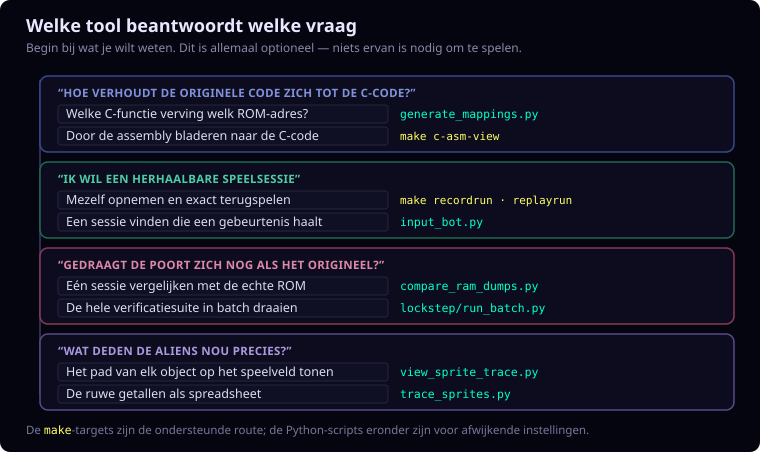

# Phoenix C-poort Tools

Engelse documentatie: [README.md](README.md).

## Wat deze map is

Dit is de werkplaats, niet het spel. Niets hiervan is nodig om Phoenix te
spelen — elk script bestaat om een vraag over de *vertaling* van de originele
Z80-assembly naar C te beantwoorden: gedraagt het zich nog hetzelfde, welke
C-functie verving welk ROM-adres, en wat deden de aliens nou precies tijdens
die ene sessie.

Elke tool neemt iets concreets en levert iets concreets op: een opname, een
geheugendump, een vergelijkingsrapport, een doorbladerbare pagina. Waar een
`make`-target bestaat is dat de ondersteunde ingang — die vult de paden en
opties voor je in. De Python-scripts eronder zijn er voor als je van de
standaardinstellingen wilt afwijken.



Voor het grotere geheel — opnemen, terugspelen, vergelijken, zichtbaar maken —
zie het workflow-diagram in de [project-README](../README.nl.md).

## Documentatiegeneratie

`generate_mappings.py` leest de `[ASM: XXXX-YYYY]` comments in `.c` en `.h`
bestanden en schrijft mappingdocumentatie naar `context/mapping/`.

```bash
python3 tools/generate_mappings.py
```

`generate_annotated_asm.py` maakt zowel van `context/Phoenix.asm` als van
`context/code-annotated.asm` een klikbare Markdown-versie met C-koppelingen:

```bash
python3 tools/generate_annotated_asm.py
```

`generate_interactive_asm_html.py` maakt van `context/Phoenix.md` de
interactieve `context/Phoenix.html`, met filterbare labelnavigatie,
kleurcodering en selectievakjes voor code- en datalabels,
`.EQU`-hoverbeschrijvingen met
geheugenadres, klikbare labelverwijzingen, een ingebouwde C-bronviewer die
kruisverwijzingen op de gekoppelde regel opent, zichtbare ASM-begin- en
eindgrenzen voor gemapte C-functiebereiken, en terug-/vooruitknoppen:

```bash
python3 tools/generate_interactive_asm_html.py
```

## Grafieken- en resultatenindex

De statische `generate_*callgraph.py`-tools schrijven **ontwerptijd**-grafen van
de broncode naar [context/graphs/README.nl.md](../context/graphs/README.nl.md).
Die lezen de `.c`-bestanden en beschrijven wat de broncode zégt: welke functie
welke aanroept, welk bronbestand van welk ander afhangt, uit welke ROM-bank een
functie komt.

Daartegenover leest `generate_c_runtime_callgraph.py` een trace die is opgenomen
met `make runtimegraph`, en schrijft **runtime**-bewijs naar
`context/runtimegraphs/<scenario>/`. `generate_c_design_runtime_comparison.py`
legt die twee naast elkaar en onderscheidt aanroepen die in het ontwerp bestaan
én zijn uitgevoerd, van aanroepen die alleen op papier bestaan.

Elke runtime-run schrijft daarnaast een **functionele decompositie**:
`c_phoenix_functional_runtime_callgraph.svg`. Die vouwt functiedetails samen
tot negen spel- en enginesystemen, zoals *Birds & alien waves*, *Player, laser
& shield* en *Audio*. De pijlbreedte en het label blijven echte, gemeten
runtime-aanroepen. Gebruik deze compacte kaart eerst; voor één systeem geeft
`c_phoenix_functional_runtime_functions.csv` de onderliggende functies en hun
in-/uitgaande aantallen. De oorspronkelijke
`c_phoenix_runtime_callgraph.svg` blijft de detailweergave.

Dat onderscheid is het hele punt: een ontwerptijd-graaf laat zien wat *mogelijk*
is, een runtime-graaf wat er *gebeurd* is, en pas het verschil tussen die twee
wijst dode code en ongedocumenteerde paden aan.

Elke opdracht meldt zelf waar het resultaat terechtkomt, zodat gegenereerde
bestanden vindbaar blijven in plaats van onzichtbare kladbestanden te worden.

Twee grafen zijn bijzonder bruikbaar naast de knowledge base:

- **[`file_callgraph`](../context/graphs/file_callgraph.md)** — de
  afhankelijkheidsgraaf tussen bronbestanden. Elk `.c`-bestand heeft een
  geannoteerde tegenhanger in [`c-annotated/`](../c-annotated/README.md); deze
  graaf laat zien welke van die pagina's je erbij moet lezen voordat je er één
  begrijpt.
- **[`rom_bank_callgraph`](../context/graphs/rom_bank_callgraph.md)** — sorteert
  functies op het `[ASM: nnnn-nnnn]`-adres uit hun doc-commentaar, dezelfde tag
  waar `generate_mappings.py` op draait. Handig als brug tussen
  [`context/mapping/`](../context/mapping/README.nl.md) en `Phoenix.asm`.

## Verificatie en Replay

### `input_bot.py`

**Wat het is.** Jij benoemt een spelmoment dat je vastgelegd wilt hebben — "haal
level negen", "open het kernvenster van het moederschip", "wissel naar speler
twee" — en dit zoekt een inputscript dat daar komt. Het muteert een bestaande
replay tot een reeks varianten, speelt elke variant headless af, scoort hem
tegen jouw target, en houdt de beste. Met `--generations` wordt de winnaar de
seed van de volgende ronde, zodat de zoektocht klimt naar targets die geen
enkele losse mutatie haalt.

Zo zijn 50 van de 59 inputscripts in deze repository ontstaan, en daarmee het
grootste deel van het dekkingsbewijs achter de C-port.

[](../../demo/input-bot-search.nl.svg)

- [input-bot-howto.nl.md](input-bot-howto.nl.md) — de werkwijze: mutatiemodi,
  generaties en een compleet uitgewerkt voorbeeld.
- [input-bot-reference.nl.md](input-bot-reference.nl.md) — elk van de 28
  targets afzonderlijk besproken, plus elke opdrachtregeloptie met zijn
  standaardwaarde. Gegenereerd uit de code.

Gebruik `evaluate` om een replay te scoren tegen coverage-doelen:

```bash
python3 tools/input_bot.py evaluate \
  --script context/input-scripts/basic_playthrough.txt \
  --frames 4000 \
  --target player_bullet_fired \
  --sdl-video-driver dummy \
  --no-render
```

Gebruik `mutate` om kandidaat-scripts te genereren:

```bash
python3 tools/input_bot.py mutate \
  --seed context/input-scripts/basic_playthrough.txt \
  --frames 8000 \
  --target level_transition
```

Voor doelgericht botgebruik staat de workflow in
[context/input-scripts/README.nl.md](../context/input-scripts/README.nl.md).

### `compare_ram_dumps.py`

Vergelijkt jphoenix- en C-Phoenix RAM-dumps byte-exact:

```bash
python3 tools/compare_ram_dumps.py /tmp/jphx.bin /tmp/port.bin \
  --align-c98 --stop-after 999999
```

### `lockstep/`

Bevat batchtooling om alle gecureerde inputscripts door jphoenix en c-phoenix
te draaien, clean runs te aggregeren en handmatige dumpparen voor
divergentieonderzoek te maken. Zie [lockstep/README.nl.md](lockstep/README.nl.md).

### `trace_sprites.py`

Extraheert objecttijdlijnen uit een RAM-dump:

```bash
python3 tools/trace_sprites.py /tmp/phoenix-ram.bin --kind all \
  --only-active --output=/tmp/objects.csv
```

### `view_sprite_trace.py`

De standaardmodus `auto` volgt per frame de gedeelde `$4B70-$4BAF`-overlay:
zestien alienslots in alienfases en acht vogelslots in vogelfases.

Maakt een interactieve HTML-viewer voor objecten of C-vs-jphoenix verschillen:

```bash
python3 tools/view_sprite_trace.py /tmp/jphoenix-ram.bin \
  --compare /tmp/c-phoenix-ram.bin \
  --reference-label jphoenix --port-label c-phoenix \
  --kind birds --player 1 --output=/tmp/bird-diff.html
```
