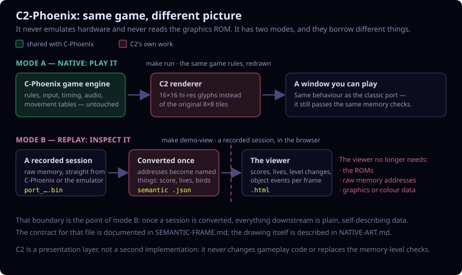

# C2-Phoenix

Dutch version: [README.nl.md](README.nl.md).

C2-Phoenix is a private semantic Phoenix presentation layer with two modes:
a replay viewer and a native SDL application. Neither mode emulates Phoenix
hardware, reads a graphics ROM, or reads colour PROMs. Both use original
geometric artwork and a C2 colour theme rather than Phoenix pixel data.

`c-phoenix/` remains the ROM-faithful C reference port. C2-Phoenix does not
modify its gameplay code and does not replace lockstep validation.

The two modes borrow different things from that reference port — the native
mode shares the running game engine, the replay mode only consumes a converted
recording:



## Boundary

The adapter currently reads a C-Phoenix or JPhoenix RAM dump through the
existing private trace decoder. It converts that decoder's result to the
versioned contract in [SEMANTIC-FRAME.md](SEMANTIC-FRAME.md). After export, the
C2 viewer consumes only the semantic JSON file; it has no dependency on the
ROMs, raw RAM addresses, graphics bytes, or colour PROM values.

The conversion step remains the bridge for the HTML replay viewer. The native
mode instead shares the existing C-Phoenix gamecore and draws its live state
through C2.

## Native interactive C2

Run from `c2-phoenix/`:

```sh
make run
```

This builds `build/native/c2-phoenix` and opens an SDL window. It keeps the
existing C-Phoenix input, frame timing, audio, game rules, RAM-bank handling,
and lockstep dump hooks. The C2 renderer replaces only the original
`graphics.rom`/colour-PROM pixel route with its own player, projectile, alien,
bird, explosion, shield, and grid drawings.

The shared C gamecore uses named tables in `c-phoenix/phoenix_tables.c` for
movement, waves, collisions, levels, and text. The native runtime has no
program-ROM read path; assembled ROM images are build-time inputs only.

The visual contract and state-to-pose mapping are documented in
[NATIVE-ART.md](NATIVE-ART.md). The Dutch version is
[NATIVE-ART.nl.md](NATIVE-ART.nl.md).

Replay an existing input script visibly:

```sh
make replayrun REPLAY_SCRIPT=context/input-scripts/bird-investigation.txt
```

For a deterministic native C2 run:

```sh
make headlessrun \
  REPLAY_SCRIPT=context/input-scripts/bird-investigation.txt \
  REPLAY_FRAMES=13935 \
  REPLAY_EXTRA_ARGS='--ram-dump=/tmp/c2-bird-investigation.bin'
```

Compare that dump to the JPhoenix reference dump with C-Phoenix's existing
lockstep comparison tool. The renderer does not participate in the RAM
comparison.

`make native-check` verifies that the final native binary does not retain
graphics-ROM or colour-PROM symbols. To run the replay and comparison as one
command after creating a reference dump, use:

```sh
make native-compare \
  REPLAY_SCRIPT=context/input-scripts/bird-investigation.txt \
  REPLAY_FRAMES=13935 \
  NATIVE_REFERENCE_DUMP=/tmp/ref_bird-investigation.bin
```

## Quick demo

First create a RAM dump through the existing private replay pipeline. For the
curated bird-investigation recording, from the monorepo root run:

```sh
make -C c-phoenix tracerun \
  COMPARE_SCRIPT=context/input-scripts/bird-investigation.txt \
  COMPARE_FRAMES=13935 \
  COMPARE_NAME=bird-investigation \
  COMPARE_STOP_AFTER=999999
```

This writes the C-Phoenix dump to `/tmp/port_bird-investigation.bin` (note the
underscore after `port`). It requires the sibling JPhoenix project and JDK 11+
because `tracerun` performs the lockstep comparison first.

Then run:

```sh
cd c2-phoenix
make demo-view DUMP=/tmp/port_bird-investigation.bin
```

Make prints the localhost URL (default port `8767`) and keeps the server
running until `Ctrl-C`. Use `make demo-view-only` to serve an existing semantic
viewer without regenerating it. The same local-server workflow is available
for C2's standalone object tracer through `make tracer-view` and
`make tracer-view-only`; from the monorepo root, use `make c2-tracer-view` and
`make c2-tracer-view-only` instead. For the semantic viewer, the root
equivalents are `make c2-demo-view` and `make c2-demo-view-only`. Do not open
these interactive viewers with `file://`.

The generated semantic JSON and HTML remain outside Git by default. They are
derived artefacts, not a replacement for a replay or a proof of game-state
equivalence.

The viewer shows both players' decoded scores and lives, plus observed frame
events such as a score change, life change, level/round transition, game-state
transition, or an object activation/deactivation. Event names intentionally do
not claim an unobserved cause.

It renders player and bird explosions plus the player shield from their known
visual anchors. Mothership state has no reliable independent grid coordinate in
the current trace model, so its phase is shown in the status panel rather than
inventing a grid position.

## Semantic comparison

The same `tracerun` produces `/tmp/ref_bird-investigation.bin` and
`/tmp/port_bird-investigation.bin`. Compare their C2 exports with:

```sh
make compare
```

The comparison pairs exports by their recorded order, which is the lockstep
pairing produced by `tracerun`, and reports only game context and
semantic-object differences. It deliberately ignores raw RAM layout and screen
drawing order. A reference-only tail is reported separately rather than being
treated as an object mismatch.

## Scenario coverage

The reproducible scenarios and their measured coverage are documented in
[SCENARIOS.md](SCENARIOS.md). The Dutch version is
[SCENARIOS.nl.md](SCENARIOS.nl.md).

Summarize the object and event families actually seen in an export:

```sh
make summary SCENARIO=bird-investigation \
  SUMMARY_ARGS='--require-kind alien --require-kind bird --require-kind mothership --require-event impact_observed'
```

For the curated two-player grown-bird case, extract the documented compressed
dumps first, then use `SCENARIO=last-grown-bird` and override `DUMP` or
`REFERENCE_DUMP` as necessary. The command reports coverage; it is not a claim
that unobserved game families are absent from Phoenix.

## Deliberate limitations

- The drawing is a visual prototype, not an original-art recreation.
- The palette is a semantic theme in the renderer, not a PROM emulation.
- Not every gameplay effect has an explicit spatial model. Mothership is
  intentionally status-only until a reliable visual anchor is documented.
- Native C2 shares the C-Phoenix program-data table; removing that dependency
  requires a future, independently modeled C2 gamecore.
- The contract preserves observed frame state; it does not infer undocumented
  game rules.

## Checks

```sh
make test
```
