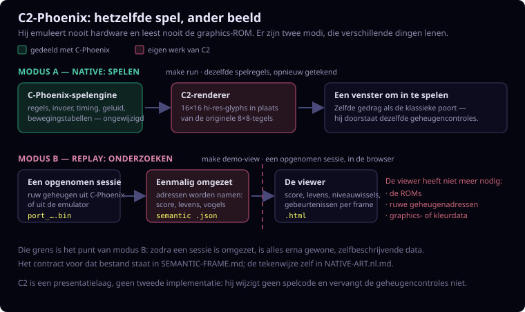

# C2-Phoenix

English version: [README.md](README.md).

C2-Phoenix is een private semantische Phoenix-presentatielaag met twee
standen: een replayviewer en een native SDL-applicatie. Geen van beide
emuleert Phoenix-hardware of leest een graphics-ROM of kleur-PROM. Beide
gebruiken zelf getekende geometrische vormen en een eigen C2-kleurthema in
plaats van Phoenix-pixeldata.

`c-phoenix/` blijft de ROM-getrouwe C-referentieport. C2-Phoenix wijzigt de
gameplaycode daarvan niet en vervangt lockstep-validatie niet.

De twee standen lenen verschillende dingen van die referentieport — de native
stand deelt de draaiende spelengine, de replaystand gebruikt alleen een
omgezette opname:



## Afbakening

De adapter leest voorlopig een C-Phoenix- of JPhoenix-RAM-dump via de
bestaande private trace-decoder. Hij zet het decoderresultaat om naar het
geversioneerde contract in [SEMANTIC-FRAME.md](SEMANTIC-FRAME.md). Na export
leest de C2-viewer alleen dat semantische JSON-bestand: geen ROMs, ruwe
RAM-adressen, graphicsbytes of kleur-PROM-waarden.

Deze omzetstap blijft de brug voor de HTML-replayviewer. De native stand deelt
in plaats daarvan de bestaande C-Phoenix-gamecore en tekent de live toestand
via C2.

## Native interactieve C2

Voer uit vanuit `c2-phoenix/`:

```sh
make run
```

Dit bouwt `build/native/c2-phoenix` en opent een SDL-venster. Hij behoudt de
bestaande C-Phoenix-invoer, frametiming, audio, spelregels, RAM-bankafhandeling
en lockstep-dumphooks. De C2-renderer vervangt uitsluitend de oorspronkelijke
pixelroute via `graphics.rom` en kleur-PROMs door eigen tekeningen van speler,
projectielen, aliens, vogels, ontploffingen, schild en grid.

De gedeelde C-gamecore gebruikt benoemde tabellen in
`c-phoenix/phoenix_tables.c` voor bewegingen, golven, botsingen, levels en
tekst. De native runtime heeft geen program-ROM-leespad; samengestelde
ROM-images zijn alleen build-time-invoer.

Het visuele contract en de state-naar-posemapping staan in
[NATIVE-ART.nl.md](NATIVE-ART.nl.md). De Engelse versie is
[NATIVE-ART.md](NATIVE-ART.md).

Speel een bestaand invoerscript zichtbaar af:

```sh
make replayrun REPLAY_SCRIPT=context/input-scripts/bird-investigation.txt
```

Voor een deterministische native C2-run:

```sh
make headlessrun \
  REPLAY_SCRIPT=context/input-scripts/bird-investigation.txt \
  REPLAY_FRAMES=13935 \
  REPLAY_EXTRA_ARGS='--ram-dump=/tmp/c2-bird-investigation.bin'
```

Vergelijk die dump met de JPhoenix-referentiedump via de bestaande
C-Phoenix-lockstepvergelijker. De renderer speelt geen rol in de
RAM-vergelijking.

`make native-check` controleert dat de uiteindelijke native binary geen
graphics-ROM- of kleur-PROM-symbolen bevat. Gebruik na het maken van een
referentiedump voor replay en vergelijking in één keer:

```sh
make native-compare \
  REPLAY_SCRIPT=context/input-scripts/bird-investigation.txt \
  REPLAY_FRAMES=13935 \
  NATIVE_REFERENCE_DUMP=/tmp/ref_bird-investigation.bin
```

## Snelle demo

Maak eerst een RAM-dump via de bestaande private replaypijplijn. Voer voor de
samengestelde bird-investigation-opname vanaf de monorepo-root uit:

```sh
make -C c-phoenix tracerun \
  COMPARE_SCRIPT=context/input-scripts/bird-investigation.txt \
  COMPARE_FRAMES=13935 \
  COMPARE_NAME=bird-investigation \
  COMPARE_STOP_AFTER=999999
```

Dit schrijft de C-Phoenix-dump naar `/tmp/port_bird-investigation.bin` (let op
het underscore-teken na `port`). Hiervoor zijn het naastgelegen
JPhoenix-project en JDK 11+ nodig, omdat `tracerun` eerst de
lockstepvergelijking uitvoert.

Voer daarna uit:

```sh
cd c2-phoenix
make demo-view DUMP=/tmp/port_bird-investigation.bin
```

Make meldt de localhost-URL (standaardpoort `8767`) en houdt de server actief
tot `Ctrl-C`. Gebruik `make demo-view-only` om een bestaande semantische viewer
te serveren zonder opnieuw te genereren. Dezelfde lokale-serverwerkwijze is
beschikbaar voor de zelfstandige C2-objecttracer via `make tracer-view` en
`make tracer-view-only`; gebruik vanuit de monorepo-root respectievelijk
`make c2-tracer-view` en `make c2-tracer-view-only`. De root-equivalenten voor
de semantische viewer zijn `make c2-demo-view` en `make c2-demo-view-only`.
Open deze interactieve viewers niet via `file://`.

De gegenereerde semantische JSON en HTML blijven standaard buiten Git. Het
zijn afgeleide artefacten, geen vervanging voor een replay of bewijs van
gelijke speltoestand.

De viewer toont de gedecodeerde scores en levens van beide spelers, plus
waargenomen frame-events zoals score- of levenswijziging, level/roundovergang,
speltoestandsovergang en objectactivatie/-deactivatie. Eventnamen beweren
bewust geen niet-waargenomen oorzaak.

Hij tekent speler- en vogelontploffingen plus het spelersschild vanuit hun
bekende zichtankers. De mothershipfase heeft in het huidige tracemodel geen
betrouwbare onafhankelijke gridpositie; daarom staat die in het statuspaneel
en wordt er geen positie verzonnen.

## Semantische vergelijking

Dezelfde `tracerun` maakt `/tmp/ref_bird-investigation.bin` en
`/tmp/port_bird-investigation.bin`. Vergelijk hun C2-exports met:

```sh
make compare
```

De vergelijking paart exports op hun opnamevolgorde, de lockstep-koppeling die
`tracerun` produceert, en rapporteert alleen verschillen in spelcontext en
semantische objecten. Ruwe RAM-indeling en schermtekenvolgorde blijven bewust
buiten beschouwing. Een staart die alleen in de referentie voorkomt wordt apart
gemeld en niet als objectverschil behandeld.

## Scenariodekking

De reproduceerbare scenario's en hun gemeten dekking staan in
[SCENARIOS.nl.md](SCENARIOS.nl.md). De Engelse versie is
[SCENARIOS.md](SCENARIOS.md).

Vat samen welke object- en eventfamilies werkelijk in een export voorkomen:

```sh
make summary SCENARIO=bird-investigation \
  SUMMARY_ARGS='--require-kind alien --require-kind bird --require-kind mothership --require-event impact_observed'
```

Pak voor de gecureerde twee-speler-grown-birdcase eerst de gedocumenteerde
gecomprimeerde dumps uit. Gebruik daarna `SCENARIO=last-grown-bird` en
overschrijf waar nodig `DUMP` of `REFERENCE_DUMP`. Het commando rapporteert
dekking; het beweert niet dat niet-waargenomen spelfamilies niet in Phoenix
bestaan.

## Bewuste beperkingen

- De tekeningen zijn een visuele proef, geen reproductie van originele art.
- Het palet is een semantisch thema in de renderer, geen PROM-emulatie.
- Niet elk speleffect heeft al een expliciet ruimtelijk model. Mothership
  blijft bewust status-only tot een betrouwbare zichtanker is gedocumenteerd.
- Native C2 deelt de C-Phoenix-programmadatatabel; het verwijderen van die
  afhankelijkheid vraagt later een zelfstandig gemodelleerde C2-gamecore.
- Het contract bewaart waargenomen frametoestand en verzint geen
  ongedocumenteerde spelregels.

## Controle

```sh
make test
```
