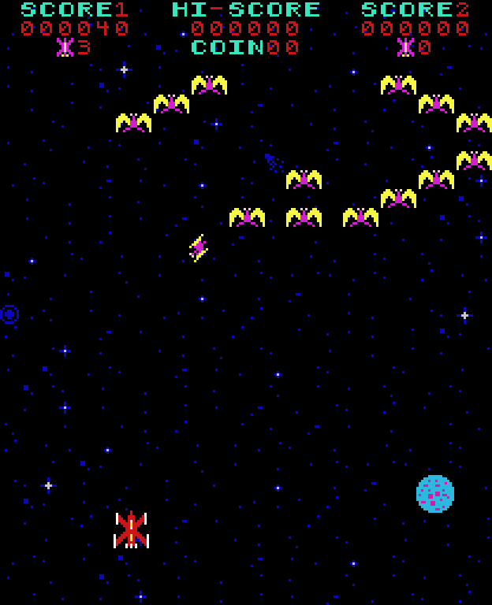
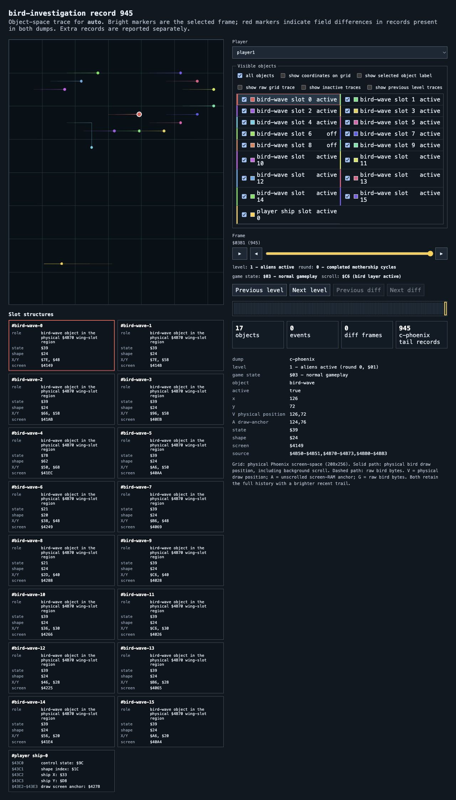
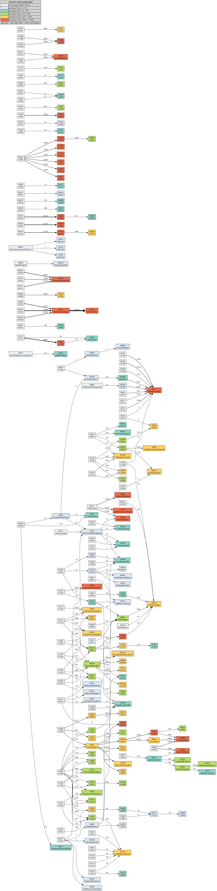

# Phoenix: Two Implementations, One Verifiable Game

This project brings together two complementary ways to play, understand, and
verify Phoenix (1980).

- **JPhoenix** is a Java emulator that executes the original Intel 8080 ROM.
- **C-Phoenix** is a hand-translated C implementation that follows the ROM's
  frame routines, RAM layout, input, video, and sound decisions.

The goal is not merely a similar game. It is a C implementation that is
readable, reproducible, and comparable with the original ROM execution.

## Why Two Projects?

JPhoenix is the executable reference: it runs the original program bytes on an
8080 emulator. C-Phoenix makes the same behaviour inspectable as C modules,
with links back to assembly addresses. Together they answer a stronger question
than “does it look right?”: *does the translated state evolve like the original
ROM during the same recorded play session?*

## What Can Be Explored?

Both projects offer attract mode, one- and two-player play, alien and bird
waves, mothership phases, scoring, shields, and sound. C-Phoenix is organised
by state machine, player, enemies, collisions, video, sound, and platform
integration, with assembly anchors and annotated reference material.

Interactive play can be saved as a small input script:

```text
203 start1 press
220 start1 release
841 fire press
850 fire release
```

The script can be played visibly, run headlessly, or supplied to both projects
for comparison. Lockstep records RAM `$4000-$4BFF` after each frame in both
projects and reports named differences, making divergence inspectable at the
level of player position, object slots, counters, levels, and screen state.

The visual tracer turns RAM dumps into standalone HTML: a physical Phoenix
grid, frame controls, slot structures, object trails, level transitions,
tooltips, and object-level JPhoenix/C-Phoenix differences.

## Try It on macOS

From the repository root, each implementation can run the recorded
`bird-investigation` session and open its own standalone object tracer in your
default browser:

```sh
make -C c-phoenix demorun
make -C c2-phoenix demorun
make -C jphoenix-emulator-port demorun
```

Each command runs the same 13,935-frame input script headlessly, records the
game RAM, creates an HTML tracer, and opens it with macOS `open`. The tracer
shows object slots, positions, state metadata, and movement paths; bullets are
shown at their current position without a persistent trail. The first command
requires GCC and SDL2, the second also builds the C2 renderer, and the third
requires a JDK and the assembled ROM set.

## Make Execution Visible

Design diagrams describe routes that source code and the ROM *can* contain.
Runtime callgraphs show which routes a recorded session actually executed.

- **JPhoenix** records executed `CALL` transitions in the original Intel 8080
  ROM. Address labels from the annotated assembly make the graph readable as
  routines rather than only hexadecimal addresses.
- **C-Phoenix** records executed C function calls during the equivalent replay.
- Both graphs use a frequency heatmap: cool colours indicate rarely visited
  routes and warm colours frequently executed routes. Each graph includes a
  legend with that session's concrete value ranges.
- A second graph compares design and execution. Solid green edges are present
  in the design and were observed; dashed grey edges were not observed during
  this recording. That identifies test gaps, not an automatic functional
  difference.

The two levels deliberately remain separate: ROM control flow in JPhoenix and
C control flow in C-Phoenix. ASM address anchors and documentation provide the
semantic connection; lockstep remains the independent check for equivalent
game state.

## Watch the Demo

The two short recordings below use the same `bird-investigation` input session
and cover the requested game interval around frames 850-2100.

### 1. C-Phoenix gameplay

[Watch the replay](bird-investigation-gameplay-0850-2100.mp4): the playable
C implementation renders the recorded session, from frame 850 through 2100.
It is the player-facing view of the evidence.

### 2. Visual tracer

[Watch the tracer](bird-investigation-visual-tracer-0850-2100.mp4): the same
session is shown as a physical game grid with object paths, current slot state,
visible-object selection, and frame metadata. The tracer has records through
frame 2099, the last available record before 2100.

### One record, three views

All three images are deterministic captures of record 945 from the same
`bird-investigation` input script. The replay presents the bird wave as a
player sees it. The tracer presents the same RAM record as physical positions,
paths, and slot state. `bird-wave slot` identifies a physical `$4B70`
wing-slot whose current visual role is a bird, even though the underlying slot
region is also used by other enemy phases.

C2-Phoenix's native mode shares the same C gamecore and the same recorded
state, replacing only the renderer: instead of the original 8x8 graphics-ROM
tiles it draws a dedicated 16x16 hi-res glyph per character, with PROM-derived
colour and a compositor that joins adjacent glyphs into smooth outlines. See
[`c2-phoenix/NATIVE-ART.md`](../c2-phoenix/NATIVE-ART.md) for how the atlas is
built and verified.

The default C2 look (`hires3a`) softens the hard step between adjacent
primary colours and adds a stable, position-hashed grain, both computed after
the hi-res atlas is drawn. Build with `make c2-run C2_VARIANT=classic` for
the original, unblended rendering, or another `C2_VARIANT` value
(`hires2`, `hires2a`, `hires3`) to compare an individual step of that
experiment in isolation; `c2-phoenix/native/c2_renderer.c` documents each one.
See [`c2-hires-variants-comparison.md`](c2-hires-variants-comparison.md) for
a side-by-side gallery of all five renderers on the same record (also
available as a styled, single-file
[HTML page](c2-hires-variants-comparison.html)).

| C-Phoenix framebuffer, record 945 | C2-Phoenix hi-res, record 945 | Visual tracer, record 945 |
| --- | --- | --- |
|  |  |  |

## Runtime Graph Gallery

The following images are the `bird-investigation` session used by this demo.
They are included locally so the showcase can be viewed without first running
the instrumentation pipeline.

### C-Phoenix: executed C calls


### JPhoenix: executed 8080 ROM calls



### C-Phoenix: design routes compared with this execution


The solid and dashed edges, frequency colours, and their legends are part of
each image. They distinguish observed control flow from design-time-only
routes for this concrete replay.

## Find New Scenarios Deliberately

The input bot is a deterministic test-scenario tool. It does not play live;
it varies an existing replay and ranks candidates by game goals such as a
two-player handoff, a bonus life, or a particular mothership phase. A separate
evaluation step then proves which goals the selected candidate actually
reaches.

This lets new regression sessions grow from a proven opening route without
hand-authoring thousands of input events.

## Evidence for Equivalence

The C port is not judged only by appearance. The current scripted lockstep
suite plays 57 scenarios in both implementations and compares game state
record by record. The completed suite reports byte-exact game-state equality
with JPhoenix for those scenarios; associated PC coverage connects 176 C
routines to executed ROM instruction addresses.

This is strong, reproducible evidence for the covered scenarios and RAM
regions. It is not a claim that every hypothetical, unexecuted input path is
automatically proven. New or changed gameplay remains subject to the same
replay, lockstep, and trace checks.

## Demonstration Path

For visible C-Phoenix playback:

```sh
make
make replayrun REPLAY_SCRIPT=context/input-scripts/bird-investigation.txt
```

For a full comparison and visual tracer, after building the sibling JPhoenix
project with JDK 11+:

```sh
make tracerun \
  COMPARE_SCRIPT=context/input-scripts/bird-investigation.txt \
  COMPARE_FRAMES=13935 \
  COMPARE_NAME=bird-investigation \
  COMPARE_STOP_AFTER=999999
```

The tracer is written to `/tmp/bird-investigation-diff.html`.

For a compact view of what this session executes in the C implementation:

```sh
make runtimegraph RUNTIME_SCENARIO=bird-investigation RUNTIME_FRAMES=13935
```

This writes SVG and PNG summaries to
`context/runtimegraphs/bird-investigation/`. The equivalent JPhoenix command
lives in the sibling project; both use the same scenario name and replay.

## Engineering Approach

- The original ROM remains a living reference.
- The C port is hand translated, not behaviourally approximated.
- Deterministic input scripts turn gameplay reports into reproducible evidence.
- RAM dumps, semantic deltas, and annotated assembly connect observation to
  implementation detail.
- Runtime callgraphs distinguish reachable routes from routes actually run by
  a concrete session.
- The input bot turns an observed gameplay moment into a repeatable test case.
- Visual tools make low-level state understandable without debugger or emulator
  expertise.

## Further Reading

- [Replay and visual-tracer pipeline](../c-phoenix/context/traces/replay-tracer-pipeline-howto.md)
- [Visual object tracer](../c-phoenix/context/traces/visual-tracer-howto.md)
- [Semantic lockstep analysis](../c-phoenix/context/traces/semantic-lockstep-howto.md)
- [Input bot: purpose and use](../c-phoenix/tools/input-bot-howto.md)

Phoenix is both playable software and a transparent record of how an arcade ROM
can be understood, translated, tested, and explored.
