# Phoenix: twee implementaties, één verifieerbaar spel

Dit project brengt twee complementaire manieren samen om Phoenix (1980) te
spelen, te begrijpen en te controleren.

- **JPhoenix** is een Java-emulator die de originele Intel 8080-ROM uitvoert.
- **C-Phoenix** is een handvertaalde C-implementatie die de frame-routines,
  RAM-layout, invoer, video en geluidsbeslissingen van de ROM volgt.

Het doel is niet alleen een spel dat erop lijkt. Het doel is een C-versie die
leesbaar, reproduceerbaar en vergelijkbaar met ROM-uitvoering is.

## Waarom twee projecten?

JPhoenix is de uitvoerbare referentie: hij voert de originele programmabytes
uit op een 8080-emulator. C-Phoenix maakt hetzelfde gedrag leesbaar en
onderhoudbaar als C-modules, met verwijzingen naar assembly-adressen.

Samen beantwoorden zij een sterkere vraag dan “ziet het er goed uit?”:
*ontwikkelt de vertaalde spelstaat zich tijdens dezelfde opgenomen speelsessie
zoals de originele ROM?*

## Bekijk de demo

De twee korte opnamen hieronder gebruiken dezelfde invoersessie
`bird-investigation` en bestrijken het gevraagde spelinterval rond frames
850-2100.

### 1. C-Phoenix-gameplay

[Bekijk de replay](bird-investigation-gameplay-0850-2100.mp4): de speelbare
C-implementatie rendert de opgenomen sessie, van frame 850 tot en met 2100.
Dit is de spelweergave voor de speler.

### 2. Visuele tracer

[Bekijk de tracer](bird-investigation-visual-tracer-0850-2100.mp4): dezelfde
sessie verschijnt als fysiek spelgrid met objectsporen, actuele slotstatus,
zichtbare-objectselectie en framemetadata. De tracer heeft records tot frame
2099, het laatste beschikbare record vóór 2100.

### Een record, drie weergaven

Alle drie de afbeeldingen zijn deterministische opnamen van record 945 uit
hetzelfde invoerscript `bird-investigation`. De replay toont de vogelgolf
zoals een speler die ziet. De tracer toont precies hetzelfde RAM-record als
fysieke posities, sporen en slotstatus. `bird-wave slot` betekent dat een
fysiek wing-slot in `$4B70` op dat moment visueel een vogel is, ook al wordt
die onderliggende slotregio in andere vijandfases eveneens gebruikt.

C2-Phoenix's native stand gebruikt dezelfde C-gamecore en exact dezelfde
opgenomen status en vervangt alleen de renderer: in plaats van de originele
8x8-graphics-ROM-tegels tekent hij een dedicated 16x16 hi-res-glyph per
karakter, met PROM-afgeleide kleur en een compositor die aangrenzende glyphs
samenvoegt tot vloeiende contouren. Zie
[`c2-phoenix/NATIVE-ART.md`](../c2-phoenix/NATIVE-ART.md) (Engels) voor hoe
die atlas wordt gebouwd en geverifieerd.

De standaard C2-weergave (`hires3a`) verzacht de harde stap tussen
aangrenzende primaire kleuren en voegt een stabiele, positiegebonden korrel
toe, beide berekend nadat de hi-res-atlas is getekend. Bouw met
`make c2-run C2_VARIANT=classic` voor de oorspronkelijke, ongeblende
weergave, of een andere `C2_VARIANT`-waarde (`hires2`, `hires2a`, `hires3`)
om een losse stap uit dat experiment apart te bekijken;
`c2-phoenix/native/c2_renderer.c` documenteert elk van hen.
Zie [`c2-hires-variants-comparison.nl.md`](c2-hires-variants-comparison.nl.md)
voor een naast-elkaar-galerij van alle vijf renderers op hetzelfde record
(ook beschikbaar als vormgegeven, op zichzelf staande
[HTML-pagina](c2-hires-variants-comparison.html)).

| C-Phoenix-framebuffer, record 945 | C2-Phoenix hi-res, record 945 | Visuele tracer, record 945 |
| --- | --- | --- |
|  |  |  |

## Wat is er te ontdekken?

### Phoenix spelen

Beide projecten bieden de arcade-ervaring met attractmodus, één en twee
spelers, aliens, vogelgolven, moederschipfases, score, schild en geluid.

### De vertaling onderzoeken

C-Phoenix is ingedeeld naar verantwoordelijkheid: statemachine, speler,
aliens, vogels, moederschip, botsingen, video, geluid en platformintegratie.
ASM-adresankers en geannoteerd referentiemateriaal houden de C-code
traceerbaar naar de oorspronkelijke ROM.

### Een sessie reproduceren

Interactief spelen kan worden opgeslagen als een klein inputscript:

```text
203 start1 press
220 start1 release
841 fire press
850 fire release
```

Dat script kan zichtbaar worden herhaald, headless worden uitgevoerd of in
beide implementaties worden gebruikt voor vergelijking.

### Spelstaat frame voor frame vergelijken

De lockstep-workflow bewaart na ieder frame RAM `$4000-$4BFF` in beide
projecten. De vergelijking meldt benoemde RAM-verschillen in plaats van alleen
ondoorzichtige binaire wijzigingen. Daardoor zijn afwijkingen te onderzoeken op
het niveau van spelerpositie, objectslots, tellers, levels en schermstatus.

### Objectgedrag zien

De visuele tracer zet RAM-dumps om in een zelfstandige HTML-onderzoekstool. Hij
toont een fysiek Phoenix-grid, framebediening, slotstructuren, objectsporen,
levelovergangen, tooltips en objectniveauverschillen tussen JPhoenix en
C-Phoenix.

## Probeer het op macOS

Voer de standaard opgenomen demo uit en genereer de zelfstandige tracer van
ieder project:

```sh
make -C c-phoenix demorun
make -C c2-phoenix demorun
make -C jphoenix-emulator-port demorun
```

Speel een opname zichtbaar af met hetzelfde script in iedere implementatie:

```sh
make -C c-phoenix replayrun REPLAY_SCRIPT=context/input-scripts/bird-investigation.txt
make -C c2-phoenix replayrun REPLAY_SCRIPT=context/input-scripts/bird-investigation.txt
make -C jphoenix-emulator-port replayrun REPLAY_SCRIPT=context/input-scripts/bird-investigation.txt
```

Gebruik voor reproduceerbare uitvoering zonder beeld de implementaties met een
headless-runner:

```sh
make -C c-phoenix headlessrun REPLAY_SCRIPT=context/input-scripts/bird-investigation.txt REPLAY_FRAMES=13935
make -C c2-phoenix headlessrun REPLAY_SCRIPT=context/input-scripts/bird-investigation.txt REPLAY_FRAMES=13935
```

Genereer en serveer visuele tracers via localhost vanuit de repository-root:

```sh
make c-tracer-view    # vergelijkingstracer C-Phoenix versus JPhoenix (poort 8766)
make j-tracer-view    # zelfstandige JPhoenix-objecttracer (poort 8766)
make c2-tracer-view   # zelfstandige C2-Phoenix-objecttracer (poort 8767)
```

Elk viewer-target meldt de exacte `http://127.0.0.1:…`-URL en houdt de server
actief tot `Ctrl-C`. Voeg `-only` toe om een bestaand resultaat zonder opnieuw
genereren te serveren, bijvoorbeeld `make c-tracer-view-only`.

## De C-geannoteerde assembly onderzoeken

C-Phoenix biedt ook een interactieve route van de geannoteerde Z80-bron naar
de vertaalde C-code:

```text
Phoenix.asm → Phoenix.md → Phoenix.html
```

Genereer en serveer de viewer vanuit de repository-root met:

```sh
make c-asm-view       # poort 8765
```

De lokaal geserveerde pagina koppelt ASM-labels en symbolen aan C-functies en
bronbestanden, onderscheidt code- en datalabels, toont datarepresentaties in C
en markeert het ASM-bereik van iedere C-functie. Er zijn filters, hoverdetails,
terug/vooruit-navigatie tussen labels en een expliciete Light/Dark-schakelaar.


Gebruik `make c-asm-view-only` om de al gegenereerde pagina te serveren.
Gebruik geen `file://`: de ingebouwde bronviewer heeft localhost nodig om
C-bestanden te laden.

## Nieuwe scenario's gericht vinden

De input-bot is een deterministisch hulpmiddel voor testscenario's. Hij speelt
geen live spel, maar varieert een bestaande replay en rangschikt de kandidaten
op bereikte speldoelen: bijvoorbeeld een beurtwisseling bij twee spelers, een
bonusleven of een specifieke moederschipfase. Daarna bewijst een aparte
evaluatiestap welke doelen de gekozen kandidaat werkelijk haalt.

Hierdoor kunnen nieuwe regressiesessies doelgericht ontstaan uit een bewezen
beginroute, zonder dat handmatig duizenden invoerevents hoeven te worden
geschreven.

## Gelijkwaardigheid onderbouwd

De C-poort is niet alleen visueel beoordeeld. Hij wordt frame voor frame
gecontroleerd tegen de originele ROM:



De actuele scripted lockstep-suite speelt 57 scenario's in beide
implementaties af en vergelijkt de spelstaat record-voor-record. De
afgeronde suite rapporteert voor die scenario's byte-exacte
spelstaatgelijkheid met JPhoenix; de bijbehorende PC-coverage koppelt 176
C-routines aan uitgevoerde ROM-instructieadressen.

Dit is een sterk, reproduceerbaar bewijs voor de afgedekte scenario's en
RAM-regio's. Het is geen claim dat elk hypothetisch, nog niet uitgevoerd
invoerpad automatisch bewezen is. Nieuwe of gewijzigde gameplay blijft daarom
onder dezelfde replay-, lockstep- en tracecontrole vallen.

## Uitvoering zichtbaar maken

Ontwerpdiagrammen vertellen welke routes de broncode en ROM *kunnen* bevatten.
De runtime-callgraphs laten zien welke routes een werkelijk opgenomen sessie
daadwerkelijk heeft uitgevoerd.

- **JPhoenix** registreert uitgevoerde `CALL`-overgangen in de originele
  Intel 8080-ROM. Adreslabels uit de geannoteerde assembly maken de grafiek
  leesbaar als routines in plaats van alleen hexadecimale adressen.
- **C-Phoenix** registreert uitgevoerde C-functieaanroepen tijdens diezelfde
  soort replay.
- Beide grafieken tonen frequentie als heatmap: koele kleuren zijn weinig
  bezochte routes, warme kleuren veelvuldig uitgevoerde routes. De legenda in
  iedere grafiek vermeldt de concrete waardebereiken van die sessie.
- Een tweede grafiek vergelijkt ontwerp en uitvoering. Doorgetrokken groene
  verbindingen bestaan in het ontwerp en zijn geraakt; grijze stippellijnen
  zijn tijdens deze opname niet geraakt. Dit maakt testgaten zichtbaar, geen
  automatisch functioneel verschil.

Zo blijven de twee niveaus bewust gescheiden: ROM-controlflow in JPhoenix en
C-controlflow in C-Phoenix. ASM-adresankers en documentatie leggen de
inhoudelijke koppeling; lockstep blijft de onafhankelijke controle op gelijke
spelstaat.

## Runtimegrafiekengalerij

De onderstaande afbeeldingen horen bij de sessie `bird-investigation` van
deze demo. Ze zijn lokaal opgenomen, zodat de showcase zonder eerst de
instrumentatiepijplijn te draaien is te bekijken.

### C-Phoenix: uitgevoerde C-aanroepen


### JPhoenix: uitgevoerde 8080-ROM-aanroepen


### C-Phoenix: ontwerproutes vergeleken met deze uitvoering


De doorgetrokken en gestippelde verbindingen, frequentiekleuren en de legenda
maken deel uit van iedere afbeelding. Zij onderscheiden voor deze concrete
replay de werkelijk uitgevoerde controlflow van uitsluitend bij ontwerp
onderkende routes.

## Demonstratiepad

Voor een zichtbare demonstratie in iedere implementatie:

```sh
make -C c-phoenix replayrun REPLAY_SCRIPT=context/input-scripts/bird-investigation.txt
make -C c2-phoenix replayrun REPLAY_SCRIPT=context/input-scripts/bird-investigation.txt
make -C jphoenix-emulator-port replayrun REPLAY_SCRIPT=context/input-scripts/bird-investigation.txt
```

Voor een volledige vergelijking en visual tracer, nadat het siblingproject
JPhoenix met JDK 11+ is gebouwd:

```sh
make tracerun \
  COMPARE_SCRIPT=context/input-scripts/bird-investigation.txt \
  COMPARE_FRAMES=13935 \
  COMPARE_NAME=bird-investigation \
  COMPARE_STOP_AFTER=999999
```

De HTML-tracer komt in `/tmp/bird-investigation-diff.html`.

Voor een compact beeld van wat deze sessie in de C-implementatie uitvoert:

```sh
make runtimegraph RUNTIME_SCENARIO=bird-investigation RUNTIME_FRAMES=13935
```

Dat schrijft SVG- en PNG-overzichten naar
`context/runtimegraphs/bird-investigation/`. De equivalente JPhoenix-opdracht
staat in het siblingproject; beide gebruiken dezelfde naam en replay-sessie.

## Engineeringaanpak

- De originele ROM-uitvoering blijft beschikbaar als levende referentie.
- De C-poort is handvertaald in plaats van alleen gedragsmatig benaderd.
- Deterministische inputscripts maken spelmeldingen reproduceerbaar bewijs.
- RAM-dumps, semantische delta's en geannoteerde assembly verbinden observatie
  met implementatiedetail.
- Runtime-callgraphs onderscheiden bereikbare routes van routes die in een
  concrete sessie werkelijk zijn uitgevoerd.
- De input-bot maakt van een waargenomen spelmoment een herhaalbare testcase.
- Visuele tooling maakt laag-niveau-spelstaat begrijpelijk zonder debugger of
  emulator-expertise.

## Verder lezen

- [Spelontwerp en architectuur](../c-phoenix/context/game-design.nl.md)
- [Replay- en visual-tracerpijplijn](../c-phoenix/context/traces/replay-tracer-pipeline-howto.nl.md)
- [Visuele objecttracer](../c-phoenix/context/traces/visual-tracer-howto.nl.md)
- [Semantische lockstep-analyse](../c-phoenix/context/traces/semantic-lockstep-howto.nl.md)
- [Input-bot: doel en gebruik](../c-phoenix/tools/input-bot-howto.nl.md)

Phoenix is daarmee zowel speelbare software als een transparant verslag van
hoe een arcade-ROM kan worden begrepen, vertaald, getest en onderzocht.
