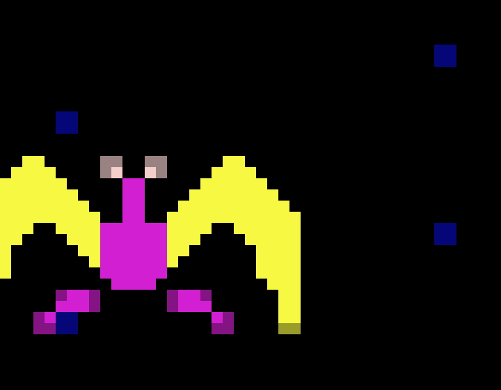
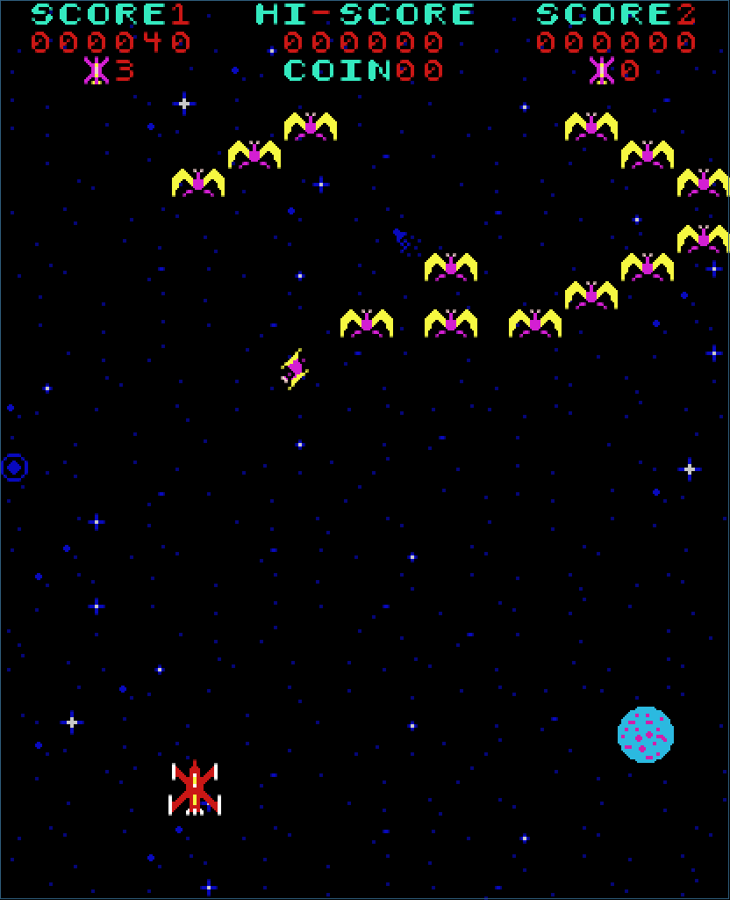
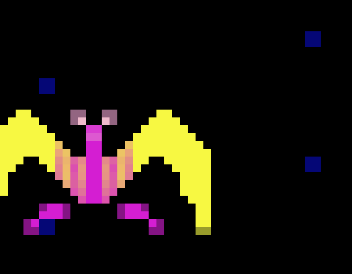
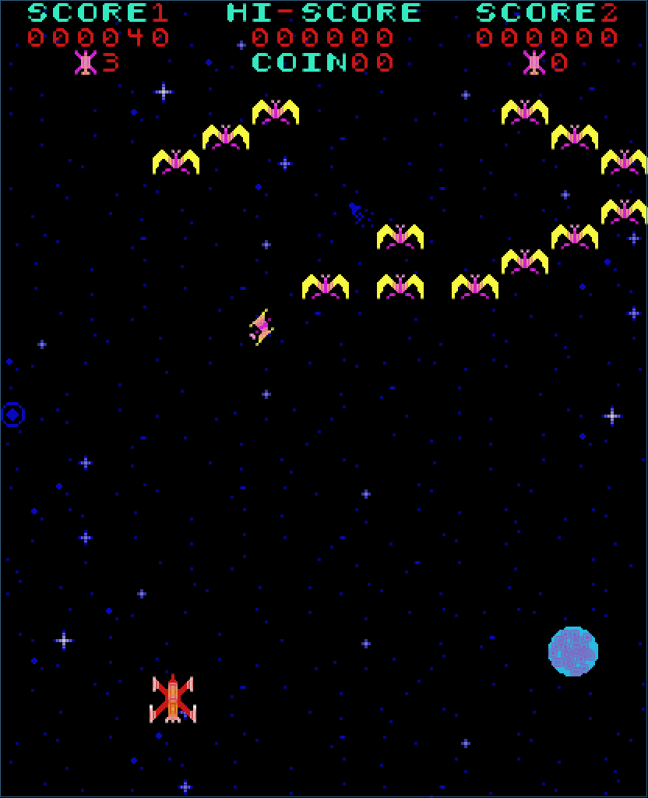

# C2-rendervarianten: hires, hires2, hires2a, hires3, hires3a

Engelse versie: [c2-hires-variants-comparison.md](c2-hires-variants-comparison.md).

Vijf builds van dezelfde `c2-phoenix`-native-renderer, dezelfde replay
(`bird-investigation.txt`), hetzelfde frame (945). Elke build deelt dezelfde
C-gamecore en dezelfde ROM-afgeleide hi-res-glyph-atlas; alleen de renderstap
verschilt, gekozen op build-tijd met `C2_VARIANT`
(`c2-phoenix/native/c2_renderer.c` documenteert elk van hen). `hires3a` is de
default (geen `C2_VARIANT` nodig); de rest is opt-in ter vergelijking.

## classic

`make c2-run C2_VARIANT=classic` -- de oorspronkelijke, ongeblende weergave:
een vlakke PROM-kleur per tegel, harde stappen op kleurgrenzen.

| Detail | Volledig frame |
| --- | --- |
|  |  |

## hires2

`make c2-run C2_VARIANT=hires2` -- voegt `blend_colour_transitions()` toe:
één pass over vier orthogonale buren, die de harde stap tussen twee
aangrenzende primaire kleuren verzacht tot een dunne overgangsband.

| Detail | Volledig frame |
| --- | --- |
|  |  |

## hires2a

`make c2-run C2_VARIANT=hires2a` -- dezelfde blend, verbreed: acht buren
(inclusief diagonalen) en twee passes, wat een bredere, rondere
overgangsband geeft dan `hires2`.

| Detail | Volledig frame |
| --- | --- |
|  |  |

## hires3

`make c2-run C2_VARIANT=hires3` -- voegt `apply_grain()` toe in plaats van
kleurovergangen: elke opake pixel krijgt een vaste, positiegebonden
kleuroffset (+/-12 per kanaal), wat een stabiele, gedrukt ogende
korreltextuur geeft in plaats van een vloeiend verloop. De hash is
gebaseerd op pixelpositie, niet op framenummer, dus de korrel flikkert niet.

| Detail | Volledig frame |
| --- | --- |
|  |  |

## hires3a (default)

Geen `C2_VARIANT` nodig -- combineert hires2's kleurovergangsblend (één
pass, vier buren) met een verzachte versie van hires3's korrel (halve
amplitude, +/-6). De kleurovergangsband blijft zichtbaar terwijl de korrel
als zachte schaduw oogt in plaats van zware textuur.

| Detail | Volledig frame |
| --- | --- |
|  |  |

## Zelf een variant proberen

```sh
make c2-run C2_VARIANT=hires2a
```

Elke variant bouwt naar zijn eigen binary (`c2-phoenix/build/native/<variant>/c2-phoenix`),
dus wisselen vereist geen opschonen van een vorige build, en `make c2-run`
zonder `C2_VARIANT` bouwt altijd de `hires3a`-default opnieuw.
