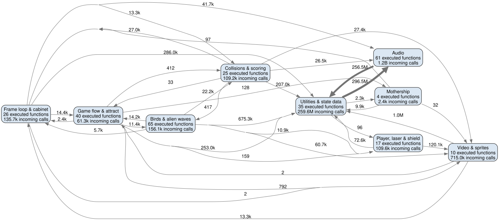

# Functionele runtimedecompositie

Deze opname groepeert uitgevoerde C-functies naar hun spel- of engineverantwoordelijkheid. Pijllabels in de graaf zijn gemeten aantallen aanroepen tussen gebieden; aanroepen binnen één gebied zijn bewust samengevouwen in de knoop.

| Functioneel gebied | Verantwoordelijkheid | Uitgevoerde functies | Inkomende aanroepen |
| --- | --- | ---: | ---: |
| Frameloop & cabinet | frametiming, invoer en hardware-I/O | 26 | 135741 |
| Spelverloop & attractmodus | attractmodus, spelstaten en rondeopbouw | 40 | 61348 |
| Speler, laser & schild | spelerbesturing, projectiel en explosie | 17 | 109646 |
| Vogels & aliengolven | formaties, vogelbeweging, duiken en vijandelijk vuur | 65 | 156069 |
| Moederschip | nadering, gevecht en scorefase van het moederschip | 4 | 2436 |
| Botsingen & score | raakdetectie, schade, score en bonuslevens | 25 | 109227 |
| Video & sprites | tegeltekening, palet, scroll en spritecompositie | 10 | 715028 |
| Geluid | geluidssturing, synthese en samplegeneratie | 61 | 1185560052 |
| Hulpfuncties & statusdata | RAM-hulpfuncties, tabellen en gedeelde ondersteuning | 35 | 259560807 |

De lidmaatschappen per functie en de gemeten aantallen staan in `c_phoenix_functional_runtime_functions.csv`. De bestaande `c_phoenix_runtime_callgraph.svg` blijft de detailweergave.
