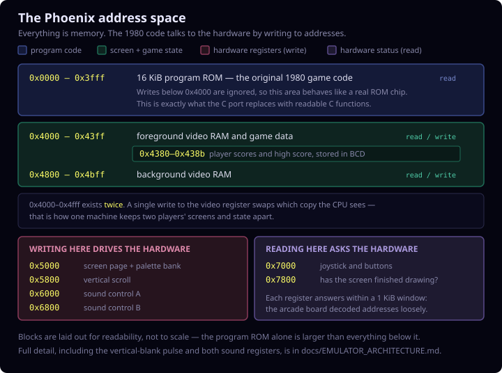

# JPhoenix

Dutch version: [README.nl.md](README.nl.md).

Java desktop port of the Phoenix arcade emulator. The game uses an
Intel 8080 (Z80) emulation, the original program and graphics ROM, the bundled
color PROM and a MAME-based emulation of the sound hardware.

The emulator has two desktop frontends: the compact Java AWT version and a
LibGDX/LWJGL3 version. Both use the same emulation core, ROM validation,
renderer, input state and sound hardware.

## How the machine is laid out

An arcade board has no operating system and no drivers. The game talks to the
screen, the sound chips and the joystick by writing to memory addresses — so
the memory map *is* the machine:



The emulator reproduces exactly that layout, which is why the original ROM
runs on it unmodified.

## Documentation

See [JPhoenix Technical Architecture](docs/EMULATOR_ARCHITECTURE.md) for
the full description of the boot sequence, Intel 8080 (Z80) core,
memory map, video, input, frame timing, attract mode, sound and highscore.

See [How the Phoenix Game Works](docs/GAME_LOGIC.md) for the ROM main loop,
credits and start, game states, level sequence, player, enemies, collisions, score,
lives, mothership and demo AI.

See [SOUND_PORT_NOTES.md](docs/SOUND_PORT_NOTES.md) for detailed technical
information about the sound port, mapping and comparison tools.

## Requirements

- JDK 11 or newer
- `make`
- A desktop environment with Java AWT
- `program.rom`, `graphics.rom` and `proms.rom` in the project directory

The optional LibGDX frontend needs JDK 17 or newer. The bundled
Gradle wrapper downloads the pinned LibGDX dependencies itself.

Check the Java installation with:

```sh
java -version
javac -version
```

## Building

Open a terminal in this project directory:

```sh
make
```

This compiles the eighteen Java source files of the desktop game into
`build/classes`. Use `make clean` to remove all generated
build files.

## Running the game

Start the game from the project directory, so the ROM files and highscore are
found in the correct location:

```sh
make run
```

### Options

Optionally the emulation can start later, for example to first start
a screen recording:

```sh
# Start after five seconds
java -cp build/classes PhoenixDesktop --start-delay=5

# Show the window and only start when space is pressed
java -cp build/classes PhoenixDesktop --wait-for-space
```

Without an option the game starts immediately. The space press that releases
the start gate is not passed to the game as a laser shot.

### LibGDX frontend

Start the same game core through LibGDX and the LWJGL3 desktop backend with:

```sh
make run-libgdx
```

The first time, the Gradle wrapper downloads Gradle 9.5.1 and LibGDX 1.14.1.
This frontend must also be started from the project directory; that is where the ROMs
and `hiscore.sav` are found. The existing `make run` command still starts the
lightweight AWT frontend.

### RAM dump for comparison

The RAM dump is off by default and is not needed to play the game.
Only enable it for debugging or a frame comparison with another
port:

```sh
make
java \
  -Dphoenix.ramdump=ramdump.bin \
  -Dphoenix.ramdump.frames=600 \
  -cp build/classes PhoenixDesktop
```

Without `phoenix.ramdump.frames`, 3600 frames are captured by default. Each
record contains a four-byte big-endian frame number, followed by 3072
bytes from the active RAM page (`0x4000-0x4bff`). An existing output file
is overwritten.

Disable the dump by starting the game again without `phoenix.ramdump`:

```sh
make run
```

The dump cannot be enabled or disabled while a game is running.

### Input recording and replay

JPhoenix can read and write the same input script files as the C port.
The format is text, with one event per line:

```text
<frame> <button> <press|release>
```

Valid buttons are `coin`, `start1`, `start2`, `fire`, `left`, `right` and
`shield`. Empty lines and lines starting with `#` are ignored.

Record an interactive session with:

```sh
make
java \
  -Dphoenix.recordinput=context/input-scripts/my_session.txt \
  -cp build/classes PhoenixDesktop
```

Play back a recording or a handwritten script deterministically with:

```sh
make replayrun REPLAY_SCRIPT=context/input-scripts/bird-investigation.txt
```

`context/...` is the shared script location used by every implementation.
`make replayrun` resolves it to C-Phoenix's context directory and runs the
desktop emulator with lockstep-compatible input polling. `make demorun`
generates a fixed-length RAM dump and standalone visual tracer. Use
`make tracer-view` to generate it and serve it at `http://127.0.0.1:8766/`;
use `make tracer-view-only` to serve an already generated tracer. This avoids
opening interactive HTML through `file://`.

The frame numbers are compatible with `c-phoenix --record-input=` and
`--input-script=`. A recorded event is flushed after every line, so a
force-quit preserves the recording up to and including the last written event.

For lockstep comparison with the C port, replay can also be clocked on the
`WaitVBlankCoin` poll of the main loop instead of on raw
vblank interrupts:

```sh
java \
  -Dphoenix.inputclock=poll \
  -Dphoenix.inputscript=../c-phoenix/context/input-scripts/my_session.txt \
  -cp build/classes PhoenixDesktop
```

This is mainly useful for recordings that were captured per main-loop frame.
Without `phoenix.inputclock=poll`, replay keeps running on the hardware interrupt clock.

### PC coverage from recordings

For coverage of the original 8080 (Z80) ROM paths, JPhoenix can count every executed
program counter. Run a single script:

```sh
make
java -cp build/classes PhoenixCoverageRunner \
  ../c-phoenix/context/input-scripts/basic_playthrough.txt \
  build/pc-coverage \
  15000
```

The CSV contains `pc,count,frequency`, where `count` is the number of opcode fetches at
that ROM address and `frequency` is the share within all executed
instructions.

Run all recordings under `../c-phoenix/context/input-scripts` in batch:

```sh
make
java -cp build/classes PhoenixCoverageRunner
```

Optionally you can pass a script directory, output directory and a fixed number of
frames:

```sh
java -cp build/classes PhoenixCoverageRunner \
  ../c-phoenix/context/input-scripts \
  build/pc-coverage \
  15000
```

## Controls

| Key | Function |
|---|---|
| `3` | Insert coin |
| `1` | Start player 1 |
| `2` | Start player 2 |
| `Space` | Fire |
| `Left arrow` | Move left |
| `Right arrow` | Move right |
| `Down arrow` or `B` | Barrier shield |
| Left mouse button in the window | Pause on/off |
| `F5` | Save save state |
| `F9` | Load save state |

### Save states

`F5` writes the full emulation state to `jphoenix.state` in the
project directory. `F9` loads that file. This works in both the AWT and
LibGDX frontend.

A state is captured at a frame boundary and contains CPU registers, flags,
cycle timing, all 64 KiB of memory, both video RAM pages and the full
discrete, noise, resampler and music state. The format contains a
version number, the required ROM hashes and a CRC32. Saving first uses a
temporary file and then atomically replaces the previous state. On load,
pressed keys are released to prevent stuck input.

## Required Java source

These eighteen files make up the desktop game:

- [PhoenixDesktop.java](PhoenixDesktop.java) - startup window and keyboard
- [PhoenixCanvas.java](PhoenixCanvas.java) - AWT display adapter
- [PhoenixFrameBuffer.java](PhoenixFrameBuffer.java) - thread-safe ARGB framebuffer
- [PhoenixVideoRenderer.java](PhoenixVideoRenderer.java) - framework-neutral renderer
- [PhoenixGraphicsDecoder.java](PhoenixGraphicsDecoder.java) - tested 2bpp ROM decoder
- [Phoenix.java](Phoenix.java) - machine, memory map, ROM and highscore
- [PhoenixInputScript.java](PhoenixInputScript.java) - input recording and script replay
- [PhoenixPalette.java](PhoenixPalette.java) - MAME-conforming color PROM decoder
- [PhoenixSaveState.java](PhoenixSaveState.java) - versioned, checksummed state files
- [PhoenixStateHotkeys.java](PhoenixStateHotkeys.java) - shared asynchronous F5/F9 actions
- [RomLoader.java](RomLoader.java) - ROM size and SHA-256 validation
- [I8080.java](I8080.java) - Intel 8080 (Z80) CPU emulation
- [Sound.java](Sound.java) - discrete sound hardware
- [PcmSink.java](PcmSink.java) - platform-neutral PCM output boundary
- [JavaSoundPcmSink.java](JavaSoundPcmSink.java) - Java Sound desktop adapter
- [TMS36XX.java](TMS36XX.java) - music generator
- [MameLofiResampler.java](MameLofiResampler.java) - audio resampling
- [SoundControlMapping.java](SoundControlMapping.java) - sound register mapping

The LibGDX frontend lives separately under
[`libgdx/src/main/java`](libgdx/src/main/java):

- `PhoenixLibGdxLauncher.java` - LWJGL3 configuration and entrypoint
- `LibGdxPhoenixApplication.java` - texture upload, input and lifecycle
- `LibGdxPcmSink.java` - LibGDX `AudioDevice` adapter
- `LibGdxFrameEncoder.java` - ARGB to RGBA8888 conversion

## Runtime files

Besides the compiled Java classes, the game uses:

| File | Function | Required |
|---|---|---|
| `program.rom` | Phoenix program ROM, 16,384 bytes | Yes |
| `graphics.rom` | Graphics ROM, 8,192 bytes | Yes |
| `proms.rom` | Color PROM: IC40 followed by IC41, 512 bytes | Yes |
| `hiscore.sav` | Saved highscore, four bytes | No |
| `jphoenix.state` | Save state from `F5` | No |

For the bundled Amstar ROM set, the emulator checks both the exact size and SHA-256
before opening the game window:

| File | SHA-256 |
|---|---|
| `program.rom` | `261cddb2f0ef45248f976d56f810e3b6a5e71284ba57dbeade31aae562728e2e` |
| `graphics.rom` | `e11168866950870074e7a5f9bcb749dedd2c89f8c8643c174710b73d21a96545` |
| `proms.rom` | `4dc21d169eb6f344e1af22ecb2cfe6423fd5e14b4a5f2df2e2e188d26a062b37` |

A missing, truncated, modified or wrong ROM file stops startup with
an error message. This prevents the emulator from continuing to run with invalid
machine code or graphics.

`proms.rom` contains first the 256 bytes of `mmi6301.ic40` (low bits) and then
the 256 bytes of `mmi6301.ic41` (high bits). These are converted using the same
resistor network and the same luminance normalization as MAME. The
manual color table from the old port is no longer used.

`hiscore.sav` is read at startup and updated when the highscore
is saved. If the file is missing, the game starts with a highscore of zero.
The highscore is not added to Git, via `.gitignore`.
`jphoenix.state` is also local runtime data and is not added to Git.

## Tests, tools and historical files

The non-runtime files are separated by purpose:

- [`tests/`](tests/) contains the automated regression tests;
- [`tools/sound/`](tools/sound/) contains the MAME, WAV, CSV and trace tools;
- [`legacy/`](legacy/) contains the old applet, web files and `.au` samples;
- [`reference/sound-renders/`](reference/sound-renders/) contains captured
  reference output.

These files are not loaded by:

```sh
make run
```

## Sound verification

The desktop port uses the MAME-style hardware-emulated sound path in
`Sound.java` and `TMS36XX.java`. This does not use the legacy `.au`
sample playback files.

Run the ROM validation, color PROM test, full graphics bitplane check,
video regression tests and deterministic source and sound checks with:

```sh
make verify
```

In addition, check the same graphics bitplane check and the
LibGDX pixel upload, input mapping and PCM adapter with:

```sh
make verify-libgdx
```

Generate WAV and discrete-node comparison artifacts with:

```sh
make artifacts
```

Generate only Java-side discrete-node CSV output for MAME `WAVELOG` comparison:

```sh
java -cp build/test-classes SoundNodeDump
java -cp build/test-classes SoundNodeCsvCompare sound-renders/nodes_effect2_bird_hit.csv mame-nodes-effect2.csv
java -cp build/test-classes SoundNodeCsvCompare sound-renders/nodes_effect2_bird_hit.csv mame-nodes-effect2.csv 0.001 0.0001
```

For direct MAME latch trace, raw-device and mixed-WAV comparisons, see
`tools/sound/mame-phoenix-sound-trace.lua`, `SoundMameTraceReplay`,
`SoundMameRawTraceReplay`, `SoundFloatCompare` and `SoundWavCompare`.

## Porting Notes

The emulator uses the original `I8080` CPU core and `Phoenix` hardware class.
Rendering publishes a framework-neutral `208 x 256` ARGB buffer per frame.
`PhoenixCanvas` is only the AWT adapter; a LibGDX frontend can use the same
`PhoenixFrameBuffer`. That frontend is implemented under `libgdx/`
and only uploads complete frames. Audio leaves the core through the
platform-neutral `PcmSink`; the frontends supply
`JavaSoundPcmSink` and `LibGdxPcmSink` respectively. The 8080 (Z80) loop keeps
running on its own core-timed thread in both cases.
