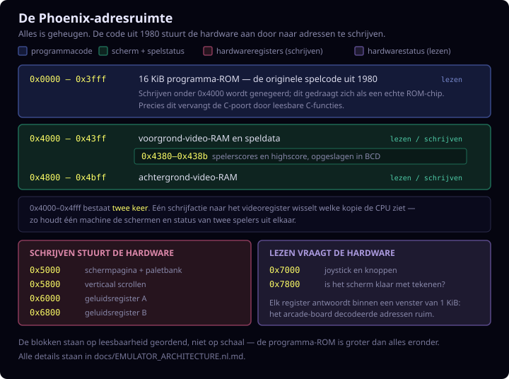

# JPhoenix

Engelse versie: [README.md](README.md).

Java-desktopport van de Phoenix-arcade-emulator. De game gebruikt een
Intel 8080 (Z80)-emulatie, de originele programma- en grafische ROM, de gebundelde
kleur-PROM en een MAME-gebaseerde emulatie van de geluidshardware.

De emulator heeft twee desktopfrontends: de compacte Java AWT-versie en een
LibGDX/LWJGL3-versie. Beide gebruiken dezelfde emulatiekern, ROM-validatie,
renderer, inputstatus en soundhardware.

## Hoe de machine is ingedeeld

Een arcade-board heeft geen besturingssysteem en geen drivers. Het spel stuurt
het scherm, de geluidschips en de joystick aan door naar geheugenadressen te
schrijven — de geheugenkaart *is* dus de machine:



De emulator bootst precies die indeling na; daarom draait de originele ROM er
ongewijzigd op.

## Documentatie

Zie [Technische architectuur van JPhoenix](docs/EMULATOR_ARCHITECTURE.nl.md) voor
de uitgebreide beschrijving van de opstartvolgorde, Intel 8080 (Z80)-kern,
geheugenmap, video, input, frame-timing, attract mode, geluid en highscore.

Zie [Werking van het Phoenix-spel](docs/GAME_LOGIC.nl.md) voor de ROM-hoofdloop,
credits en start, game states, levelreeks, speler, vijanden, collisions, score,
levens, mothership en demo-AI.

Zie [SOUND_PORT_NOTES.md](docs/SOUND_PORT_NOTES.md) voor gedetailleerde technische
informatie over de sound port, mapping en vergelijkingstools.

## Vereisten

- JDK 11 of nieuwer
- `make`
- Een desktopomgeving met Java AWT
- `program.rom`, `graphics.rom` en `proms.rom` in de projectmap

Voor de optionele LibGDX-frontend is JDK 17 of nieuwer nodig. De meegeleverde
Gradle-wrapper downloadt zelf de vastgezette LibGDX-afhankelijkheden.

Controleer de Java-installatie met:

```sh
java -version
javac -version
```

## Compileren

Open een terminal in deze projectmap:

```sh
make
```

Hiermee worden de achttien Java-bronbestanden van de desktopgame naar
`build/classes` gecompileerd. Gebruik `make clean` om alle gegenereerde
buildbestanden te verwijderen.

## Game starten

Start de game vanuit de projectmap, zodat de ROM-bestanden en highscore op de
juiste locatie worden gevonden:

```sh
make run
```

### Opties

Optioneel kan de emulatie later beginnen, bijvoorbeeld om eerst een
schermopname te starten:

```sh
# Start na vijf seconden
java -cp build/classes PhoenixDesktop --start-delay=5

# Toon het venster en start pas wanneer spatie wordt ingedrukt
java -cp build/classes PhoenixDesktop --wait-for-space
```

Zonder optie start de game direct. De spatie waarmee de startgate wordt
vrijgegeven wordt niet als lasershot aan de game doorgegeven.

### LibGDX-frontend

Start dezelfde gamekern via LibGDX en de LWJGL3-desktopbackend met:

```sh
make run-libgdx
```

De eerste keer downloadt de Gradle-wrapper Gradle 9.5.1 en LibGDX 1.14.1.
Ook deze frontend moet vanuit de projectmap worden gestart; daar worden de ROM's
en `hiscore.sav` gevonden. De bestaande opdracht `make run` blijft de
lichtgewicht AWT-frontend starten.

### RAM-dump voor vergelijking

De RAM-dump staat standaard uit en is niet nodig om de game te spelen.
Activeer hem alleen voor debugging of een framevergelijking met een andere
port:

```sh
make
java \
  -Dphoenix.ramdump=ramdump.bin \
  -Dphoenix.ramdump.frames=600 \
  -cp build/classes PhoenixDesktop
```

Zonder `phoenix.ramdump.frames` worden standaard 3600 frames vastgelegd. Ieder
record bevat een vier bytes groot big-endian framenummer, gevolgd door 3072
bytes uit de actieve RAM-pagina (`0x4000-0x4bff`). Een bestaand uitvoerbestand
wordt overschreven.

Deactiveer de dump door de game opnieuw zonder `phoenix.ramdump` te starten:

```sh
make run
```

De dump kan niet tijdens een draaiende game worden in- of uitgeschakeld.

### Input recording en replay

JPhoenix kan dezelfde input-scriptbestanden lezen en schrijven als de C-port.
Het formaat is tekst, met één event per regel:

```text
<frame> <button> <press|release>
```

Geldige knoppen zijn `coin`, `start1`, `start2`, `fire`, `left`, `right` en
`shield`. Lege regels en regels die met `#` beginnen worden genegeerd.

Neem een interactieve sessie op met:

```sh
make
java \
  -Dphoenix.recordinput=context/input-scripts/my_session.txt \
  -cp build/classes PhoenixDesktop
```

Speel een opname of handgeschreven script deterministisch af met:

```sh
make replayrun REPLAY_SCRIPT=context/input-scripts/bird-investigation.txt
```

`context/...` is de gedeelde scriptlocatie van alle implementaties.
`make replayrun` lost dit op naar de contextmap van C-Phoenix en start de
desktopemulator met lockstep-compatibele inputpolling. `make demorun`
genereert een RAM-dump met vaste lengte en een zelfstandige visual tracer.
Gebruik `make tracer-view` om die te genereren en op
`http://127.0.0.1:8766/` te serveren; gebruik `make tracer-view-only` voor
een al bestaande tracer. Zo wordt interactieve HTML niet via `file://`
geopend.

De framenummers zijn compatibel met `c-phoenix --record-input=` en
`--input-script=`. Een opgenomen event wordt na iedere regel geflusht, zodat een
force-quit de opname behoudt tot en met het laatst geschreven event.

Voor lockstep-vergelijking met de C-port kan replay ook op de
`WaitVBlankCoin`-poll van de hoofdloop worden geklokt in plaats van op ruwe
vblank-interrupts:

```sh
java \
  -Dphoenix.inputclock=poll \
  -Dphoenix.inputscript=../c-phoenix/context/input-scripts/my_session.txt \
  -cp build/classes PhoenixDesktop
```

Dit is vooral nuttig voor recordings die per hoofdloop-frame zijn vastgelegd.
Zonder `phoenix.inputclock=poll` blijft replay op de hardware-interruptklok
lopen.

### PC coverage uit recordings

Voor coverage van de originele 8080 (Z80)-ROM-paden kan JPhoenix iedere uitgevoerde
program counter tellen. Eén script draaien:

```sh
make
java -cp build/classes PhoenixCoverageRunner \
  ../c-phoenix/context/input-scripts/basic_playthrough.txt \
  build/pc-coverage \
  15000
```

De CSV bevat `pc,count,frequency`, waarbij `count` het aantal opcode-fetches op
dat ROM-adres is en `frequency` het aandeel binnen alle uitgevoerde
instructies.

Alle recordings onder `../c-phoenix/context/input-scripts` batchgewijs draaien:

```sh
make
java -cp build/classes PhoenixCoverageRunner
```

Optioneel kun je scriptdirectory, outputdirectory en een vast aantal frames
meegeven:

```sh
java -cp build/classes PhoenixCoverageRunner \
  ../c-phoenix/context/input-scripts \
  build/pc-coverage \
  15000
```

## Bediening

| Toets | Functie |
|---|---|
| `3` | Munt inwerpen |
| `1` | Speler 1 starten |
| `2` | Speler 2 starten |
| `Spatie` | Vuren |
| `Pijl links` | Naar links |
| `Pijl rechts` | Naar rechts |
| `Pijl omlaag` of `B` | Barrierschild |
| Linkermuisknop in het venster | Pauze aan/uit |
| `F5` | Save state opslaan |
| `F9` | Save state laden |

### Save states

`F5` schrijft de volledige emulatiestaat naar `jphoenix.state` in de
projectmap. `F9` laadt dat bestand. Dit werkt in zowel de AWT- als
LibGDX-frontend.

Een state wordt op een framegrens vastgelegd en bevat CPU-registers, flags,
cyclustiming, alle 64 KiB geheugen, beide video-RAM-pagina's en de volledige
discrete-, noise-, resampler- en muziekstaat. Het formaat bevat een
versienummer, de vereiste ROM-hashes en een CRC32. Opslaan gebruikt eerst een
tijdelijk bestand en vervangt de vorige state daarna atomair. Bij laden worden
ingedrukte toetsen vrijgegeven om vastzittende input te voorkomen.

## Benodigde Java-source

Deze achttien bestanden vormen de desktopgame:

- [PhoenixDesktop.java](PhoenixDesktop.java) - startvenster en keyboard
- [PhoenixCanvas.java](PhoenixCanvas.java) - AWT-weergaveadapter
- [PhoenixFrameBuffer.java](PhoenixFrameBuffer.java) - thread-safe ARGB-framebuffer
- [PhoenixVideoRenderer.java](PhoenixVideoRenderer.java) - framework-neutrale renderer
- [PhoenixGraphicsDecoder.java](PhoenixGraphicsDecoder.java) - geteste 2bpp-ROM-decoder
- [Phoenix.java](Phoenix.java) - machine, geheugenmap, ROM en highscore
- [PhoenixInputScript.java](PhoenixInputScript.java) - input-recording en scriptreplay
- [PhoenixPalette.java](PhoenixPalette.java) - MAME-conforme kleur-PROM-decoder
- [PhoenixSaveState.java](PhoenixSaveState.java) - geversioneerde, checksummed statebestanden
- [PhoenixStateHotkeys.java](PhoenixStateHotkeys.java) - gedeelde asynchrone F5/F9-acties
- [RomLoader.java](RomLoader.java) - ROM-grootte- en SHA-256-validatie
- [I8080.java](I8080.java) - Intel 8080 (Z80)-CPU-emulatie
- [Sound.java](Sound.java) - discrete geluidshardware
- [PcmSink.java](PcmSink.java) - platformneutrale PCM-uitvoergrens
- [JavaSoundPcmSink.java](JavaSoundPcmSink.java) - Java Sound-desktopadapter
- [TMS36XX.java](TMS36XX.java) - muziekgenerator
- [MameLofiResampler.java](MameLofiResampler.java) - audioresampling
- [SoundControlMapping.java](SoundControlMapping.java) - sound-registermapping

De LibGDX-frontend staat afzonderlijk onder
[`libgdx/src/main/java`](libgdx/src/main/java):

- `PhoenixLibGdxLauncher.java` - LWJGL3-configuratie en entrypoint
- `LibGdxPhoenixApplication.java` - texture-upload, input en lifecycle
- `LibGdxPcmSink.java` - LibGDX `AudioDevice`-adapter
- `LibGdxFrameEncoder.java` - ARGB-naar-RGBA8888-conversie

## Runtimebestanden

Naast de gecompileerde Java-klassen gebruikt de game:

| Bestand | Functie | Vereist |
|---|---|---|
| `program.rom` | Phoenix programma-ROM, 16.384 bytes | Ja |
| `graphics.rom` | Grafische ROM, 8.192 bytes | Ja |
| `proms.rom` | Kleur-PROM: IC40 gevolgd door IC41, 512 bytes | Ja |
| `hiscore.sav` | Opgeslagen highscore, vier bytes | Nee |
| `jphoenix.state` | Save state uit `F5` | Nee |

Voor de meegeleverde Amstar-ROM-set controleert de emulator vóór het openen van
het gamevenster zowel de exacte grootte als SHA-256:

| Bestand | SHA-256 |
|---|---|
| `program.rom` | `261cddb2f0ef45248f976d56f810e3b6a5e71284ba57dbeade31aae562728e2e` |
| `graphics.rom` | `e11168866950870074e7a5f9bcb749dedd2c89f8c8643c174710b73d21a96545` |
| `proms.rom` | `4dc21d169eb6f344e1af22ecb2cfe6423fd5e14b4a5f2df2e2e188d26a062b37` |

Een ontbrekend, afgekapt, gewijzigd of verkeerd ROM-bestand stopt de start met
een foutmelding. Daarmee wordt voorkomen dat de emulator met ongeldige
machinecode of graphics verder draait.

`proms.rom` bevat eerst de 256 bytes van `mmi6301.ic40` (lage bits) en daarna
de 256 bytes van `mmi6301.ic41` (hoge bits). Deze worden via hetzelfde
weerstandsnetwerk en dezelfde luminantienormalisatie als MAME omgezet. De
handmatige kleurentabel uit de oude port wordt niet meer gebruikt.

`hiscore.sav` wordt gelezen bij het starten en bijgewerkt wanneer de highscore
wordt opgeslagen. Als het bestand ontbreekt, begint de game met highscore nul.
De highscore wordt door `.gitignore` niet aan Git toegevoegd.
Ook `jphoenix.state` is lokale runtimegegevens en wordt niet aan Git
toegevoegd.

## Tests, tools en historische bestanden

De niet-runtimebestanden zijn naar doel gescheiden:

- [`tests/`](tests/) bevat de automatische regressietests;
- [`tools/sound/`](tools/sound/) bevat de MAME-, WAV-, CSV- en tracehulpmiddelen;
- [`legacy/`](legacy/) bevat de oude applet, webbestanden en `.au`-samples;
- [`reference/sound-renders/`](reference/sound-renders/) bevat vastgelegde
  referentie-uitvoer.

Deze bestanden worden niet geladen door:

```sh
make run
```

## Sound-verificatie

De desktop port gebruikt de MAME-style hardware-emulated sound path in
`Sound.java` en `TMS36XX.java`. Dit maakt geen gebruik van de legacy `.au`
sample playback files.

Voer de ROM-validatie, kleur-PROM-test, volledige graphics-bitplanecontrole,
video-regressietests en deterministische broncode- en soundchecks uit met:

```sh
make verify
```

Controleer daarnaast dezelfde graphics-bitplanecontrole en de
LibGDX-pixelupload, inputmapping en PCM-adapter met:

```sh
make verify-libgdx
```

Genereer WAV en discrete-node vergelijkingsartefacten met:

```sh
make artifacts
```

Genereer alleen Java-side discrete-node CSV-uitvoer voor MAME `WAVELOG`-vergelijking:

```sh
java -cp build/test-classes SoundNodeDump
java -cp build/test-classes SoundNodeCsvCompare sound-renders/nodes_effect2_bird_hit.csv mame-nodes-effect2.csv
java -cp build/test-classes SoundNodeCsvCompare sound-renders/nodes_effect2_bird_hit.csv mame-nodes-effect2.csv 0.001 0.0001
```

Voor directe MAME latch-trace, raw-device en mixed-WAV vergelijkingen, zie
`tools/sound/mame-phoenix-sound-trace.lua`, `SoundMameTraceReplay`,
`SoundMameRawTraceReplay`, `SoundFloatCompare` en `SoundWavCompare`.

## Porting Notes

De emulator gebruikt de originele `I8080` CPU-core en `Phoenix`-hardwareklasse.
Rendering publiceert per frame een framework-neutrale `208 x 256` ARGB-buffer.
`PhoenixCanvas` is alleen de AWT-adapter; een LibGDX-frontend kan dezelfde
`PhoenixFrameBuffer` gebruiken. Die frontend is geïmplementeerd onder `libgdx/`
en uploadt alleen complete frames. Audio verlaat de kern via de
platformneutrale `PcmSink`; de frontends leveren respectievelijk
`JavaSoundPcmSink` en `LibGdxPcmSink`. De 8080 (Z80)-loop blijft in beide gevallen op
een eigen, door de kern getimede thread draaien.
