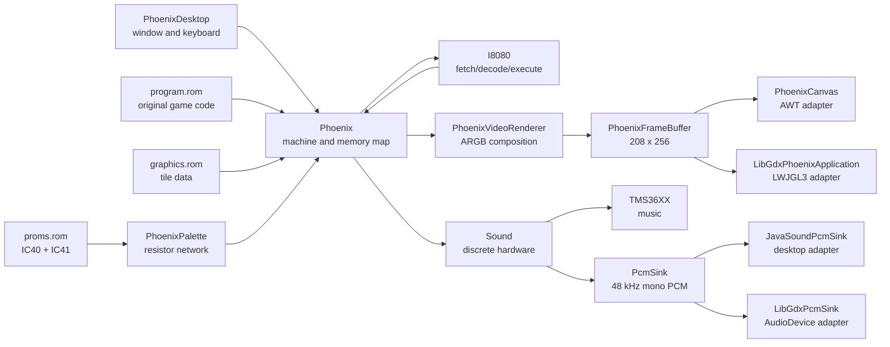
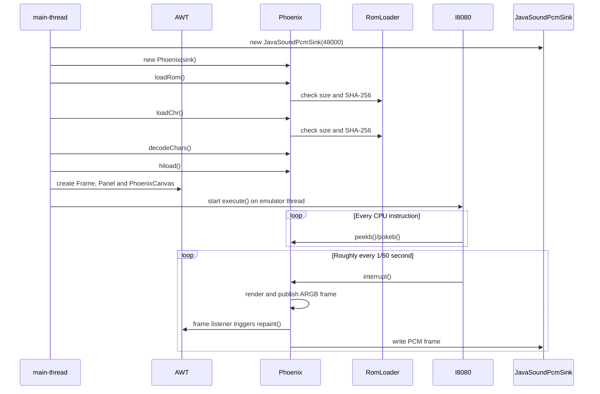
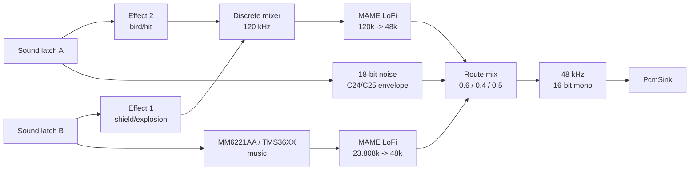

# JPhoenix Technical Architecture

Dutch version: [EMULATOR_ARCHITECTURE.nl.md](EMULATOR_ARCHITECTURE.nl.md).

This document describes how the Java desktop emulator works. It covers the
runtime from `make run` or `make run-libgdx` down to CPU instructions, video,
input, sound and highscore storage.

The game rules and the internal ROM state machine are covered separately in
[`GAME_LOGIC.md`](GAME_LOGIC.md).

The shared core and AWT frontend consist of seventeen runtime sources:

- [`PhoenixDesktop.java`](../PhoenixDesktop.java)
- [`PhoenixCanvas.java`](../PhoenixCanvas.java)
- [`PhoenixFrameBuffer.java`](../PhoenixFrameBuffer.java)
- [`PhoenixVideoRenderer.java`](../PhoenixVideoRenderer.java)
- [`PhoenixGraphicsDecoder.java`](../PhoenixGraphicsDecoder.java)
- [`Phoenix.java`](../Phoenix.java)
- [`PhoenixPalette.java`](../PhoenixPalette.java)
- [`PhoenixSaveState.java`](../PhoenixSaveState.java)
- [`PhoenixStateHotkeys.java`](../PhoenixStateHotkeys.java)
- [`RomLoader.java`](../RomLoader.java)
- [`I8080.java`](../I8080.java)
- [`Sound.java`](../Sound.java)
- [`PcmSink.java`](../PcmSink.java)
- [`JavaSoundPcmSink.java`](../JavaSoundPcmSink.java)
- [`TMS36XX.java`](../TMS36XX.java)
- [`MameLofiResampler.java`](../MameLofiResampler.java)
- [`SoundControlMapping.java`](../SoundControlMapping.java)

The LibGDX frontend adds four sources:

- [`PhoenixLibGdxLauncher.java`](../libgdx/src/main/java/PhoenixLibGdxLauncher.java)
- [`LibGdxPhoenixApplication.java`](../libgdx/src/main/java/LibGdxPhoenixApplication.java)
- [`LibGdxPcmSink.java`](../libgdx/src/main/java/LibGdxPcmSink.java)
- [`LibGdxFrameEncoder.java`](../libgdx/src/main/java/LibGdxFrameEncoder.java)

## 1. Core idea

JPhoenix is not a rewritten Java version of the Phoenix game. The original
game program lives in `program.rom` and is executed instruction by instruction
by the Intel 8080 emulator.

The Java code supplies the hardware around that ROM:

- an Intel 8080 CPU;
- 64 KiB of addressed memory;
- memory-mapped video, input and sound registers;
- two tile memories for foreground and background;
- graphics ROM decoding;
- vertical blanking and a 60 Hz frame callback;
- discrete sound hardware and an MM6221AA/TMS36XX music generator;
- desktop window, keyboard and PCM audio output.

Because of this, attract mode, demo AI, level progression, collisions, score and
game rules do not exist as Java methods in the emulator. They are part of the
machine code in `program.rom`.



## 2. Runtime files

The emulator expects the following files in the current working directory:

| File | Size | Use |
|---|---:|---|
| `program.rom` | 16,384 bytes | SHA-256 `261cddb2f0ef45248f976d56f810e3b6a5e71284ba57dbeade31aae562728e2e` |
| `graphics.rom` | 8,192 bytes | SHA-256 `e11168866950870074e7a5f9bcb749dedd2c89f8c8643c174710b73d21a96545` |
| `proms.rom` | 512 bytes | SHA-256 `4dc21d169eb6f344e1af22ecb2cfe6423fd5e14b4a5f2df2e2e188d26a062b37` |
| `hiscore.sav` | 4 bytes | Optional persistent highscore |
| `jphoenix.state` | variable | Optional, manually saved emulation state |

The working directory matters. `PhoenixDesktop` and
`LibGdxPhoenixApplication` use the canonical URL of `.` as the base for the
ROM files. `Phoenix` also opens `hiscore.sav` relative to the current
directory.

`RomLoader` reads each ROM file in full and first checks the exact
size and SHA-256. `proms.rom` contains IC40 (low color bits) at offsets
`0x000-0x0ff` and IC41 (high color bits) at `0x100-0x1ff`. Only the documented
Amstar set is accepted. A missing or mismatched file ends
startup before AWT shows a game window.

The old `.au` samples are not used. All runtime audio is computed
by `Sound.java` and `TMS36XX.java`.

## 3. Boot sequence

`PhoenixDesktop.main()` performs the following steps:

1. Instantiate `Phoenix`, including the framework-neutral framebuffer and sound hardware.
2. Load and validate `program.rom`.
3. Load and validate `graphics.rom`.
4. Load and validate both `mmi6301` color PROMs.
5. Decode the 128 MAME-conforming palette pens.
6. Decode all graphical characters into an internal pixel table.
7. Load the highscore.
8. Create a non-resizable AWT `Frame`.
9. Place a `Panel` with `BorderLayout` inside it.
10. Create a `PhoenixCanvas` that displays the framebuffer as an AWT image.
11. Register keyboard handling through the global `KeyboardFocusManager`.
12. Set the visible canvas size to `208 x 256`, scaled by a factor of 3.
13. Show the window.
14. Request keyboard focus for the canvas.
15. Start the CPU loop on the `Phoenix Emulator` thread.

With `--start-delay=<seconds>`, step 15 waits the configured time. With
`--wait-for-space`, it waits for space. During this gate, all
keyboard events are consumed; the start space press therefore does not also trigger
the laser bit. Without an option, the original immediate start behavior is kept.



If the audio output line cannot be opened, `PhoenixDesktop` replaces the
Java Sound adapter with a discarding `PcmSink`. The game then keeps running
without sound and reports `Sound hardware disabled`.

### 3.1 LibGDX startup

`make run-libgdx` uses the Gradle wrapper and starts
`PhoenixLibGdxLauncher`. The launcher creates a non-resizable LWJGL3 window of
`624 x 768` pixels and caps the frontend at 60 frames per second.

`LibGdxPhoenixApplication`:

1. creates a `208 x 256` RGBA8888 `Pixmap` and nearest-neighbour `Texture`;
2. opens a mono `AudioDevice` through `LibGdxPcmSink`, with a silent fallback;
3. loads and validates the same ROMs and highscore as the AWT frontend;
4. starts `Phoenix.execute()` on the separate emulator thread;
5. copies only a newly published ARGB frame and converts it to
   RGBA8888;
6. translates LibGDX keycodes to the same active-low machine input;
7. on `dispose()`, requests the CPU loop to stop, closes audio and cleans up all
   native LibGDX objects.

The machine clock therefore stays independent of the LWJGL3 render loop.

## 4. CPU emulation

### 4.1 CPU model

`Phoenix` extends `I8080`. The base class contains:

- the 8-bit registers A, B, C, D, E, H and L;
- combined register pairs AF, BC, DE and HL;
- program counter PC and stack pointer SP;
- the 8080 status flags;
- a parity lookup for all 256 byte values;
- 65,536 memory locations in `int[] mem`;
- a decode switch for all 256 opcodes;
- ALU, stack, branch and register helpers.

Although each memory location is stored as a Java `int`, the
accessors treat values as bytes or 16-bit words. Addresses are bounded
with `0xffff`.

### 4.2 Clock and cycles

The `Phoenix` constructor calls `super(0.74)`. This configures the CPU
for 0.74 MHz.

```text
cyclesPerInterrupt = int(0.74 * 1,000,000 / 60) = 12,333 cycles
```

For each opcode:

1. read the opcode at PC;
2. increment PC;
3. count the base cycle time from `OPCODE_CYCLES`;
4. execute the opcode;
5. for conditional calls/returns, adjust the cycle time as needed.

When the counter reaches the frame boundary, `Phoenix.interrupt()` is called
and a new cycle budget begins. In this port, this callback is mainly the
60 Hz hardware tick. `I8080.interrupt()` itself does not inject an interrupt vector.

### 4.3 ROM protection

Byte and word writes below `0x4000` are ignored by `Phoenix`. This makes
the program area behave as ROM. From `0x4000` onward, memory is
writable, alongside the special side effects of the hardware addresses.

## 5. Memory map

Phoenix uses memory-mapped I/O. The ROM therefore writes to addresses instead
of calling Java methods directly.

| Address range | Direction | Function in this port |
|---|---|---|
| `0x0000-0x3fff` | read | 16 KiB program ROM |
| `0x4000-0x43ff` | read/write | foreground video RAM and game data in the selected page |
| `0x4380-0x438b` | read/write | player and highscore fields in BCD |
| `0x438c` | write | highscore save/load trigger at value `0x0f` |
| `0x4800-0x4bff` | read/write | background video RAM in the selected page |
| `0x5000-0x53ff` | write | video RAM page via bit 0; palette bank via bit 1 |
| `0x5800-0x5bff` | write | vertical scroll value |
| `0x6000-0x63ff` | write | sound control A |
| `0x6800-0x6bff` | write | sound control B |
| `0x7000-0x73ff` | read | active-low player input |
| `0x7800-0x7bff` | read | vertical blank status |
| other addresses from `0x4000` | read/write | general emulation memory |

The wide 1 KiB ranges represent address decoding/mirroring of the
arcade hardware: any address within such a range triggers the same logical
register.

The `0x4000-0x4fff` range has two separate pages. A write to the
video register selects which page the CPU reads, writes and sees
on screen. The ROM uses those banks among other things for the separate player status.

### 5.1 Vertical blank

At the start of each frame callback, `vblankReadsRemaining` is set to 2.
The first two reads from `0x7800-0x7bff` return `0x80`; subsequent reads return
`0x00` until the next frame.

This is a practical pulse representation, not a scanline-by-scanline
CRT simulation.

## 6. Frame and timing model

`Phoenix.interrupt()` forms the hardware tick:

1. handle any pause/reset;
2. increment the frame counter;
3. arm two vblank reads;
4. render the screen according to `frameSkip`;
5. render and send one audio frame;
6. write optional debug status;
7. wait for the next 60 Hz deadline.

`paceFrame()` uses `System.nanoTime()` and an absolute next deadline.
If the emulator falls more than one frame behind, the deadline is reset
from the current time. This prevents a prolonged catch-up spiral.

A normal frame takes approximately:

```text
1 / 60 second = 16.6667 ms
```

At 48 kHz audio, each normal frame contains:

```text
48,000 / 60 = 800 samples
```

`frameSkip` only affects how often the picture is built. CPU and audio
keep running on every hardware tick.

## 7. Video pipeline

### 7.1 Resolution and layers

The internal screen is `208 x 256` pixels:

- 26 tile columns of 8 pixels;
- 32 tile rows of 8 pixels.

There are two video layers:

- background from `0x4800-0x4bff`;
- transparent foreground from `0x4000-0x43ff`.

The visible AWT canvas is scaled 3x by `PhoenixDesktop`. The internal
emulation buffer is always `208 x 256`.

### 7.2 Graphics ROM

`graphics.rom` contains:

- 2 character sets;
- 256 characters per set;
- 8 x 8 pixels per character;
- 2 bitplanes per pixel.

`PhoenixPalette` combines the low and high PROM bits through the same
open-collector resistor network as MAME, arranges the addresses in native
palette order and applies the same luminance normalization. The 128 resulting
ARGB pens are tested byte-for-byte against MAME.

`decodeChars()` then combines the graphics bitplanes into a pixel value
of 0-3, adds character set, character group and palette bank, and precomputes
each character into 64 ARGB pixels. The result is the table:

```text
Character[2 palette banks * 2 character sets * 256 characters * 64 pixels]
```

Black is stored as ARGB 0 for the foreground and is therefore transparent.

### 7.3 Frame construction

`screenRefresh()` has `PhoenixVideoRenderer`:

1. select the active palette bank;
2. convert 26 x 32 background tiles from the selected video RAM page to ARGB;
3. convert 26 x 32 transparent foreground tiles to ARGB;
4. scroll the background with vertical wrap-around;
5. composite the foreground without scroll over the background;
6. publish the complete frame to `PhoenixFrameBuffer`.

`PhoenixFrameBuffer` copies the frame under synchronization and then
notifies registered listeners that a new frame is available. `PhoenixCanvas`
copies the latest pixels to a `BufferedImage` during an AWT paint.

The background positions:

```text
y = 256 - ScrollReg
y = -ScrollReg
```

produce a seamlessly vertically scrolling layer.

### 7.4 Video RAM orientation

The tiles are not walked linearly like normal screen rows. For each
screen row, the renderer starts at:

```text
base + 32 * (26 - 1) + y
```

and subtracts 32 from the address per column. This translates the
physical memory orientation of Phoenix to the vertical Java framebuffer.

### 7.5 Current video limitations

The renderer rebuilds both tile layers from scratch every rendered frame. Dirty-tile
tracking is not yet implemented.

## 8. Input

### 8.1 Active-low register

`gameControlState` starts at `0xff`: all bits high, meaning no button pressed.
A key-down clears the corresponding bit to 0; key-up sets it back to 1.

| Bit | Mask | Key | Action |
|---:|---:|---|---|
| 0 | `0x01` | `3` | insert coin |
| 1 | `0x02` | `1` | start player 1 |
| 2 | `0x04` | `2` | start player 2 |
| 3 | `0x08` | - | unassigned |
| 4 | `0x10` | space | fire |
| 5 | `0x20` | right arrow | right |
| 6 | `0x40` | left arrow | left |
| 7 | `0x80` | down arrow or `B` | barrier shield |

The ROM reads this byte through `0x7000-0x73ff`.

### 8.2 Focus and event handling

Keyboard events are captured at multiple levels:

- the global `KeyboardFocusManager`;
- the AWT frame;
- the host panel;
- the game canvas.

A mouse click on the canvas re-requests keyboard focus. A click with the
left mouse button also toggles pause/resume and sets the window title to
`PAUZE` while the emulator thread is stopped. The multiple registration is
meant to avoid input loss from AWT focus changes. Because
`gameControlState` is `volatile`, the emulator thread sees changes from the
AWT event thread.

The `[` and `]` keys exist in `doKey()` as historical
frame-skip controls, but `doDesktopKey()` currently does not map them from AWT.

## 9. Sound overview

The sound port uses hardware emulation exclusively:

1. discrete effect generator for effect 1 and effect 2;
2. custom 18-bit noise generator;
3. MM6221AA/TMS36XX music generator;
4. MAME LoFi resampling;
5. a final mix to 48 kHz signed 16-bit mono PCM.



## 10. Sound registers

### 10.1 Control A (`0x6000-0x63ff`)

| Bits | Meaning |
|---|---|
| 0-3 | effect-2 preload/data |
| 4-5 | effect-2 frequency selection |
| 6 | C24/noise discharge |
| 7 | C25/noise charge |

### 10.2 Control B (`0x6800-0x6bff`)

| Bits | Meaning |
|---|---|
| 0-3 | effect-1 preload/data |
| 4 | effect-1 frequency selection |
| 5 | effect-1 filter on/off |
| 6-7 | MM6221AA tune number 0-3 |

`SoundControlMapping` is deliberately kept small and forms the central,
testable translation of latch bits to the individual sound branches.

### 10.3 Timing of sound writes

A ROM write is not applied only roughly at the end of the frame.
`Phoenix.pokeb()` also passes on:

- the current CPU cycle within the frame;
- the total cycle budget of the frame.

`Sound.queueEvent()` translates this into a sample index within the 800-sample
audio frame. Events are sorted chronologically. Writes at the same sample
retain CPU order.

As a result, laser, explosion and music changes start at approximately the right
moment within the frame.

## 11. Discrete effect generator

The discrete graph runs internally at 120 kHz and follows MAME's Phoenix graph.

### 11.1 Effect 1

Effect 1 is used for, among others, shield and explosion sounds:

```text
NODE_20  RCDISC4 envelope/frequency control
NODE_21  555 astable with control voltage
NODE_22  two coupled counters / DISCRETE_NOTE
NODE_23  TTL level or attenuated TTL level
NODE_24  multiplication of counter and level
NODE_25  optional RC filter
```

The TTL high value is 3.4 V, matching MAME's
`DEFAULT_TTL_V_LOGIC_1`.

### 11.2 Effect 2

Effect 2 is used for flying birds and hit sounds:

```text
NODE_30  selected total capacitance
NODE_31  high frequency bit
NODE_32  3.4 V or 1.7 V effect level
NODE_33  autonomous 555
NODE_34  slow autonomous 555
NODE_35  first resistor mixer
NODE_36  second resistor mixer
NODE_37  C22 RC filter
NODE_38  control-voltage mixer
NODE_39  control-voltage 555
NODE_40  coupled counters / DISCRETE_NOTE
```

The autonomous 555 nodes receive the same initial reset step at construction as
MAME. The RC networks use `double` for component values and state.

### 11.3 Final mixer

Effect 1 and effect 2 go to a resistor mixer with coupling capacitors. The
final stage also includes a high-pass action. The discrete output uses the
MAME gain of 40,000 before being normalized to stream scale.

## 12. Noise generator

The custom noise generator builds a full 18-bit
pseudo-random polynomial table at startup.

During rendering:

1. C24 and C25 are charged or discharged according to latch A;
2. their level determines a variable noise frequency;
3. a bit from the 18-bit polynomial provides the fast noise component;
4. a 400 Hz sample-and-hold path provides a coarse low component;
5. both components are weighted by their capacitor envelopes.

The bit operations use unsigned right shifts where the MAME implementation uses a
`uint32_t`.

## 13. Music generator

`TMS36XX` emulates the MM6221AA in this configuration:

- base clock: 372 Hz;
- internal sample frequency: `372 * 64 = 23,808 Hz`;
- four active voices;
- twelve tone/decay channels;
- alternating banks of six harmonics for decaying notes;
- ROM tables for the Phoenix melodies.

A tune write from bits 6-7 of sound latch B selects tune 0-3. The generator keeps
frequency counters and volume decay per voice and produces a normalized
mono sample.

## 14. Resampling and final mix

`MameLofiResampler` is a port of MAME's standard LoFi resampler:

- 24-bit phase accumulator;
- four source samples;
- cubic interpolation tables;
- `sourceDivide` averaging on downsampling.

There are two instances:

| Source | Source frequency | Target frequency |
|---|---:|---:|
| discrete graph | 120,000 Hz | 48,000 Hz |
| MM6221AA | 23,808 Hz | 48,000 Hz |

The three audio branches are mixed with MAME route gains:

```text
mixed = discrete * 0.6 + customNoise * 0.4 + music * 0.5
```

After that, the sample is rounded, clamped to signed 16-bit and offered
little-endian to the injected `PcmSink`.

## 15. Audio output

The `PcmSink` contract uses:

| Property | Value |
|---|---|
| encoding | PCM signed |
| sample rate | 48,000 Hz |
| sample size | 16 bit |
| channels | 1, mono |
| frame size | 2 bytes |
| byte order | little-endian |

`Sound` calls `PcmSink.write()` once per emulation frame.
`JavaSoundPcmSink` translates this on desktop to `SourceDataLine.write()`.
Headless tests and other frontends can inject their own sink. The
sound methods that share CPU and audio state are synchronized.

## 16. Highscore

Phoenix stores scores as Binary Coded Decimal. `getScore()` converts four
bytes to a Java integer.

Relevant fields:

| Address | Meaning |
|---|---|
| `0x4380` | player 1 score |
| `0x4384` | player 2 score |
| `0x4388` | current highscore |
| `0x438c` | highscore initialization/save trigger |

When `0x0f` is written to `0x438c`:

1. read player 1, player 2 and the highscore;
2. determine the highest score;
3. write those four BCD bytes to `hiscore.sav` if it is higher than the
   stored score;
4. load the stored score back if the ROM temporarily has a lower value.

At startup, `hiload()` reads four bytes into `0x4388-0x438b` and then updates the
visible highscore tiles in foreground RAM.

A missing or unreadable file is not fatal: the emulator reports
`Error loading high score` and continues.

## 17. Save states

Both frontends use the same controls:

| Key | Action |
|---|---|
| `F5` | write `jphoenix.state` |
| `F9` | load `jphoenix.state` |

`PhoenixStateHotkeys` performs file I/O outside the frontend thread.
`Phoenix` then places the operation on a thread-safe command queue. The
emulator thread processes that queue at the start of a 60 Hz interrupt.
This means a copy is never made halfway through a CPU instruction or sound frame.

A state contains:

- all 8080 registers, flags, interrupt status and remaining cycles;
- all 64 KiB of memory;
- both video RAM pages, active page, palette, scroll and vblank status;
- frame and highscore status;
- sound latches and not yet processed sample events;
- all capacitor, 555, noise and mixer state;
- both LoFi resamplers and the full MM6221AA/TMS36XX state.

Framebuffer pixels are rebuilt from video RAM after loading.
Host audio, wall-clock deadlines and physical key status are not
emulation hardware and are not saved. All input bits are released on load
and the 60 Hz deadline is restarted from the current host time.

`PhoenixSaveState` writes an explicit binary format with:

1. magic `JPHOENIX` and format version;
2. the SHA-256 hashes of the required program and graphics ROM;
3. payload length and CRC32;
4. the full machine payload.

Saving goes through a temporary file in the same directory and then
an atomic replace where the filesystem supports it. A wrong
version, ROM set, length or checksum is rejected before restoring.

## 18. Attract mode and demo

Attract mode is entirely driven by the ROM. The emulator has no separate
Java function that plays the titles, score table or demo.

See [`GAME_LOGIC.md`](GAME_LOGIC.md) for the full attract timeline, the three
demo intervals and how the live demo AI works.

The ROM:

- increments its own counter at `0x4398/0x4399`;
- writes tiles to foreground and background RAM;
- changes scroll and sound registers;
- changes game modes in RAM;
- simulates demo input from its own machine code.

If attract mode does not work, it must therefore first be determined whether:

1. the CPU executes enough cycles;
2. the 60 Hz callback occurs;
3. vblank reads return correctly;
4. writes to video RAM are retained;
5. the ROM and RAM contents are correct.

The problem then does not necessarily lie in the Java keyboard layer.

## 19. Threading

There are practically two main threads:

| Thread | Responsibility |
|---|---|
| AWT event dispatch thread | paint, window events and keyboard events |
| `Phoenix Emulator` | CPU loop, hardware tick, framebuffer construction and audio frames |

`gameControlState` is `volatile`. Sound latch updates and frame handling are
synchronized where CPU and audio state touch each other.

The emulator thread publishes complete frames under synchronization to
`PhoenixFrameBuffer`. The AWT thread always copies the latest complete
snapshot. This means the frontend does not share a mutable render array with the core.

Save and load requests come from a frontend thread, but the actual
snapshot is performed by `Phoenix Emulator` at the next frame boundary.
The calling helper thread waits for completion and then reports the
result.

## 20. Debugging

Start debug logging with:

```sh
java -Dphoenix.debug=true -cp build/classes PhoenixDesktop
```

Debug mode selectively logs:

- relevant input actions;
- changes to sound latch A and B;
- changes to important attract/game-mode addresses;
- a summary every 60 frames if the counter or video checksums change.

The frame summary includes, among other things:

- `Counter98` from `0x4398/0x4399`;
- mode bytes `0x43a2` and `0x43a3`;
- coin status `0x438f`;
- scroll and palette;
- foreground and background checksums;
- current program counter.

Normal use does not require the debug property.

## 21. Error handling and limits

The current port has a number of deliberate or historical limits:

- audio errors disable sound but do not stop the game;
- missing highscore data is not fatal;
- only the documented Amstar ROM hashes are accepted;
- the renderer rebuilds the tile layers completely each time;
- vblank is a short read pulse and not a scanline model;
- all game rules remain dependent on the correct original ROM.

## 22. Responsibilities per source file

### `PhoenixDesktop.java`

- desktop entrypoint;
- window and scale factor;
- focus and keyboard routing;
- ROM/highscore boot sequence;
- emulator thread.

### `PhoenixCanvas.java`

- AWT canvas and scaled display;
- copying the latest framebuffer to a `BufferedImage`;
- requesting repaint on a new frame.

### `PhoenixFrameBuffer.java`

- thread-safe publication of fixed `208 x 256` ARGB frames;
- snapshots for arbitrary frontends;
- frame sequence number and listeners.

### `PhoenixVideoRenderer.java`

- tile orientation and layer construction;
- transparent foreground compositing;
- vertical scroll and wrap-around;
- no dependency on AWT or LibGDX.

### `Phoenix.java`

- Phoenix-specific memory map;
- video RAM and graphics ROM;
- input and vblank registers;
- sound latch writes;
- 60 Hz hardware tick;
- driving the framework-neutral video renderer;
- highscore persistence.

### `RomLoader.java`

- fully reading program ROM, graphics ROM and color PROMs;
- checking exact file size;
- SHA-256 validation before the emulator starts.

### `PhoenixPalette.java`

- decoding the two 256-byte `mmi6301` PROMs;
- Phoenix open-collector resistor network;
- MAME-conforming native pen order and luminance normalization.

### `PhoenixSaveState.java`

- versioned state format with ROM binding and CRC32;
- atomic file replacement;
- serialization of CPU, machine, video and sound state.

### `PhoenixStateHotkeys.java`

- shared asynchronous `F5`/`F9` actions for both frontends;
- user notification after saving, loading or an error.

### `I8080.java`

- registers and flags;
- 64 KiB memory base;
- opcode fetch and decode;
- instruction cycles;
- ALU, branch, stack and I/O instructions.

### `Sound.java`

- sample-accurate latch event queue;
- discrete effect nodes;
- noise generator;
- mix and PCM conversion.

### `PcmSink.java`

- platform-neutral contract for 48 kHz signed 16-bit mono PCM;
- discarding implementation for headless use.

### `JavaSoundPcmSink.java`

- desktop PCM output through Java Sound;
- management of the `SourceDataLine`.

### LibGDX frontend

- `PhoenixLibGdxLauncher`: LWJGL3 window and 60 Hz frontend configuration;
- `LibGdxPhoenixApplication`: framebuffer upload, key input and lifecycle;
- `LibGdxPcmSink`: little-endian PCM to LibGDX `AudioDevice`;
- `LibGdxFrameEncoder`: ARGB to RGBA8888 with no color or filter conversion.

### `TMS36XX.java`

- MM6221AA tunes;
- tone frequencies and harmonics;
- volume decay;
- internal music samples.

### `MameLofiResampler.java`

- MAME-compatible sample-rate conversion;
- phase accumulator;
- cubic interpolation;
- downsample averaging.

### `SoundControlMapping.java`

- central bit mapping of sound latch A and B.

## 23. Frontend boundaries

The AWT and LibGDX frontends use the same boundaries:

1. keep `I8080`, the memory map and sound graph as the emulation core;
2. read complete frames from `PhoenixFrameBuffer`;
3. upload that fixed `208 x 256` ARGB buffer as a frontend texture;
4. translate frontend input to the same active-low input byte;
5. implement `PcmSink` for the target platform;
6. keep the 60 Hz machine clock independent of the render frequency.

Hardware behavior belongs in the core. Window management, texture upload, controllers and
platform audio belong in the frontend.

The current boundary is:

```text
PhoenixCore
  screenRefresh() -> PhoenixVideoRenderer
  frameBuffer()
  doKey(...)

AWTFrontend / LibGDXFrontend
  copy/display framebuffer
  collect keyboard/gamepad input
  provide platform PcmSink
```

The video and audio boundaries are platform-neutral. The LibGDX implementation also
serves as a reference for a future platform backend: only window,
texture upload, input and `PcmSink` are frontend responsibilities.

## 24. Verification

Compile the runtime core:

```sh
make
```

Start the emulator:

```sh
make run
```

Compile or start the LibGDX frontend:

```sh
make libgdx
make run-libgdx
```

The video and sound regression tests live in `tests/`; the MAME comparison tools
live in `tools/sound/`. Run the tests with `make verify`. Check the
LibGDX adapters with `make verify-libgdx`. See
[`SOUND_PORT_NOTES.md`](SOUND_PORT_NOTES.md) for the comparison procedure.
