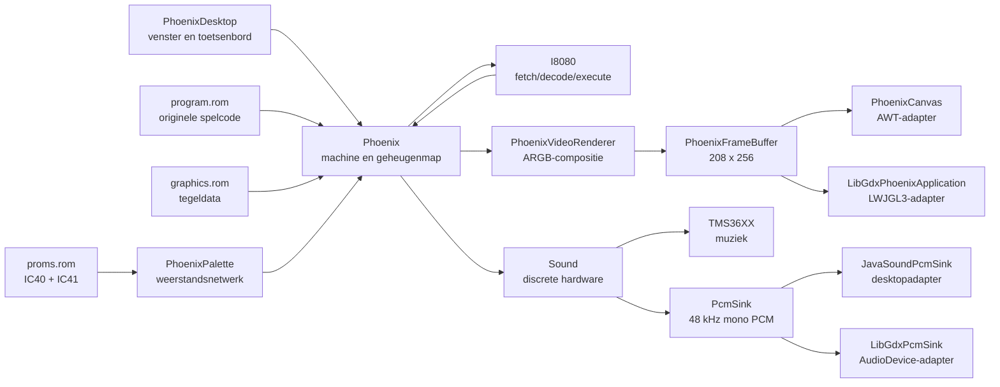
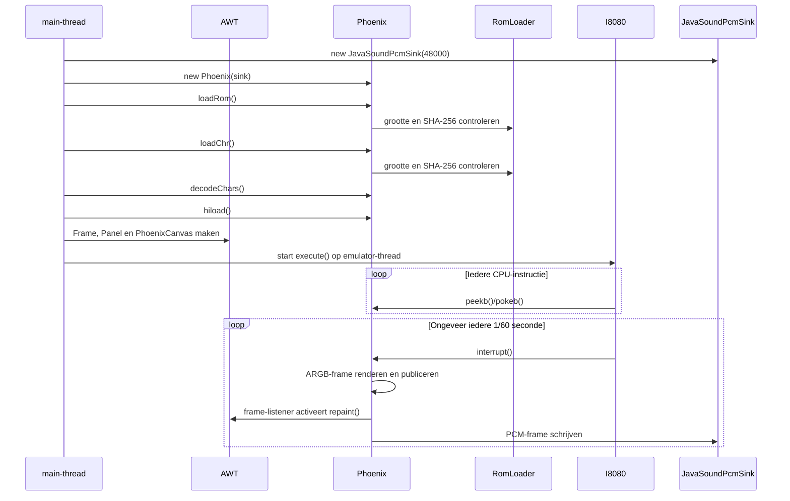
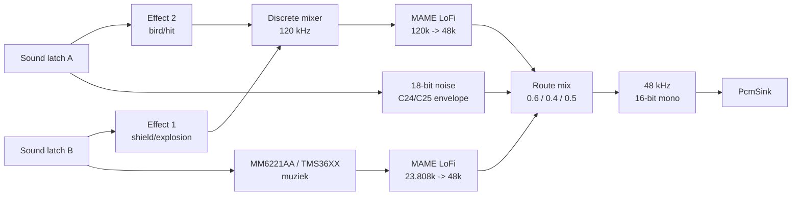

# Technische architectuur van JPhoenix

Engelse versie: [EMULATOR_ARCHITECTURE.md](EMULATOR_ARCHITECTURE.md).

Dit document beschrijft hoe de Java-desktopemulator werkt. Het behandelt de
runtime vanaf `make run` of `make run-libgdx` tot aan CPU-instructies, video,
invoer, geluid en highscore-opslag.

De spelregels en de interne ROM-state-machine worden afzonderlijk behandeld in
[`GAME_LOGIC.nl.md`](GAME_LOGIC.nl.md).

De gedeelde kern en AWT-frontend bestaan uit zeventien runtimebronnen:

- [`PhoenixDesktop.java`](../PhoenixDesktop.java)
- [`PhoenixCanvas.java`](../PhoenixCanvas.java)
- [`PhoenixFrameBuffer.java`](../PhoenixFrameBuffer.java)
- [`PhoenixVideoRenderer.java`](../PhoenixVideoRenderer.java)
- [`PhoenixGraphicsDecoder.java`](../PhoenixGraphicsDecoder.java)
- [`Phoenix.java`](../Phoenix.java)
- [`PhoenixPalette.java`](../PhoenixPalette.java)
- [`PhoenixSaveState.java`](../PhoenixSaveState.java)
- [`PhoenixStateHotkeys.java`](../PhoenixStateHotkeys.java)
- [`RomLoader.java`](../RomLoader.java)
- [`I8080.java`](../I8080.java)
- [`Sound.java`](../Sound.java)
- [`PcmSink.java`](../PcmSink.java)
- [`JavaSoundPcmSink.java`](../JavaSoundPcmSink.java)
- [`TMS36XX.java`](../TMS36XX.java)
- [`MameLofiResampler.java`](../MameLofiResampler.java)
- [`SoundControlMapping.java`](../SoundControlMapping.java)

De LibGDX-frontend voegt vier bronnen toe:

- [`PhoenixLibGdxLauncher.java`](../libgdx/src/main/java/PhoenixLibGdxLauncher.java)
- [`LibGdxPhoenixApplication.java`](../libgdx/src/main/java/LibGdxPhoenixApplication.java)
- [`LibGdxPcmSink.java`](../libgdx/src/main/java/LibGdxPcmSink.java)
- [`LibGdxFrameEncoder.java`](../libgdx/src/main/java/LibGdxFrameEncoder.java)

## 1. Kernidee

JPhoenix is geen herschreven Java-versie van het Phoenix-spel. Het originele
spelprogramma staat in `program.rom` en wordt instructie voor instructie
uitgevoerd door de Intel 8080-emulator.

De Java-code levert de hardware rondom die ROM:

- een Intel 8080 CPU;
- 64 KiB geadresseerd geheugen;
- geheugenmapped video-, input- en soundregisters;
- twee tegelgeheugens voor voor- en achtergrond;
- grafische ROM-decodering;
- verticale blanking en een 60 Hz framecallback;
- discrete geluidshardware en een MM6221AA/TMS36XX-muziekgenerator;
- desktopvenster, toetsenbord en PCM-audio-uitvoer.

Daarom bevinden attract mode, demo-AI, levelverloop, botsingen, scores en
spelregels zich niet als Java-methoden in de emulator. Ze zijn onderdeel van de
machinecode in `program.rom`.



## 2. Runtimebestanden

De emulator verwacht de volgende bestanden in de actuele werkdirectory:

| Bestand | Grootte | Gebruik |
|---|---:|---|
| `program.rom` | 16.384 bytes | SHA-256 `261cddb2f0ef45248f976d56f810e3b6a5e71284ba57dbeade31aae562728e2e` |
| `graphics.rom` | 8.192 bytes | SHA-256 `e11168866950870074e7a5f9bcb749dedd2c89f8c8643c174710b73d21a96545` |
| `proms.rom` | 512 bytes | SHA-256 `4dc21d169eb6f344e1af22ecb2cfe6423fd5e14b4a5f2df2e2e188d26a062b37` |
| `hiscore.sav` | 4 bytes | Optionele persistente highscore |
| `jphoenix.state` | variabel | Optionele, handmatig opgeslagen emulatiestaat |

De werkdirectory is belangrijk. `PhoenixDesktop` en
`LibGdxPhoenixApplication` gebruiken de canonieke URL van `.` als basis voor de
ROM-bestanden. `Phoenix` opent `hiscore.sav` eveneens relatief aan de actuele
directory.

`RomLoader` leest ieder ROM-bestand volledig en controleert eerst de exacte
grootte en SHA-256. `proms.rom` bevat op offsets `0x000-0x0ff` IC40 (lage
kleurbits) en op `0x100-0x1ff` IC41 (hoge kleurbits). Alleen de gedocumenteerde
Amstar-set wordt geaccepteerd. Een ontbrekend of afwijkend bestand beëindigt
de start voordat AWT een gamevenster toont.

De oude `.au`-samples worden niet gebruikt. Alle runtimeaudio wordt berekend
door `Sound.java` en `TMS36XX.java`.

## 3. Opstartvolgorde

`PhoenixDesktop.main()` voert de volgende stappen uit:

1. Instantieer `Phoenix`, inclusief framework-neutrale framebuffer en soundhardware.
2. Laad en valideer `program.rom`.
3. Laad en valideer `graphics.rom`.
4. Laad en valideer beide `mmi6301`-kleur-PROMs.
5. Decodeer de 128 MAME-conforme palettepennen.
6. Decodeer alle grafische tekens naar een interne pixeltabel.
7. Laad de highscore.
8. Maak een niet-resizable AWT `Frame`.
9. Plaats daarin een `Panel` met `BorderLayout`.
10. Maak een `PhoenixCanvas` dat de framebuffer als AWT-image weergeeft.
11. Registreer toetsenbordafhandeling via de globale `KeyboardFocusManager`.
12. Stel de zichtbare canvasgrootte in op `208 x 256`, geschaald met factor 3.
13. Toon het venster.
14. Vraag keyboardfocus voor het canvas.
15. Start de CPU-loop op de thread `Phoenix Emulator`.

Met `--start-delay=<seconden>` wacht stap 15 de ingestelde tijd. Met
`--wait-for-space` wacht hij op spatie. Tijdens deze gate worden alle
keyboardevents geconsumeerd; de startspatie activeert daarom niet tegelijk het
laserbit. Zonder optie blijft de oorspronkelijke directe start behouden.



Als de audio-outputlijn niet kan worden geopend, vervangt `PhoenixDesktop` de
Java Sound-adapter door een weggooiende `PcmSink`. De game blijft dan zonder
geluid draaien en meldt `Sound hardware disabled`.

### 3.1 LibGDX-opstart

`make run-libgdx` gebruikt de Gradle-wrapper en start
`PhoenixLibGdxLauncher`. De launcher maakt een niet-resizable LWJGL3-venster van
`624 x 768` pixels en begrenst de frontend op 60 frames per seconde.

`LibGdxPhoenixApplication`:

1. maakt een `208 x 256` RGBA8888-`Pixmap` en nearest-neighbour-`Texture`;
2. opent een mono `AudioDevice` via `LibGdxPcmSink`, met stille fallback;
3. laadt en valideert dezelfde ROM's en highscore als de AWT-frontend;
4. start `Phoenix.execute()` op de aparte emulatorthread;
5. kopieert alleen een nieuw gepubliceerd ARGB-frame en zet dit om naar
   RGBA8888;
6. vertaalt LibGDX-keycodes naar dezelfde active-low machine-input;
7. vraagt bij `dispose()` de CPU-loop te stoppen, sluit audio en ruimt alle
   native LibGDX-objecten op.

De machineclock blijft daarmee onafhankelijk van de LWJGL3-renderloop.

## 4. CPU-emulatie

### 4.1 CPU-model

`Phoenix` erft van `I8080`. De basisklasse bevat:

- de 8-bitregisters A, B, C, D, E, H en L;
- samengestelde registerparen AF, BC, DE en HL;
- program counter PC en stack pointer SP;
- de 8080-statusflags;
- een pariteitslookup voor alle 256 bytewaarden;
- 65.536 geheugenplaatsen in `int[] mem`;
- een decode-switch voor alle 256 opcodes;
- ALU-, stack-, branch- en registerhelpers.

Hoewel iedere geheugenplaats als Java `int` wordt opgeslagen, behandelen de
accessors waarden als bytes of 16-bitwoorden. Adressen worden met `0xffff`
begrensd.

### 4.2 Klok en cycli

De constructor van `Phoenix` roept `super(0.74)` aan. Daarmee wordt de CPU
geconfigureerd voor 0,74 MHz.

```text
cyclesPerInterrupt = int(0,74 * 1.000.000 / 60) = 12.333 cycli
```

Voor iedere opcode:

1. lees de opcode op PC;
2. verhoog PC;
3. tel de basiscylustijd uit `OPCODE_CYCLES`;
4. voer de opcode uit;
5. corrigeer bij conditionele calls/returns zo nodig de cyclustijd.

Wanneer de teller de framegrens bereikt, wordt `Phoenix.interrupt()` aangeroepen
en begint een nieuw cyclibudget. Deze callback is in deze port vooral de
60 Hz-hardwaretick. `I8080.interrupt()` injecteert zelf geen interruptvector.

### 4.3 ROM-bescherming

Byte- en woordwrites onder `0x4000` worden door `Phoenix` genegeerd. Daarmee
gedraagt het programmagebied zich als ROM. Vanaf `0x4000` is geheugen
beschrijfbaar, naast de speciale side effects van de hardwareadressen.

## 5. Geheugenmap

Phoenix gebruikt geheugenmapped I/O. De ROM schrijft dus naar adressen in plaats
van Java-methoden rechtstreeks aan te roepen.

| Adresbereik | Richting | Functie in deze port |
|---|---|---|
| `0x0000-0x3fff` | lezen | 16 KiB programma-ROM |
| `0x4000-0x43ff` | lezen/schrijven | foreground video-RAM en speldata in de geselecteerde pagina |
| `0x4380-0x438b` | lezen/schrijven | speler- en highscorevelden in BCD |
| `0x438c` | schrijven | highscore save/load-trigger bij waarde `0x0f` |
| `0x4800-0x4bff` | lezen/schrijven | background video-RAM in de geselecteerde pagina |
| `0x5000-0x53ff` | schrijven | video-RAM-pagina via bit 0; palettebank via bit 1 |
| `0x5800-0x5bff` | schrijven | verticale scrollwaarde |
| `0x6000-0x63ff` | schrijven | sound control A |
| `0x6800-0x6bff` | schrijven | sound control B |
| `0x7000-0x73ff` | lezen | active-low spelerinput |
| `0x7800-0x7bff` | lezen | vertical-blankstatus |
| overige adressen vanaf `0x4000` | lezen/schrijven | algemeen emulatiegeheugen |

De brede 1 KiB-ranges vertegenwoordigen adresdecodering/mirroring van de
arcadehardware: ieder adres binnen zo'n range activeert hetzelfde logische
register.

Het bereik `0x4000-0x4fff` heeft twee afzonderlijke pagina's. Een write naar het
videoregister selecteert welke pagina de CPU leest, beschrijft en op het scherm
ziet. De ROM gebruikt die banken onder meer voor de afzonderlijke spelerstatus.

### 5.1 Vertical blank

Aan het begin van iedere framecallback wordt `vblankReadsRemaining` op 2 gezet.
De eerste twee reads uit `0x7800-0x7bff` leveren `0x80`; volgende reads leveren
`0x00` tot het volgende frame.

Dit is een praktische pulsrepresentatie, geen scanline-per-scanline
beeldbuissimulatie.

## 6. Frame- en tijdmodel

`Phoenix.interrupt()` vormt de hardwaretick:

1. verwerk eventueel pause/reset;
2. verhoog de frameteller;
3. activeer twee vblankreads;
4. render het scherm volgens `frameSkip`;
5. render en verstuur één audioframe;
6. schrijf optionele debugstatus;
7. wacht tot de volgende 60 Hz-deadline.

`paceFrame()` gebruikt `System.nanoTime()` en een absolute volgende deadline.
Als de emulator meer dan één frame achterloopt, wordt de deadline opnieuw vanaf
de huidige tijd gezet. Dit voorkomt een langdurige inhaalspiraal.

Een normaal frame duurt ongeveer:

```text
1 / 60 seconde = 16,6667 ms
```

Bij 48 kHz audio bevat ieder normaal frame:

```text
48.000 / 60 = 800 samples
```

`frameSkip` beïnvloedt alleen hoe vaak het beeld wordt opgebouwd. CPU en audio
blijven per hardwaretick doorlopen.

## 7. Videopipeline

### 7.1 Resolutie en lagen

Het interne scherm is `208 x 256` pixels:

- 26 tegelkolommen van 8 pixels;
- 32 tegelrijen van 8 pixels.

Er zijn twee videolagen:

- achtergrond uit `0x4800-0x4bff`;
- transparante voorgrond uit `0x4000-0x43ff`.

De zichtbare AWT-canvas wordt door `PhoenixDesktop` op 3x geschaald. De interne
emulatiebuffer blijft altijd `208 x 256`.

### 7.2 Grafische ROM

`graphics.rom` bevat:

- 2 character sets;
- 256 tekens per set;
- 8 x 8 pixels per teken;
- 2 bitplanes per pixel.

`PhoenixPalette` combineert de lage en hoge PROM-bits via hetzelfde
open-collector-weerstandsnetwerk als MAME, zet de adressen in native
palettevolgorde en past dezelfde luminantienormalisatie toe. De 128 resulterende
ARGB-pennen zijn byte-voor-byte tegen MAME getest.

`decodeChars()` combineert vervolgens de grafische bitplanes tot een pixelwaarde
van 0-3, voegt charset, karaktergroep en palettebank toe en zet ieder teken
vooraf om naar 64 ARGB-pixels. Het resultaat is de tabel:

```text
Character[2 palettebanken * 2 character sets * 256 tekens * 64 pixels]
```

Zwart wordt voor de voorgrond als ARGB 0 opgeslagen en is daardoor transparant.

### 7.3 Frameopbouw

`screenRefresh()` laat `PhoenixVideoRenderer`:

1. de actieve palettebank selecteren;
2. 26 x 32 achtergrondtegels uit de geselecteerde video-RAM-pagina omzetten naar ARGB;
3. 26 x 32 transparante voorgrondtegels omzetten naar ARGB;
4. de achtergrond met verticale wrap-around scrollen;
5. de voorgrond zonder scroll over de achtergrond compositeren;
6. het complete frame publiceren naar `PhoenixFrameBuffer`.

`PhoenixFrameBuffer` kopieert het frame onder synchronisatie en meldt daarna
geregistreerde listeners dat een nieuw frame beschikbaar is. `PhoenixCanvas`
kopieert bij een AWT-paint de laatste pixels naar een `BufferedImage`.

De achtergrondposities:

```text
y = 256 - ScrollReg
y = -ScrollReg
```

leveren een naadloos verticaal scrollende laag.

### 7.4 Oriëntatie van video-RAM

De tegels worden niet lineair als normale schermrijen doorlopen. Voor iedere
schermrij begint de renderer bij:

```text
base + 32 * (26 - 1) + y
```

en trekt per kolom 32 van het adres af. Hiermee wordt de fysieke
geheugenoriëntatie van Phoenix naar het verticale Java-framebuffer vertaald.

### 7.5 Huidige videobeperkingen

De renderer bouwt beide tegellagen ieder gerenderd frame opnieuw op. Dirty-tile-
tracking is nog niet geïmplementeerd.

## 8. Invoer

### 8.1 Active-low register

`gameControlState` begint op `0xff`: alle bits hoog, dus geen knop ingedrukt.
Een key-down maakt het bijbehorende bit 0; key-up maakt het weer 1.

| Bit | Masker | Toets | Actie |
|---:|---:|---|---|
| 0 | `0x01` | `3` | munt inwerpen |
| 1 | `0x02` | `1` | speler 1 starten |
| 2 | `0x04` | `2` | speler 2 starten |
| 3 | `0x08` | - | niet toegewezen |
| 4 | `0x10` | spatie | vuren |
| 5 | `0x20` | pijl rechts | rechts |
| 6 | `0x40` | pijl links | links |
| 7 | `0x80` | pijl omlaag of `B` | barrierschild |

De ROM leest dit byte via `0x7000-0x73ff`.

### 8.2 Focus en eventafhandeling

Keyboardevents worden op meerdere niveaus opgevangen:

- globale `KeyboardFocusManager`;
- het AWT-frame;
- het hostpanel;
- het gamecanvas.

Een muisklik op het canvas vraagt opnieuw keyboardfocus. Een klik met de
linkermuisknop togglet daarnaast pauze/hervatten en zet de venstertitel op
`PAUZE` zolang de emulator-thread stilstaat. De meervoudige registratie is
bedoeld om inputverlies door AWT-focuswisselingen te vermijden. Omdat
`gameControlState` `volatile` is, ziet de emulator-thread wijzigingen van de
AWT-eventthread.

De toetsen `[` en `]` bestaan in `doKey()` als historische
frame-skipbediening, maar `doDesktopKey()` mapt ze momenteel niet vanuit AWT.

## 9. Geluidsoverzicht

De soundport gebruikt uitsluitend hardware-emulatie:

1. discrete effectgenerator voor effect 1 en effect 2;
2. custom 18-bit noisegenerator;
3. MM6221AA/TMS36XX-muziekgenerator;
4. MAME LoFi-resampling;
5. een eindmix naar 48 kHz signed 16-bit mono PCM.



## 10. Soundregisters

### 10.1 Control A (`0x6000-0x63ff`)

| Bits | Betekenis |
|---|---|
| 0-3 | effect-2 preload/data |
| 4-5 | effect-2 frequentieselectie |
| 6 | C24/noise discharge |
| 7 | C25/noise charge |

### 10.2 Control B (`0x6800-0x6bff`)

| Bits | Betekenis |
|---|---|
| 0-3 | effect-1 preload/data |
| 4 | effect-1 frequentieselectie |
| 5 | effect-1 filter aan/uit |
| 6-7 | MM6221AA-tunenummer 0-3 |

`SoundControlMapping` is bewust klein gehouden en vormt de centrale,
testbare vertaling van latchbits naar de afzonderlijke soundtakken.

### 10.3 Timing van soundwrites

Een ROM-write wordt niet pas grofweg aan het einde van het frame toegepast.
`Phoenix.pokeb()` geeft ook door:

- de huidige CPU-cyclus binnen het frame;
- het totale cyclibudget van het frame.

`Sound.queueEvent()` vertaalt dit naar een sample-index binnen het 800-sample
audioframe. Events worden chronologisch gesorteerd. Writes op dezelfde sample
behouden CPU-volgorde.

Hierdoor beginnen laser-, explosie- en muziekwijzigingen op ongeveer het juiste
moment binnen het frame.

## 11. Discrete effectgenerator

De discrete graph draait intern op 120 kHz en volgt de Phoenix-graph van MAME.

### 11.1 Effect 1

Effect 1 wordt gebruikt voor onder andere shield- en explosiegeluiden:

```text
NODE_20  RCDISC4 envelope/frequentiecontrol
NODE_21  555 astable met control voltage
NODE_22  twee gekoppelde counters / DISCRETE_NOTE
NODE_23  TTL-niveau of verzwakt TTL-niveau
NODE_24  vermenigvuldiging van counter en niveau
NODE_25  optioneel RC-filter
```

De TTL-highwaarde is 3,4 V, gelijk aan MAME's
`DEFAULT_TTL_V_LOGIC_1`.

### 11.2 Effect 2

Effect 2 wordt gebruikt voor vliegende vogels en hitgeluiden:

```text
NODE_30  geselecteerde totale capaciteit
NODE_31  hoog frequentiebit
NODE_32  3,4 V of 1,7 V effectniveau
NODE_33  autonome 555
NODE_34  langzame autonome 555
NODE_35  eerste resistormixer
NODE_36  tweede resistormixer
NODE_37  C22 RC-filter
NODE_38  control-voltage-mixer
NODE_39  control-voltage 555
NODE_40  gekoppelde counters / DISCRETE_NOTE
```

De autonome 555-nodes krijgen bij constructie dezelfde eerste resetstap als
MAME. De RC-netwerken gebruiken `double` voor componentwaarden en toestand.

### 11.3 Eindmixer

Effect 1 en effect 2 gaan naar een resistormixer met koppelcondensatoren. De
eindtrap bevat eveneens een high-passwerking. De discrete uitgang gebruikt de
MAME-gain van 40.000 voordat hij naar streamschaal wordt genormaliseerd.

## 12. Noisegenerator

De custom noisegenerator bouwt bij startup een volledige 18-bit
pseudo-randompolynoomtabel.

Tijdens rendering:

1. C24 en C25 worden volgens latch A opgeladen of ontladen;
2. hun niveau bepaalt een variabele noisefrequentie;
3. een bit uit de 18-bitpolynoom levert de snelle noisecomponent;
4. een 400 Hz sample-and-holdpad levert een grove lage component;
5. beide componenten worden door hun condensatorenveloppen gewogen.

De bitoperaties gebruiken unsigned right shifts waar de MAME-implementatie een
`uint32_t` gebruikt.

## 13. Muziekgenerator

`TMS36XX` emuleert in deze configuratie de MM6221AA:

- basisklok: 372 Hz;
- interne samplefrequentie: `372 * 64 = 23.808 Hz`;
- vier actieve stemmen;
- twaalf toon-/decaykanalen;
- afwisselende banken van zes harmonischen voor uitklinkende noten;
- ROM-tabellen voor de Phoenix-melodieën.

Een tunewrite uit bits 6-7 van sound latch B kiest tune 0-3. De generator houdt
per stem frequentietellers en volumeverval bij en produceert een genormaliseerde
monosample.

## 14. Resampling en eindmix

`MameLofiResampler` is een port van MAME's standaard LoFi-resampler:

- 24-bit faseaccumulator;
- vier bronsamples;
- kubische interpolatietabellen;
- `sourceDivide`-averaging bij downsampling.

Er zijn twee instanties:

| Bron | Bronfrequentie | Doelfrequentie |
|---|---:|---:|
| discrete graph | 120.000 Hz | 48.000 Hz |
| MM6221AA | 23.808 Hz | 48.000 Hz |

De drie audiotakken worden gemengd met MAME-routegains:

```text
mixed = discrete * 0,6 + customNoise * 0,4 + music * 0,5
```

Daarna wordt de sample afgerond, op signed 16-bit begrensd en little-endian aan
de geïnjecteerde `PcmSink` aangeboden.

## 15. Audio-output

Het `PcmSink`-contract gebruikt:

| Eigenschap | Waarde |
|---|---|
| encoding | PCM signed |
| samplefrequentie | 48.000 Hz |
| samplegrootte | 16 bit |
| kanalen | 1, mono |
| framegrootte | 2 bytes |
| bytevolgorde | little-endian |

`Sound` roept `PcmSink.write()` één keer per emulatieframe aan.
`JavaSoundPcmSink` vertaalt dit op desktop naar `SourceDataLine.write()`.
Headless tests en andere frontends kunnen een eigen sink injecteren. De
soundmethoden die CPU- en audiostaat delen zijn gesynchroniseerd.

## 16. Highscore

Phoenix bewaart scores als Binary Coded Decimal. `getScore()` converteert vier
bytes naar een Java-integer.

Relevante velden:

| Adres | Betekenis |
|---|---|
| `0x4380` | score speler 1 |
| `0x4384` | score speler 2 |
| `0x4388` | actuele highscore |
| `0x438c` | highscore-initialisatie/save-trigger |

Wanneer `0x0f` naar `0x438c` wordt geschreven:

1. lees speler 1, speler 2 en highscore;
2. bepaal de hoogste score;
3. schrijf die vier BCD-bytes naar `hiscore.sav` als hij hoger is dan de
   opgeslagen score;
4. laad de opgeslagen score terug als de ROM tijdelijk een lagere waarde heeft.

Bij startup leest `hiload()` vier bytes naar `0x4388-0x438b` en werkt daarna de
zichtbare highscoretegels in foreground-RAM bij.

Een ontbrekend of onleesbaar bestand is niet fataal: de emulator meldt
`Error loading high score` en gaat verder.

## 17. Save states

Beide frontends gebruiken dezelfde bediening:

| Toets | Actie |
|---|---|
| `F5` | schrijf `jphoenix.state` |
| `F9` | laad `jphoenix.state` |

`PhoenixStateHotkeys` voert bestands-I/O buiten de frontendthread uit.
`Phoenix` zet de bewerking vervolgens in een thread-safe commandowachtrij. De
emulatorthread verwerkt die wachtrij aan het begin van een 60 Hz-interrupt.
Daardoor wordt nooit halverwege een CPU-instructie of soundframe gekopieerd.

Een state bevat:

- alle 8080-registers, flags, interruptstatus en resterende cycli;
- alle 64 KiB geheugen;
- beide video-RAM-pagina's, actieve pagina, palette, scroll en vblankstatus;
- frame- en highscorestatus;
- soundlatches en nog niet verwerkte sample-events;
- alle condensator-, 555-, noise- en mixerstaat;
- beide LoFi-resamplers en de volledige MM6221AA/TMS36XX-staat.

Framebufferpixels worden na het laden opnieuw uit video-RAM opgebouwd.
Hostaudio, wall-clockdeadlines en fysieke toetsstatus zijn geen
emulatiehardware en worden niet opgeslagen. Alle inputbits worden bij laden
vrijgegeven en de 60 Hz-deadline wordt opnieuw vanaf de actuele hosttijd
gestart.

`PhoenixSaveState` schrijft een expliciet binair formaat met:

1. magic `JPHOENIX` en formaatversie;
2. de SHA-256-hashes van de vereiste programma- en grafische ROM;
3. payloadlengte en CRC32;
4. de volledige machinepayload.

Opslaan gebeurt via een tijdelijk bestand in dezelfde directory en daarna met
een atomische replace waar het bestandssysteem dat ondersteunt. Een verkeerde
versie, ROM-set, lengte of checksum wordt vóór het herstellen geweigerd.

## 18. Attract mode en demo

Attract mode wordt volledig door de ROM bestuurd. De emulator heeft geen aparte
Java-functie die de titels, scoretabel of demo afspeelt.

Zie [`GAME_LOGIC.nl.md`](GAME_LOGIC.nl.md) voor de volledige attracttijdlijn, de drie
demo-intervallen en de werking van de live demo-AI.

De ROM:

- verhoogt zijn eigen teller op `0x4398/0x4399`;
- schrijft tegels naar foreground- en background-RAM;
- wijzigt scroll- en soundregisters;
- verandert spelmodi in RAM;
- simuleert demo-input vanuit zijn eigen machinecode.

Als attract mode niet werkt, moet daarom eerst worden bepaald of:

1. de CPU voldoende cycli uitvoert;
2. de 60 Hz-callback plaatsvindt;
3. vblankreads correct terugkomen;
4. writes naar video-RAM behouden blijven;
5. de ROM- en RAM-inhoud correct is.

Het probleem hoeft dan niet in de Java-keyboardlaag te zitten.

## 19. Threading

Er zijn praktisch twee belangrijke threads:

| Thread | Verantwoordelijkheid |
|---|---|
| AWT event dispatch thread | paint, windowevents en keyboardevents |
| `Phoenix Emulator` | CPU-loop, hardwaretick, framebufferopbouw en audioframes |

`gameControlState` is `volatile`. Soundlatchupdates en frame-afhandeling zijn
gesynchroniseerd waar CPU- en audiostaat elkaar raken.

De emulator-thread publiceert complete frames onder synchronisatie naar
`PhoenixFrameBuffer`. De AWT-thread kopieert steeds de laatste volledige
snapshot. Daardoor deelt de frontend geen mutabele renderarray met de kern.

Save- en loadverzoeken komen van een frontendthread, maar de daadwerkelijke
snapshot wordt door `Phoenix Emulator` op de eerstvolgende framegrens
uitgevoerd. De aanroepende hulpthread wacht op voltooiing en meldt daarna het
resultaat.

## 20. Debugging

Start debuglogging met:

```sh
java -Dphoenix.debug=true -cp build/classes PhoenixDesktop
```

De debugmodus logt selectief:

- relevante inputacties;
- wijzigingen van sound latch A en B;
- wijzigingen van belangrijke attract/game-modeadressen;
- iedere 60 frames een samenvatting als teller of videochecksums veranderen.

De framesamenvatting bevat onder andere:

- `Counter98` uit `0x4398/0x4399`;
- modebytes `0x43a2` en `0x43a3`;
- coinstatus `0x438f`;
- scroll en palette;
- foreground- en backgroundchecksums;
- huidige program counter.

Normaal gebruik vereist geen debugproperty.

## 21. Foutafhandeling en grenzen

De huidige port heeft een aantal bewuste of historische grenzen:

- audiofouten schakelen geluid uit maar stoppen de game niet;
- ontbrekende highscoredata is niet fataal;
- alleen de gedocumenteerde Amstar-ROM-hashes worden geaccepteerd;
- de renderer bouwt de tegellagen volledig opnieuw op;
- vblank is een korte readpuls en geen scanline-model;
- alle spelregels blijven afhankelijk van de correcte originele ROM.

## 22. Verantwoordelijkheden per bronbestand

### `PhoenixDesktop.java`

- desktopentrypoint;
- venster en schaalfactor;
- focus- en keyboardrouting;
- ROM/highscore-opstartvolgorde;
- emulator-thread.

### `PhoenixCanvas.java`

- AWT-canvas en geschaalde weergave;
- kopiëren van de laatste framebuffer naar een `BufferedImage`;
- aanvragen van repaint bij een nieuw frame.

### `PhoenixFrameBuffer.java`

- thread-safe publicatie van vaste `208 x 256` ARGB-frames;
- snapshots voor willekeurige frontends;
- framevolgnummer en listeners.

### `PhoenixVideoRenderer.java`

- tegeloriëntatie en laagopbouw;
- transparante voorgrondcompositie;
- verticale scroll en wrap-around;
- geen afhankelijkheid van AWT of LibGDX.

### `Phoenix.java`

- Phoenix-specifieke geheugenmap;
- video-RAM en grafische ROM;
- input- en vblankregisters;
- soundlatchwrites;
- 60 Hz-hardwaretick;
- aansturen van de framework-neutrale videorenderer;
- highscorepersistentie.

### `RomLoader.java`

- volledig inlezen van programma-ROM, grafische ROM en kleur-PROMs;
- controle van exacte bestandsgrootte;
- SHA-256-validatie vóór de emulator start.

### `PhoenixPalette.java`

- decoderen van de twee 256-byte `mmi6301`-PROMs;
- Phoenix open-collector-weerstandsnetwerk;
- MAME-conforme native penvolgorde en luminantienormalisatie.

### `PhoenixSaveState.java`

- geversioneerd stateformaat met ROM-binding en CRC32;
- atomische bestandsvervanging;
- serialisatie van CPU-, machine-, video- en soundstaat.

### `PhoenixStateHotkeys.java`

- gedeelde asynchrone `F5`/`F9`-acties voor beide frontends;
- gebruikersmelding na opslaan, laden of een fout.

### `I8080.java`

- registers en flags;
- 64 KiB geheugenbasis;
- opcodefetch en -decode;
- instructiecycli;
- ALU-, branch-, stack- en I/O-instructies.

### `Sound.java`

- sample-exacte latch-eventqueue;
- discrete effectnodes;
- noisegenerator;
- mix en PCM-conversie.

### `PcmSink.java`

- platformneutraal contract voor 48 kHz signed 16-bit mono PCM;
- weggooiende implementatie voor headless gebruik.

### `JavaSoundPcmSink.java`

- desktop-PCM-output via Java Sound;
- beheer van de `SourceDataLine`.

### LibGDX-frontend

- `PhoenixLibGdxLauncher`: LWJGL3-venster en 60 Hz frontendconfiguratie;
- `LibGdxPhoenixApplication`: framebufferupload, toetseninput en lifecycle;
- `LibGdxPcmSink`: little-endian PCM naar LibGDX `AudioDevice`;
- `LibGdxFrameEncoder`: ARGB naar RGBA8888 zonder kleur- of filterconversie.

### `TMS36XX.java`

- MM6221AA-tunes;
- toonfrequenties en harmonischen;
- volume-decay;
- interne muzieksamples.

### `MameLofiResampler.java`

- MAME-compatible sample-rateconversie;
- faseaccumulator;
- kubische interpolatie;
- downsample-averaging.

### `SoundControlMapping.java`

- centrale bitmapping van sound latch A en B.

## 23. Frontendgrenzen

De AWT- en LibGDX-frontends gebruiken dezelfde grenzen:

1. behoud `I8080`, de geheugenmap en soundgraph als emulatiekern;
2. lees complete frames uit `PhoenixFrameBuffer`;
3. upload die vaste `208 x 256` ARGB-buffer als frontendtexture;
4. vertaal frontendinput naar hetzelfde active-low inputbyte;
5. implementeer `PcmSink` voor het doelplatform;
6. behoud de 60 Hz-machineclock onafhankelijk van de renderfrequentie.

Hardwaregedrag hoort in de kern. Vensterbeheer, textuurupload, controllers en
platformaudio horen in de frontend.

De huidige grens is:

```text
PhoenixCore
  screenRefresh() -> PhoenixVideoRenderer
  frameBuffer()
  doKey(...)

AWTFrontend / LibGDXFrontend
  copy/display framebuffer
  collect keyboard/gamepad input
  provide platform PcmSink
```

De video- en audiogrenzen zijn platformneutraal. De LibGDX-implementatie dient
tevens als referentie voor een volgende platformbackend: alleen venster,
texture-upload, input en `PcmSink` zijn frontendverantwoordelijkheden.

## 24. Verificatie

Compileer de runtimekern:

```sh
make
```

Start de emulator:

```sh
make run
```

Compileer of start de LibGDX-frontend:

```sh
make libgdx
make run-libgdx
```

De video- en soundregressietests staan in `tests/`; de MAME-vergelijkingstools
staan in `tools/sound/`. Voer de tests uit met `make verify`. Controleer de
LibGDX-adapters met `make verify-libgdx`. Zie
[`SOUND_PORT_NOTES.md`](SOUND_PORT_NOTES.md) voor de vergelijkingsprocedure.
