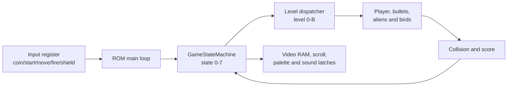
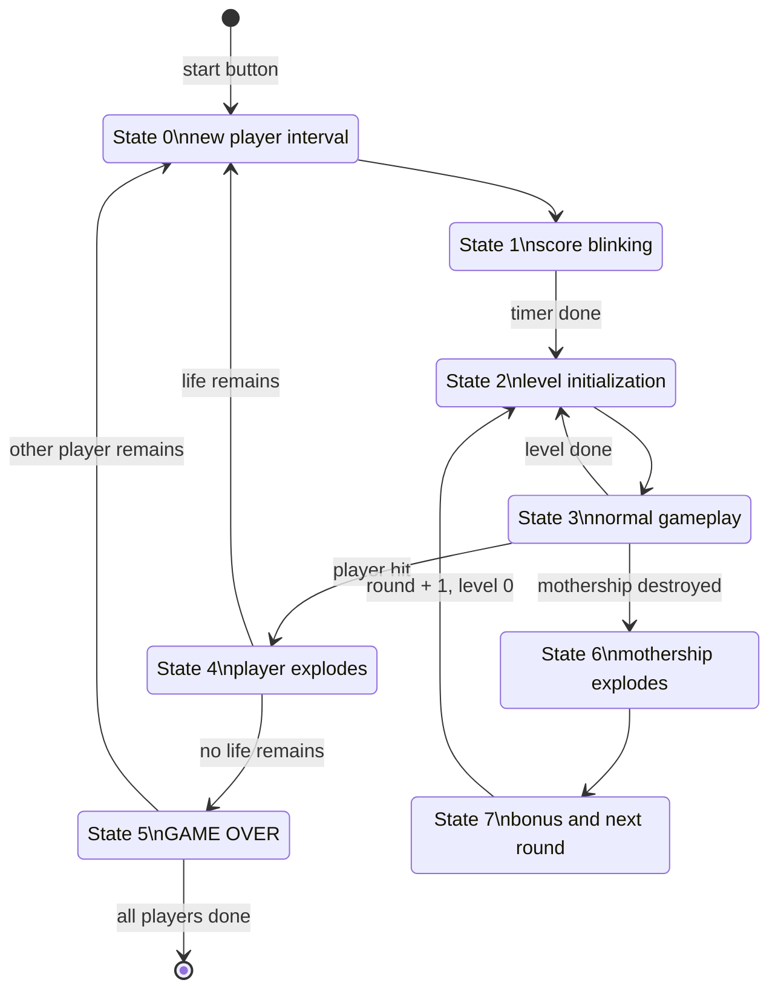

# How the Phoenix Game Works

Dutch version: [GAME_LOGIC.nl.md](GAME_LOGIC.nl.md).

This document describes how the game program in `program.rom` works.
It is therefore a companion to
[`EMULATOR_ARCHITECTURE.md`](EMULATOR_ARCHITECTURE.md), which describes the Java emulator
and the emulated hardware.

The analysis below follows the documented ROM routines and addresses. Names
such as `GameStateMachine`, `PlayerUpdate` and `GameDemo` are labels from the
available disassembly. Where the meaning of a byte is not fully proven,
this is explicitly noted.

## 1. Game and emulator are two separate layers

The Java emulator contains no Java classes such as `Enemy`, `Level` or `Collision`.
The original ROM performs all game rules:

- counting credits;
- processing start buttons;
- directing attract mode;
- moving the player and projectiles;
- animating aliens and birds;
- detecting collisions;
- updating scores and lives;
- progressing through levels and rounds;
- selecting sound effects through hardware latches.

The emulator makes this possible by offering CPU, memory, video, input and sound
to the ROM.



## 2. ROM reset and initialization

After reset, code starts at `0x0008`:

1. set the stack pointer to `0x4bff`;
2. select memory bank 0 through the video register;
3. turn off sound A and B;
4. set scroll to zero;
5. clear RAM and screen of both memory banks;
6. select bank 0;
7. draw the fixed top lines with scores, highscore and coins;
8. go to the permanent main loop at `0x001a`.

Phoenix uses two RAM banks for, among other things, the state of two
players. The ROM switches the bank through the video register at `0x5000`.

## 3. The main loop

Each iteration of `MainLoop` starts with `WaitVBlankCoin`:

1. wait until vertical blank becomes active;
2. wait until vertical blank ends again;
3. read the active-low input register;
4. store current and previous input in `0x43a0/0x43a1`;
5. increment the free frame counter;
6. detect a new coin edge;
7. increment up to a maximum of nine credits.

Then `GameOrAttract` at `0x43a2` chooses the main path:

```text
0 = attract mode
1 = one player
2 = two players
```

In game mode, per frame the following is executed:

```text
GameStateMachine()
UpdateScoresAndSound()
```

In attract mode:

```text
mute sound
check credits
show start prompt if credits > 0
otherwise SplashAndDemo()
```

## 4. Credits and start

### 4.1 Coin edge

Inputs are active-low. A coin only counts when bit 0 goes from 1 to 0.
A pressed key that stays low therefore yields a single credit, not a new
credit every frame.

The visible coin counter is updated with a digit tile. The original ROM
supports a maximum of nine credits internally; the tens position is not
updated.

### 4.2 Start prompt

With credits, `PromptForStartGame` clears the playing field and shows:

```text
PUSH ONLY
1 PLAYER BUTTON
```

With at least two credits, the choice for two players is also shown.

Start 1 sets `GameOrAttract` to 1. Start 2 sets it to 2. After that:

1. the required credits are deducted;
2. the highscore is compared with the two player scores;
3. player scores are cleared and redrawn;
4. lives are initialized;
5. foreground and background of both banks are cleared;
6. the state machine goes to a new game.

### 4.3 DIP switches in this port

The original ROM reads lives and coinage bits from the same hardware region as
the blanking/DIP status. The current Java port only supplies the
vertical-blank pulse there and zero after that.

As a result, the ROM in practice sees:

- the lowest lives setting: 3 lives;
- the coinage branch with bit `0x10` off.

There is currently no separate Java configuration screen for DIP switches.

## 5. Central RAM variables

| Address | Label | Role |
|---|---|---|
| `0x4380-0x4383` | Score1 | player 1 score in BCD |
| `0x4384-0x4387` | Score2 | player 2 score in BCD |
| `0x4388-0x438b` | HiScore | highscore in BCD |
| `0x438c` | SoundControlA | shadow copy of sound A |
| `0x438d` | SoundControlB | shadow copy of sound B |
| `0x438f` | CoinCount | credits |
| `0x4390` | Player1Lives | player 1 lives |
| `0x4391` | Player2Lives | player 2 lives |
| `0x4398/0x4399` | Counter98 | 16-bit attract/demo counter |
| `0x439a/0x439b` | Counter9A | free animation/frame counter |
| `0x43a0` | IN0Current | current active-low input |
| `0x43a1` | IN0Previous | previous input |
| `0x43a2` | GameOrAttract | attract, one player or two players |
| `0x43a3` | GameAndDemoOrSplash | active player/demo/splash context |
| `0x43a4` | GameState | global state 0-7 |
| `0x43a5` | CounterA5 | timer within states |
| `0x43a6` | ShieldCount | shield/explosion counter |
| `0x43b8` | LevelAndRound | high nibble round, low nibble level |
| `0x43ba` | AliensLeft | remaining aliens |
| `0x43bb` | BirdsLeft | remaining birds |
| `0x43c0-0x43df` | Player/object state | player and projectile slots |
| `0x43e0-0x43ff` | Object screen state | old/current screen addresses |
| `0x4b50-0x4bef` | Alien/bird data | control states, positions and movement |

Some bytes between these fields are timers, temporary score values and
movement parameters. Their meaning varies per level routine.

## 6. The global game state machine

`GameStateMachine` at `0x0400` uses `GameState` as an index into a jump table.

| State | Routine | Meaning |
|---:|---:|---|
| 0 | `0x0430` | start new life/player interval |
| 1 | `0x04ac` | blink the active player score |
| 2 | `0x0515` | initialize player and level data |
| 3 | `0x0800` | normal gameplay and level dispatcher |
| 4 | `0x0aea` | explosion of the player ship |
| 5 | `0x0b60` | GAME OVER and player/attract transition |
| 6 | `0x2400` | explosion of the mothership |
| 7 | `0x244c` | show mothership bonus and next round |



## 7. State 0: new player interval

State 0:

- prepares state 1;
- starts `CounterA5` at `0x80` for the score blinking;
- normalizes splash/demo to game context;
- in two-player mode, selects the player with remaining lives;
- copies the relevant memory bank when switching players.

The bank copy preserves not only screen data, but also scores, level state and
object data. Each player can therefore have their own progress.

## 8. State 1: score blinking

State 1 counts `CounterA5` down. Depending on timer bits, the active
player score is alternately drawn and cleared.

Halfway through:

- the background scroll is reset;
- foreground outside the score bar is cleared;
- the video/palette register for the level is set.

When the counter reaches zero, the machine proceeds to state 2.

## 9. State 2: initialization

State 2 prepares state 3:

1. set video bank and palette bits based on player and level;
2. load level-dependent global parameters;
3. copy default player and projectile data to `0x43c0`;
4. clear old object/screen positions at `0x43e0`;
5. initialize alien states and start positions;
6. compute screen addresses for player and aliens;
7. clear movement counters;
8. go to the first level routine.

The default player data includes, among other things:

```text
PlayerState  = 0x0c
PlayerShape  = 0x10
PlayerShipX  = 0x64
PlayerShipY  = 0xd8
```

There is one player bullet, one helper slot for the part above the bullet and five
enemy bullet slots.

## 10. State 3: level dispatcher

`LevelAndRound` uses:

```text
bits 0-3 = level code 0-B
bits 4-7 = round
```

The level dispatcher chooses a routine each frame from this sequence:

| Level | Phase |
|---:|---|
| `0` | stars scroll, first alien formation fade-in |
| `1` | first alien formation, active gameplay |
| `2` | stars scroll, second alien formation fade-in |
| `3` | second alien formation, active gameplay |
| `4` | spiral transition |
| `5` | first bird/Phoenix wave |
| `6` | spiral transition |
| `7` | second bird/Phoenix wave |
| `8` | spiral transition to mothership |
| `9` | mothership fade-in |
| `A` | mothership and defenders fade-in |
| `B` | active mothership phase |

After the mothership, the high nibble increases by one round and the low nibble
starts again at level 0.

## 11. Alien formations: levels 0-3

### 11.1 Fade-in

Levels 0 and 2:

- scroll the star background;
- count down a level timer;
- draw successive fade-in tiles;
- activate alien control states;
- initialize the alien formation;
- increment the level code when the fade is done.

The documented fade sequence uses foreground tiles:

```text
0x6c -> 0x6d -> 0x6e -> 0x6f -> 0x68
```

### 11.2 Active formation

Levels 1 and 3 perform, among other things, per frame:

- `PlayerUpdate`;
- projectile/alien collision;
- alien movement and animation;
- formation and dive patterns;
- enemy bullet updates;
- player/alien collision;
- killed-alien animations;
- checking `AliensLeft`.

When few aliens remain, the ROM changes certain movement timing and
individual attack patterns become more important. When `AliensLeft` reaches zero,
the next level transition is started.

## 12. Spiral transitions

Levels 4, 6 and 8 use the same `spiral fill` routine.

A timer is converted into an ever-growing rectangular pattern. The routine
first draws asterisk tiles and then clears them again. At the end:

- the level is incremented;
- state 2 is chosen;
- background/mothership data may be prepared for later phases.

The spiral is therefore not a separate video file, but a per-frame ROM algorithm that
writes tiles into video RAM.

## 13. Bird/Phoenix waves

Levels 5 and 7 use eight bird objects, divided into two groups of four.

Per frame, the ROM can:

- update player, bullet and shield;
- check bird collisions before and after vertical movement;
- couple vertical movement to the scroll register;
- perform horizontal movement for a group of birds;
- draw bird shapes and animation frames;
- process enemy bullets;
- update explosion and bonus animations;
- check `BirdsLeft`.

The two groups are updated on alternating frames to spread work across frames.
With fewer than four birds remaining, both groups are processed more often.

Bird state and position are stored in object blocks around `0x4b70`. The ROM chooses
movement based on control-state bits, timers, position and level/round. That
produces formation movement, diving, wing animation and returning to the formation.

When `BirdsLeft` is zero, the ROM clears remaining projectiles and
explosion animations and goes to the next transition.

## 14. Mothership phase

### 14.1 Level 9

The mothership image appears gradually while the star background
keeps scrolling. A level timer marks when the ship is partially visible.

### 14.2 Level A

After that, the mothership and defenders are built up together further. The ROM:

- reuses alien fade code;
- sets mothership flags;
- initializes additional control-state bytes;
- prepares the active phase.

### 14.3 Level B

Level B uses the general active alien routine supplemented with
mothership logic. The player must hit the vulnerable parts
of the ship through the defense.

On destruction:

1. `GameState` goes to 6;
2. a particle explosion is drawn over multiple frames;
3. the ship is cleared from the background;
4. a bonus is calculated and added to the score;
5. the state goes to 7;
6. the bonus remains temporarily visible;
7. the round is incremented and level 0 is restarted.

## 15. Player movement

`PlayerUpdate` consists of four main parts:

1. clear old objects or draw new objects based on state bits;
2. copy current data to the previous-frame buffer structure;
3. update ship, player bullet and shield;
4. translate logical X/Y positions to video RAM addresses.

Left and right change `PlayerShipX` within ROM-defined limits. On
movement, a flag is set so the drawing routine knows the old ship
must be cleared and drawn at the new position.

The player has a fixed vertical base position. The horizontal position is
translated to the rotated/columned video RAM layout through a mapping table.

## 16. Firing

The ROM uses a state byte for the player bullet:

- free/inactive;
- drawing;
- active and moving up;
- clearing;
- resetting when the top edge or a collision is reached.

On a new fire edge:

1. the ROM checks whether the bullet slot is free;
2. it takes the X position of the ship;
3. it places the bullet above the ship;
4. it activates the draw/movement bits;
5. it chooses the laser effect through sound control.

The helper slot `AbovePlayerBullet` supports collision and rendering around the
tile above the current bullet position.

## 17. Enemy bullets

There are five enemy bullet slots. `EnemyBulletUpdate` and
`EnemyBulletDataController`:

- clear the previous tile;
- process control-state bits;
- move the bullet down;
- switch animation shape;
- draw the new tile;
- deactivate a slot outside the playing field or after a collision.

The active level routine determines when and from which alien/bird object
a free slot is started.

## 18. Shield

The barrier key activates a temporary protection animation around the
ship. `ShieldCount` controls both duration and shape.

During the shield:

- multiple tiles are drawn around the ship;
- the shield frames used change as the counter runs down;
- collision detection uses a larger protected area;
- colliding enemies can be hit without the normal immediate
  ship explosion.

At the final value:

1. `ShieldsExpired` clears the shield image;
2. the normal player state and shape are restored;
3. the X position is normalized;
4. normal movement continues.

## 19. Collision detection

Phoenix uses tile- and object-based collision, not a modern
pixel-per-pixel physics engine.

### 19.1 Player bullet against enemy

The ROM:

1. checks whether the bullet is active;
2. reads the tile at the screen address of the bullet;
3. uses tile ranges to recognize formation or freely moving enemies;
4. compares logical X/Y positions with object data;
5. deactivates the bullet and the hit object;
6. starts an explosion/bonus record;
7. decrements `AliensLeft` or `BirdsLeft`;
8. writes a temporary BCD score value.

### 19.2 Enemy against player

The ROM checks the tile rectangle of the ship against active
alien/bird objects. Without a shield, a valid overlap leads to state 4.

With an active shield, a larger area is checked and the enemy itself can
be put into a hit/explosion status.

### 19.3 Enemy bullet against player

Enemy bullets are tested against the screen position of the ship/shield. A
valid hit sets the player state to the explosion sequence and chooses
the corresponding sound effect.

## 20. Enemy and explosion objects

Object control states use bit fields. The general drawing controller processes,
among other things:

- bit for clearing an old object;
- bit for drawing a new object;
- object active/inactive;
- shape and animation index;
- grid position;
- derived video RAM address.

Explosions are also temporary object records. Their timers select
successive tiles and, when finished, produce a score event or a free
object slot status.

## 21. Score

Scores are three bytes of packed BCD, so six visible digits. The lowest
decimal position stays zero.

`AddToScore` adds `BC * 10` using the 8080 `DAA` instruction:

```text
lowest two BCD digits
middle two BCD digits plus carry
highest two BCD digits plus carry
```

Hits first write a temporary BCD score in explosion/bonus records.
`UpdateScoresAndSound` loops through those records each frame and:

1. adds rounded hit values to the active player;
2. clears processed temporary score fields;
3. redraws the six score digits when needed;
4. checks the extra-life threshold;
5. updates lives and sound hardware.

The exact number of points depends on enemy type, hit part, level and sometimes the
phase of the object. It is therefore data- and context-driven, not a single fixed
Java score table.

## 22. Extra life

The ROM compares the active score with a BCD threshold in the global
level block. When crossing a threshold that is still active:

- the life of the active player is incremented;
- the life digit is updated;
- a flag/sound event is set;
- the threshold is marked so the same boundary does not reward again.

## 23. Player hit

A fatal collision sets state 4 and starts a timer.

State 4:

- fixes scroll at a suitable boundary;
- draws successive ship particles;
- clears other foreground elements at fixed moments;
- lets remaining enemy/explosion animations partially continue;
- goes to state 5 afterward;
- decrements the life of the active player;
- updates the lives display;
- chooses state 0 if a life still remains.

The precise transition between state 4 and 5 is timer- and life-dependent: state
5 handles both the GAME OVER display and choosing the next player.

## 24. GAME OVER and two players

State 5 increments its timer and shows `GAME OVER`.

When the timer expires:

- if the other player still has lives, the machine goes through state 0 to that
  player and the correct RAM bank is restored;
- if both players are done, `Counter98` and `GameOrAttract` are cleared;
- the machine returns to attract mode;
- bank 0 is selected if needed.

This allows two players to alternate turns while each keeps their own score, level and
object state.

## 25. Attract mode as a timeline

`SplashAndDemo` increments the 16-bit `Counter98` at
`0x4398/0x4399` every frame.

Key moments:

| Counter98 | Time at 60 Hz | Action |
|---:|---:|---|
| `0x0001` | approx. 0.02 s | draw copyright |
| `0x0002` | approx. 0.03 s | print score/average text slowly |
| `0x0120` | approx. 4.8 s | draw score table tiles |
| `0x01b0` | approx. 7.2 s | refresh copyright |
| `0x01b8` | approx. 7.3 s | prepare global level data |
| `0x01c0` | approx. 7.5 s | title/scroll intro |
| `0x0300` | approx. 12.8 s | intro bird animation |
| `0x03e6` | approx. 16.6 s | start first game demo |

The counter keeps running through several demo intervals after that.

## 26. The three game demos

The disassembly documents:

| Interval | Role |
|---|---|
| `0x03e6-0x07a0` | first demo with normal game code |
| `0x0800-0x0b60` | second demo, switch to mothership context |
| `0x0c00-0x1510` | third demo, switch to bird context |

At boundary `0x0b60`, the ROM among other things prepares a mothership level.
At `0x07a0`/the next switch, level and object counters are reset.
The exact visual sequence also depends on the state that the real
gameplay routines have built up at that moment.

## 27. Demo AI

`GameDemo` uses the same `GameStateMachine` as a real game. The difference
lies in the input.

Per demo frame:

1. `GetPlayerInputsForDemo` inspects counter phases and game object data;
2. the routine creates artificial left/right/fire/shield bits;
3. real player input is largely masked;
4. only the real coin line is preserved so that a coin can
   interrupt attract mode;
5. the composed input is written into `IN0Current`;
6. the normal game state machine is executed.

The result is not a recorded video clip. Ship, bullets, collisions and enemies
are computed live by the same ROM code.

## 28. Sound from the game code

Game routines do not write PCM directly. They modify the
`SoundControlA/B` shadow bytes. `UpdateSoundControlHW` writes the changed
values to the hardware addresses `0x6000` and `0x6800`.

Examples of triggers:

- player bullet fired;
- alien/bird hit;
- ship explosion;
- shield active or expired;
- wing/dive movement;
- level or mothership phase;
- music tune changed.

In attract mode, the main loop sets both latches to `0x0f` and
`UpdateScoresAndSound` skips scoring early. The demo therefore uses real
gameplay code, but the attract main loop suppresses normal game audio.

## 29. Why a missing demo points to an emulation problem

Because attract mode uses the same components as the game, it is an
integration test:

- `Counter98` tests 60 Hz progress and RAM;
- slow text tests foreground video RAM;
- stars/scroll tests background video RAM and `0x5800`;
- the intro bird tests character ROM and object drawing;
- the game demo tests the state machine, object RAM, collision and simulated input.

If `Counter98` increments but scenes are missing, the problem is likely
in CPU execution, memory banking, video RAM/palette or level state. If scenes
work but real keys do not, the problem is more likely in the input register
or active-low bit handling.

## 30. One frame of normal gameplay

A simplified frame sequence is:

```text
WaitVBlankCoin
  read current/previous input
  update coin edge

GameStateMachine
  dispatch on GameState
    state 3:
      dispatch on LevelAndRound
      PlayerUpdate
      update enemy movement
      update player and enemy bullets
      collision checks
      explosions and level completion

UpdateScoresAndSound
  collect hit/bonus records
  add BCD score
  check extra life
  update visible score
  write sound latches

back to WaitVBlankCoin
```

## 31. Practical reading of debug status

With:

```sh
java -Dphoenix.debug=true -cp build/classes PhoenixDesktop
```

these values can be interpreted together:

| Debug field | Meaning |
|---|---|
| `Counter98` | attract/demo timeline progress |
| `mode43a2` | attract, one player or two players |
| `mode43a3` | active player/demo/splash context |
| `coins` | credit counter |
| `scroll` | background position |
| `page` | selected video RAM page from video register bit 0 |
| `palette` | selected color bank from video register bit 1 |
| `fg` / `bg` | changes in both video RAM layers |
| `pc` | current ROM execution location |

Example interpretation:

- counter changes, `fg/bg` does not: ROM may not be reaching drawing routines, or
  writes are not becoming visible;
- `fg/bg` changes, screen does not: renderer/palette/video bank problem;
- mode becomes game, input register stays `0xff`: keyboard/input path;
- sound latches change, no audio: sound renderer/output line.

## 32. Source certainty

Directly confirmed from the ROM disassembly:

- main loop and attract/game split;
- eight game states and their jump addresses;
- level dispatcher 0-B;
- attract timeline and three demo windows;
- live demo input;
- player, bullet, alien and bird data;
- BCD scoring and lives;
- player bank copy;
- mothership explosion and round transition.

Functionally clear but not fully named for every object:

- all individual enemy control-state bits;
- all movement pattern tables;
- exact score value of each hit part;
- some temporary RAM bytes in mothership and bird routines.

Those parts are data- and table-driven and can be further elaborated
with trace captures or additional annotation of the ROM disassembly.
