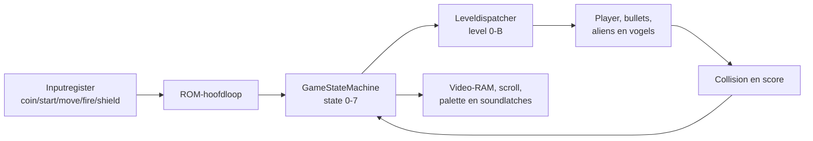
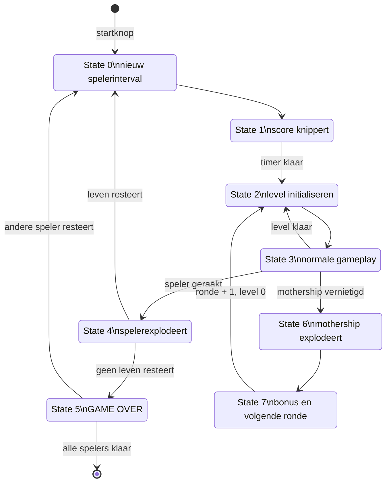

# Werking van het Phoenix-spel

Engelse versie: [GAME_LOGIC.md](GAME_LOGIC.md).

Dit document beschrijft de werking van het spelprogramma in `program.rom`.
Het is dus een aanvulling op
[`EMULATOR_ARCHITECTURE.nl.md`](EMULATOR_ARCHITECTURE.nl.md), dat de Java-emulator
en de geëmuleerde hardware beschrijft.

De analyse hieronder volgt de gedocumenteerde ROM-routines en adressen. Namen
zoals `GameStateMachine`, `PlayerUpdate` en `GameDemo` zijn labels uit de
beschikbare disassembly. Waar de betekenis van een byte niet volledig bewezen
is, wordt dat expliciet vermeld.

## 1. Spel en emulator zijn twee verschillende lagen

De Java-emulator bevat geen Java-klassen zoals `Enemy`, `Level` of `Collision`.
De originele ROM voert alle spelregels uit:

- credits tellen;
- startknoppen verwerken;
- attract mode regisseren;
- speler en projectielen bewegen;
- aliens en vogels animeren;
- botsingen detecteren;
- scores en levens bijwerken;
- levels en rondes doorlopen;
- geluidseffecten via hardwarelatches kiezen.

De emulator maakt dat mogelijk door CPU, geheugen, video, input en geluid aan
de ROM aan te bieden.



## 2. ROM-reset en initialisatie

Na reset begint de code bij `0x0008`:

1. zet de stack pointer op `0x4bff`;
2. selecteer geheugenbank 0 via het videoregister;
3. zet sound A en B uit;
4. zet scroll op nul;
5. wis RAM en scherm van beide geheugenbanken;
6. selecteer bank 0;
7. teken de vaste bovenste regels met scores, highscore en coins;
8. ga naar de permanente hoofdloop op `0x001a`.

Phoenix gebruikt twee RAM-banken voor onder andere de toestand van twee
spelers. De ROM schakelt de bank via het videoregister op `0x5000`.

## 3. De hoofdloop

Iedere iteratie van `MainLoop` begint met `WaitVBlankCoin`:

1. wacht tot vertical blank actief wordt;
2. wacht tot vertical blank weer eindigt;
3. lees het active-low inputregister;
4. bewaar huidige en vorige input in `0x43a0/0x43a1`;
5. verhoog de vrije frameteller;
6. detecteer een nieuwe coinflank;
7. verhoog maximaal tot negen credits.

Daarna kiest `GameOrAttract` op `0x43a2` het hoofdpad:

```text
0 = attract mode
1 = één speler
2 = twee spelers
```

In game mode worden per frame uitgevoerd:

```text
GameStateMachine()
UpdateScoresAndSound()
```

In attract mode:

```text
mute sound
controleer credits
toon startprompt als credits > 0
anders SplashAndDemo()
```

## 4. Credits en start

### 4.1 Coinflank

Inputs zijn active-low. Een coin telt alleen wanneer bit 0 van 1 naar 0 gaat.
Een ingedrukte toets die laag blijft levert dus één credit, niet iedere frame
een nieuwe credit.

De zichtbare cointeller wordt bijgewerkt met een cijfertegel. De originele ROM
ondersteunt intern maximaal negen credits; de tientallenpositie wordt niet
bijgewerkt.

### 4.2 Startprompt

Met credits wist `PromptForStartGame` het speelveld en toont:

```text
PUSH ONLY
1 PLAYER BUTTON
```

Bij minstens twee credits wordt ook de keuze voor twee spelers getoond.

Start 1 zet `GameOrAttract` op 1. Start 2 zet hem op 2. Daarna:

1. worden de benodigde credits afgetrokken;
2. wordt de highscore vergeleken met de twee spelerscores;
3. worden spelerscores gewist en opnieuw getekend;
4. worden levens geïnitialiseerd;
5. worden voor- en achtergrond van beide banken gewist;
6. gaat de state-machine naar een nieuw spel.

### 4.3 DIP-switches in deze port

De originele ROM leest lives- en coinagebits uit hetzelfde hardwaregebied als
de blanking/DIP-status. De huidige Java-port levert daar alleen de
vertical-blankpuls en daarna nul.

Daardoor ziet de ROM in de praktijk:

- de laagste livesinstelling: 3 levens;
- de coinagebranch met bit `0x10` uit.

Er is momenteel geen apart Java-configuratiescherm voor DIP-switches.

## 5. Centrale RAM-variabelen

| Adres | Label | Rol |
|---|---|---|
| `0x4380-0x4383` | Score1 | score speler 1 in BCD |
| `0x4384-0x4387` | Score2 | score speler 2 in BCD |
| `0x4388-0x438b` | HiScore | highscore in BCD |
| `0x438c` | SoundControlA | schaduwkopie sound A |
| `0x438d` | SoundControlB | schaduwkopie sound B |
| `0x438f` | CoinCount | credits |
| `0x4390` | Player1Lives | levens speler 1 |
| `0x4391` | Player2Lives | levens speler 2 |
| `0x4398/0x4399` | Counter98 | 16-bit attract/demo-teller |
| `0x439a/0x439b` | Counter9A | vrije animatie-/frameteller |
| `0x43a0` | IN0Current | huidige active-low input |
| `0x43a1` | IN0Previous | vorige input |
| `0x43a2` | GameOrAttract | attract, één speler of twee spelers |
| `0x43a3` | GameAndDemoOrSplash | actieve speler/demo/splashcontext |
| `0x43a4` | GameState | globale state 0-7 |
| `0x43a5` | CounterA5 | timer binnen states |
| `0x43a6` | ShieldCount | shield-/explosieteller |
| `0x43b8` | LevelAndRound | hoge nibble ronde, lage nibble level |
| `0x43ba` | AliensLeft | resterende aliens |
| `0x43bb` | BirdsLeft | resterende vogels |
| `0x43c0-0x43df` | Player/object state | speler en projectielslots |
| `0x43e0-0x43ff` | Object screen state | oude/actuele schermadressen |
| `0x4b50-0x4bef` | Alien/bird data | control states, posities en beweging |

Enkele bytes tussen deze velden zijn timers, tijdelijke scorewaarden en
bewegingsparameters. Hun betekenis varieert per levelroutine.

## 6. De globale game-state-machine

`GameStateMachine` op `0x0400` gebruikt `GameState` als index in een jumptable.

| State | Routine | Betekenis |
|---:|---:|---|
| 0 | `0x0430` | start nieuw leven/spelerinterval |
| 1 | `0x04ac` | actieve spelerscore laten knipperen |
| 2 | `0x0515` | speler- en leveldata initialiseren |
| 3 | `0x0800` | normale gameplay en leveldispatcher |
| 4 | `0x0aea` | explosie van het spelersschip |
| 5 | `0x0b60` | GAME OVER en speler-/attractovergang |
| 6 | `0x2400` | explosie van het mothership |
| 7 | `0x244c` | mothershipbonus tonen en volgende ronde |



## 7. State 0: nieuw spelerinterval

State 0:

- zet state 1 klaar;
- start `CounterA5` op `0x80` voor het scoreknipperen;
- normaliseert splash/demo naar gamecontext;
- kiest in twee-spelermode de speler met resterende levens;
- kopieert de relevante geheugenbank wanneer van speler wordt gewisseld.

De bankcopy bewaart niet alleen schermdata, maar ook scores, leveltoestand en
objectgegevens. Iedere speler kan daardoor een eigen voortgang hebben.

## 8. State 1: score knipperen

State 1 telt `CounterA5` af. Afhankelijk van timerbits wordt de actieve
spelerscore afwisselend getekend en gewist.

Halverwege wordt:

- de achtergrondscroll teruggezet;
- foreground buiten de scorebalk gewist;
- het video-/paletteregister voor het level ingesteld.

Wanneer de teller nul wordt, gaat de machine door naar state 2.

## 9. State 2: initialisatie

State 2 bereidt state 3 voor:

1. zet video-bank en palettebits op basis van speler en level;
2. laad levelafhankelijke globale parameters;
3. kopieer standaard speler- en projectieldata naar `0x43c0`;
4. wis oude object-/schermposities in `0x43e0`;
5. initialiseer alienstates en startposities;
6. bereken schermadressen van speler en aliens;
7. wis bewegingstellers;
8. ga naar de eerste levelroutine.

De standaard spelerdata bevat onder andere:

```text
PlayerState  = 0x0c
PlayerShape  = 0x10
PlayerShipX  = 0x64
PlayerShipY  = 0xd8
```

Er is één spelerskogel, een hulpslot voor het deel boven de kogel en vijf
enemy-bulletslots.

## 10. State 3: leveldispatcher

`LevelAndRound` gebruikt:

```text
bits 0-3 = levelcode 0-B
bits 4-7 = ronde
```

De leveldispatcher kiest iedere frame een routine uit deze reeks:

| Level | Fase |
|---:|---|
| `0` | sterren scrollen, eerste alienformatie fade-in |
| `1` | eerste alienformatie, actieve gameplay |
| `2` | sterren scrollen, tweede alienformatie fade-in |
| `3` | tweede alienformatie, actieve gameplay |
| `4` | spiraalovergang |
| `5` | eerste vogel-/Phoenix-golf |
| `6` | spiraalovergang |
| `7` | tweede vogel-/Phoenix-golf |
| `8` | spiraalovergang naar mothership |
| `9` | mothership fade-in |
| `A` | mothership en verdedigers fade-in |
| `B` | actieve mothershipfase |

Na het mothership gaat de hoge nibble één ronde omhoog en begint de lage nibble
weer bij level 0.

## 11. Alienformaties: levels 0-3

### 11.1 Fade-in

Levels 0 en 2:

- scrollen de sterrenachtergrond;
- tellen een leveltimer af;
- tekenen opeenvolgende fade-integels;
- activeren aliencontrol states;
- initialiseren de alienformatie;
- verhogen de levelcode wanneer de fade klaar is.

De gedocumenteerde fadevolgorde gebruikt foregroundtiles:

```text
0x6c -> 0x6d -> 0x6e -> 0x6f -> 0x68
```

### 11.2 Actieve formatie

Levels 1 en 3 voeren per frame onder andere uit:

- `PlayerUpdate`;
- projectiel/alien-collision;
- alienbeweging en animatie;
- formatie- en duikpatronen;
- enemy-bulletupdates;
- speler/alien-collision;
- killed-alienanimaties;
- controle van `AliensLeft`.

Wanneer weinig aliens over zijn, verandert de ROM bepaalde bewegingstiming en
worden individuele aanvalspatronen belangrijker. Als `AliensLeft` nul wordt,
wordt de volgende levelovergang gestart.

## 12. Spiraalovergangen

Levels 4, 6 en 8 gebruiken dezelfde `spiral fill`-routine.

Een timer wordt omgezet naar een steeds groter rechthoekig patroon. De routine
tekent eerst asterisktegels en wist ze daarna weer. Aan het einde:

- wordt het level verhoogd;
- wordt state 2 gekozen;
- wordt voor latere fasen eventueel achtergrond-/mothershipdata voorbereid.

De spiraal is dus geen los videobestand, maar een per-frame ROM-algoritme dat
tegels in video-RAM schrijft.

## 13. Vogel-/Phoenix-golven

Levels 5 en 7 gebruiken acht vogelobjecten, verdeeld in twee groepen van vier.

Per frame kan de ROM:

- speler, kogel en shield bijwerken;
- vogelcollisions voor en na verticale beweging controleren;
- de verticale beweging aan het scrollregister koppelen;
- horizontale beweging voor een groep vogels uitvoeren;
- vogelvormen en animatieframes tekenen;
- enemy bullets verwerken;
- explosie- en bonusanimaties bijwerken;
- `BirdsLeft` controleren.

De twee groepen worden op afwisselende frames bijgewerkt om werk over frames te
verdelen. Bij minder dan vier resterende vogels wordt vaker beide groepen
verwerkt.

Vogeltoestand en positie staan in objectblokken rond `0x4b70`. De ROM kiest
beweging op basis van control-statebits, timers, positie en level/ronde. Dat
levert formatiebeweging, duiken, vleugelanimatie en terugkeer naar de formatie.

Wanneer `BirdsLeft` nul is, ruimt de ROM resterende projectielen en
explosieanimaties op en gaat naar de volgende overgang.

## 14. Mothershipfase

### 14.1 Level 9

De mothershipafbeelding verschijnt geleidelijk terwijl de sterrenachtergrond
doorloopt. Een leveltimer markeert wanneer het schip gedeeltelijk zichtbaar is.

### 14.2 Level A

Daarna worden mothership en verdedigers samen verder opgebouwd. De ROM:

- hergebruikt alienfadecode;
- zet mothershipflags;
- initialiseert bijkomende control-statebytes;
- bereidt de actieve fase voor.

### 14.3 Level B

Level B gebruikt de algemene actieve alienroutine aangevuld met
mothershiplogica. De speler moet door de verdediging heen de kwetsbare delen
van het schip raken.

Bij vernietiging:

1. gaat `GameState` naar 6;
2. wordt een deeltjesexplosie over meerdere frames getekend;
3. wordt het schip uit de achtergrond gewist;
4. wordt een bonus berekend en aan de score toegevoegd;
5. gaat de state naar 7;
6. blijft de bonus tijdelijk zichtbaar;
7. wordt de ronde verhoogd en level 0 opnieuw gestart.

## 15. Spelerbeweging

`PlayerUpdate` bestaat uit vier hoofddelen:

1. oude objecten wissen of nieuwe objecten tekenen op basis van statebits;
2. actuele data naar de vorige-framebufferstructuur kopiëren;
3. schip, spelerkogel en shield bijwerken;
4. logische X/Y-posities naar video-RAM-adressen vertalen.

Links en rechts veranderen `PlayerShipX` binnen ROM-bepaalde grenzen. Bij
beweging wordt een flag gezet zodat de tekenroutine weet dat het oude schip
moet worden gewist en op de nieuwe plaats getekend.

De speler heeft een vaste verticale basispositie. De horizontale positie wordt
via een mappingtabel naar de gedraaide/gekolommeerde video-RAM-indeling
vertaald.

## 16. Vuren

De ROM gebruikt een statebyte voor de spelerskogel:

- vrij/inactief;
- tekenen;
- actief en omhoog bewegen;
- wissen;
- resetten wanneer de bovenrand of een botsing is bereikt.

Bij een nieuwe fireflank:

1. controleert de ROM of het kogelslot vrij is;
2. neemt de X-positie van het schip over;
3. plaatst de kogel boven het schip;
4. activeert de teken-/bewegingsbits;
5. kiest via soundcontrol het lasereffect.

Het hulpslot `AbovePlayerBullet` ondersteunt collision en rendering rond de
tegel boven de actuele kogelpositie.

## 17. Enemy bullets

Er zijn vijf enemy-bulletslots. `EnemyBulletUpdate` en
`EnemyBulletDataController`:

- wissen de vorige tegel;
- werken control-statebits af;
- bewegen de kogel omlaag;
- wisselen animatievorm;
- tekenen de nieuwe tegel;
- deactiveren een slot buiten het speelveld of na collision.

De actieve levelroutine bepaalt wanneer en vanuit welk alien-/vogelobject een
vrij slot wordt gestart.

## 18. Shield

De barriertoets activeert een tijdelijke beschermingsanimatie rondom het
schip. `ShieldCount` bestuurt zowel duur als vorm.

Tijdens het shield:

- worden meerdere tegels rondom het schip getekend;
- veranderen de gebruikte shieldframes naarmate de teller verloopt;
- gebruikt collisiondetectie een groter beschermd gebied;
- kunnen botsende vijanden worden geraakt zonder de normale onmiddellijke
  scheepsexplosie.

Bij de eindwaarde:

1. wist `ShieldsExpired` het shieldbeeld;
2. herstelt de normale spelerstate en -shape;
3. normaliseert de X-positie;
4. gaat normale beweging verder.

## 19. Collisiondetectie

Phoenix gebruikt tegel- en objectgebaseerde collision, geen moderne
pixel-per-pixel physics-engine.

### 19.1 Spelerkogel tegen vijand

De ROM:

1. controleert of de kogel actief is;
2. leest de tegel op het schermadres van de kogel;
3. gebruikt tegelranges om formatie- of los bewegende vijanden te herkennen;
4. vergelijkt logische X/Y-posities met objectdata;
5. deactiveert kogel en geraakt object;
6. start een explosie-/bonusrecord;
7. verlaagt `AliensLeft` of `BirdsLeft`;
8. schrijft een tijdelijke BCD-scorewaarde.

### 19.2 Vijand tegen speler

De ROM controleert de tegelrechthoek van het schip tegen actieve
alien-/vogelobjecten. Zonder shield leidt een geldige overlap naar state 4.

Met actief shield wordt een groter gebied gecontroleerd en kan de vijand zelf
in een hit-/explosiestatus worden gezet.

### 19.3 Enemy bullet tegen speler

Enemy bullets worden tegen de schermpositie van schip/shield getest. Een
geldige treffer zet de spelerstate naar de explosiesequentie en kiest het
bijbehorende soundeffect.

## 20. Vijand- en explosieobjecten

Objectcontrol states gebruiken bitvelden. De algemene tekencontroller verwerkt
onder andere:

- bit voor oud object wissen;
- bit voor nieuw object tekenen;
- object actief/inactief;
- shape- en animatie-index;
- gridpositie;
- afgeleid video-RAM-adres.

Explosies zijn eveneens tijdelijke objectrecords. Hun timers kiezen
opeenvolgende tegels en leveren na afloop een score-event of een vrije
objectslotstatus.

## 21. Score

Scores zijn drie bytes packed BCD, dus zes zichtbare cijfers. De laagste
decimale positie blijft nul.

`AddToScore` telt `BC * 10` op met de 8080 `DAA`-instructie:

```text
laagste twee BCD-cijfers
middelste twee BCD-cijfers plus carry
hoogste twee BCD-cijfers plus carry
```

Hits schrijven eerst een tijdelijke BCD-score in explosie-/bonusrecords.
`UpdateScoresAndSound` loopt per frame door die records en:

1. voegt afgeronde hitwaarden bij de actieve speler;
2. wist verwerkte tijdelijke scorevelden;
3. tekent de zes scorecijfers opnieuw wanneer nodig;
4. controleert de extra-leven-drempel;
5. werkt levens en geluidshardware bij.

Het exacte aantal punten hangt af van vijandtype, hitdeel, level en soms de
fase van het object. Het is daarom data- en contextgestuurd, niet één vaste
Java-scoretabel.

## 22. Extra leven

De ROM vergelijkt de actieve score met een BCD-drempel in het globale
levelblok. Bij het passeren van een nog actieve drempel:

- wordt het leven van de actieve speler verhoogd;
- wordt het levenscijfer bijgewerkt;
- wordt een flag/soundevent gezet;
- wordt de drempel gemarkeerd zodat dezelfde grens niet opnieuw beloont.

## 23. Speler geraakt

Een fatale collision zet state 4 en start een timer.

State 4:

- fixeert scroll op een geschikte grens;
- tekent opeenvolgende scheepsdeeltjes;
- wist andere foregroundelementen op vastgelegde momenten;
- laat resterende vijand-/explosieanimaties deels doorlopen;
- gaat na afloop naar state 5;
- verlaagt het leven van de actieve speler;
- werkt de levensweergave bij;
- kiest state 0 als nog een leven resteert.

De precieze overgang tussen state 4 en 5 is timer- en levensafhankelijk: state
5 behandelt zowel de GAME OVER-weergave als het kiezen van de volgende speler.

## 24. GAME OVER en twee spelers

State 5 verhoogt zijn timer en toont `GAME OVER`.

Wanneer de timer afloopt:

- als de andere speler nog levens heeft, gaat de machine via state 0 naar die
  speler en wordt de juiste RAM-bank teruggezet;
- als beide spelers klaar zijn, worden `Counter98` en `GameOrAttract` gewist;
- de machine keert terug naar attract mode;
- zo nodig wordt bank 0 geselecteerd.

Hierdoor kunnen twee spelers om beurten ieder hun eigen score, level en
objecttoestand behouden.

## 25. Attract mode als tijdlijn

`SplashAndDemo` verhoogt iedere frame de 16-bit `Counter98` op
`0x4398/0x4399`.

Belangrijke momenten:

| Counter98 | Tijd bij 60 Hz | Actie |
|---:|---:|---|
| `0x0001` | circa 0,02 s | copyright tekenen |
| `0x0002` | circa 0,03 s | score/average-tekst langzaam printen |
| `0x0120` | circa 4,8 s | scoretabeltegels tekenen |
| `0x01b0` | circa 7,2 s | copyright verversen |
| `0x01b8` | circa 7,3 s | globale leveldata voorbereiden |
| `0x01c0` | circa 7,5 s | titel/scrollintro |
| `0x0300` | circa 12,8 s | intro-vogelanimatie |
| `0x03e6` | circa 16,6 s | eerste gamedemo starten |

De teller loopt daarna door meerdere demo-intervallen.

## 26. De drie gamedemo’s

De disassembly documenteert:

| Interval | Rol |
|---|---|
| `0x03e6-0x07a0` | eerste demo met normale gamecode |
| `0x0800-0x0b60` | tweede demo, omschakeling naar mothershipcontext |
| `0x0c00-0x1510` | derde demo, omschakeling naar vogelcontext |

Bij grens `0x0b60` zet de ROM onder andere een mothershiplevel klaar. Bij
`0x07a0`/de volgende omschakeling worden level- en objecttellers opnieuw
ingesteld. De exacte visuele volgorde hangt ook af van de toestand die de echte
gameplayroutines op dat moment hebben opgebouwd.

## 27. Demo-AI

`GameDemo` gebruikt dezelfde `GameStateMachine` als een echt spel. Het verschil
zit in de input.

Per demoframe:

1. `GetPlayerInputsForDemo` inspecteert tellerfasen en spelobjectdata;
2. de routine maakt kunstmatige links/rechts/fire/shieldbits;
3. echte spelerinput wordt grotendeels gemaskeerd;
4. alleen de echte coinlijn blijft behouden zodat een munt de attract mode kan
   onderbreken;
5. de samengestelde input wordt in `IN0Current` geschreven;
6. de normale game-state-machine wordt uitgevoerd.

Het resultaat is geen opgenomen filmpje. Schip, kogels, collisions en vijanden
worden live door dezelfde ROM-code berekend.

## 28. Geluid vanuit de spelcode

Spelroutines schrijven niet rechtstreeks PCM. Ze wijzigen
`SoundControlA/B`-schaduwbytes. `UpdateSoundControlHW` schrijft gewijzigde
waarden naar de hardwareadressen `0x6000` en `0x6800`.

Voorbeelden van triggers:

- spelerskogel gestart;
- alien/vogel geraakt;
- scheepsexplosie;
- shield actief of verlopen;
- vleugel-/duikbeweging;
- level- of mothershipfase;
- muziektune gewijzigd.

In attract mode zet de hoofdloop beide latches op `0x0f` en slaat
`UpdateScoresAndSound` scoring vroeg over. De demo gebruikt dus echte
gameplaycode, maar de attract-hoofdloop onderdrukt normale gameaudio.

## 29. Waarom een ontbrekende demo een emulatieprobleem aanwijst

Omdat attract mode dezelfde componenten gebruikt als het spel, is hij een
integratietest:

- `Counter98` test 60 Hz-voortgang en RAM;
- langzame tekst test foreground video-RAM;
- sterren/scroll test background video-RAM en `0x5800`;
- intro-vogel test character-ROM en objecttekenen;
- gamedemo test state-machine, object-RAM, collision en gesimuleerde input.

Als `Counter98` oploopt maar scènes ontbreken, ligt het probleem waarschijnlijk
in CPU-uitvoering, geheugenbanking, video-RAM/palette of levelstate. Als scènes
werken maar echte toetsen niet, ligt het probleem eerder in het inputregister
of active-low bitbeheer.

## 30. Eén frame normale gameplay

Een vereenvoudigde framevolgorde is:

```text
WaitVBlankCoin
  lees huidige/vorige input
  werk coinflank bij

GameStateMachine
  dispatch op GameState
    state 3:
      dispatch op LevelAndRound
      PlayerUpdate
      update vijandbeweging
      update speler- en enemy bullets
      collisionchecks
      explosies en level-completion

UpdateScoresAndSound
  verzamel hit-/bonusrecords
  tel BCD-score op
  controleer extra leven
  werk zichtbare score bij
  schrijf soundlatches

terug naar WaitVBlankCoin
```

## 31. Praktisch lezen van debugstatus

Met:

```sh
java -Dphoenix.debug=true -cp build/classes PhoenixDesktop
```

kunnen deze waarden samen worden geïnterpreteerd:

| Debugveld | Betekenis |
|---|---|
| `Counter98` | voortgang attract-/demotijdlijn |
| `mode43a2` | attract, één speler of twee spelers |
| `mode43a3` | actieve speler/demo/splashcontext |
| `coins` | kredietenteller |
| `scroll` | achtergrondpositie |
| `page` | geselecteerde video-RAM-pagina uit videoregisterbit 0 |
| `palette` | geselecteerde kleurenbank uit videoregisterbit 1 |
| `fg` / `bg` | veranderingen in beide video-RAM-lagen |
| `pc` | actuele ROM-uitvoerlocatie |

Voorbeeldinterpretatie:

- teller verandert, `fg/bg` niet: ROM bereikt mogelijk geen tekenroutines of
  writes worden niet zichtbaar;
- `fg/bg` verandert, scherm niet: renderer/palette/video-bankprobleem;
- mode wordt game, inputregister blijft `0xff`: keyboard/inputpad;
- soundlatches veranderen, geen audio: soundrenderer/outputlijn.

## 32. Bronzekerheid

Direct uit de ROM-disassembly bevestigd:

- hoofdloop en attract/game-splitsing;
- acht game states en hun jumpadressen;
- leveldispatcher 0-B;
- attracttijdlijn en drie demovensters;
- live demo-input;
- speler-, bullet-, alien- en birddata;
- BCD-scoring en levens;
- player-bankcopy;
- mothershipexplosie en rondeovergang.

Functioneel duidelijk maar niet voor ieder object volledig benoemd:

- alle individuele vijand-control-statebits;
- alle bewegingspatroontabellen;
- exacte scorewaarde van ieder hitdeel;
- enkele tijdelijke RAM-bytes in mothership- en vogelroutines.

Die onderdelen zijn data- en tabelgestuurd en kunnen verder worden uitgewerkt
met tracecaptures of aanvullende annotatie van de ROM-disassembly.
